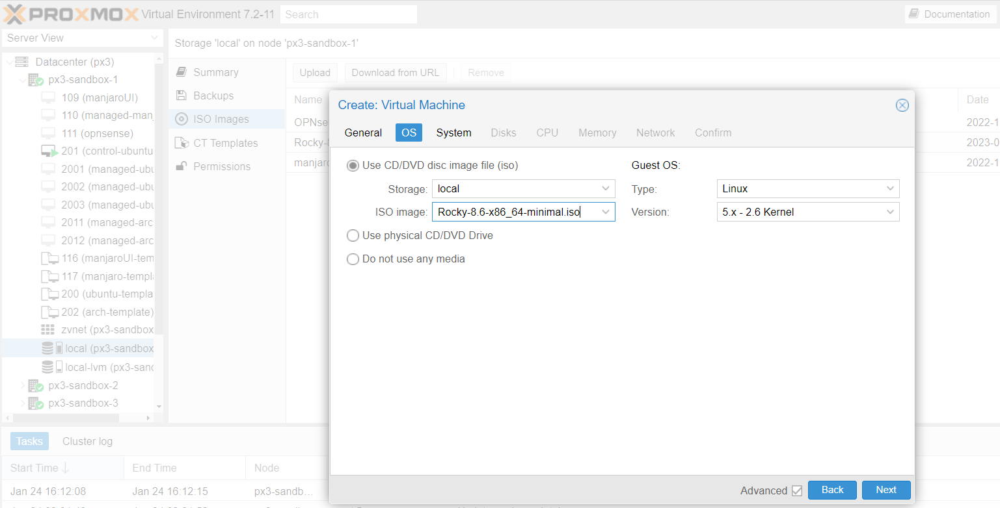
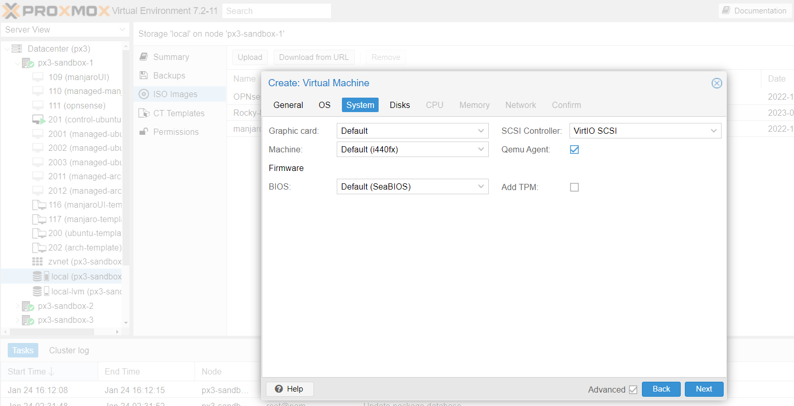
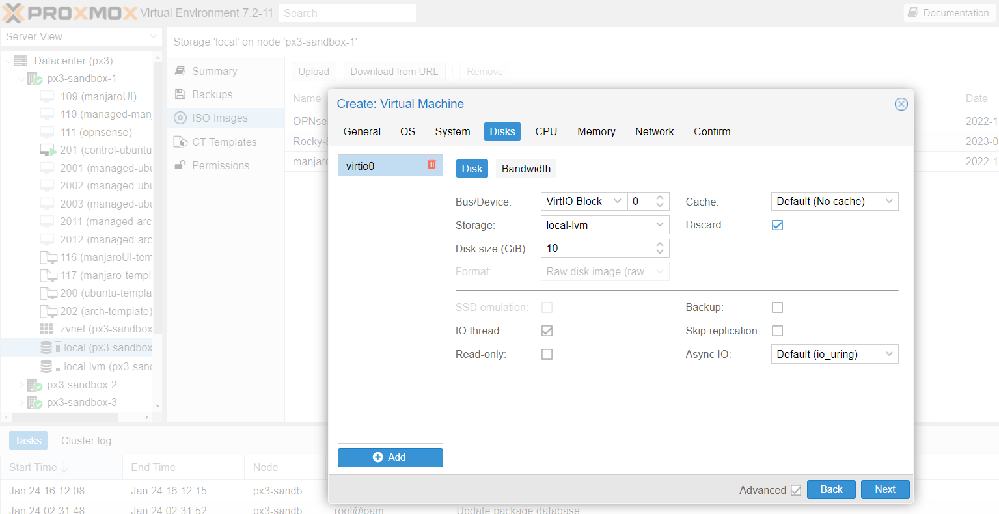
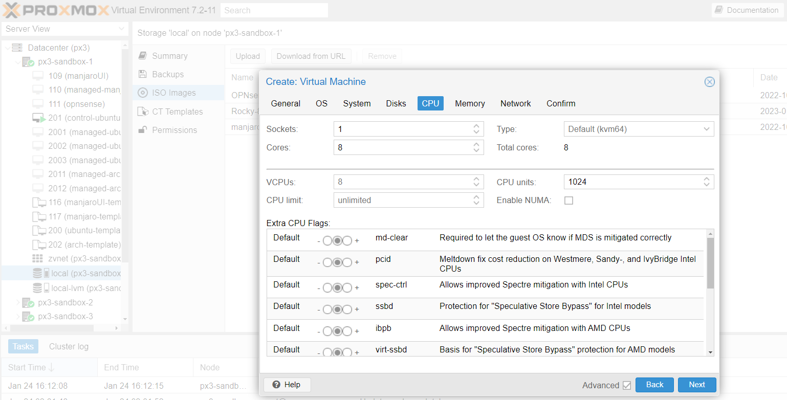
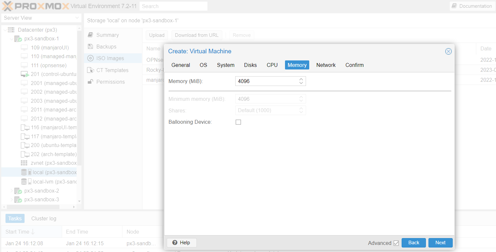
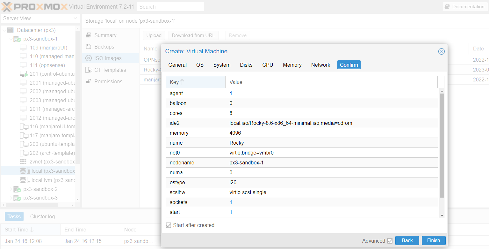

## DevOps Introductory and Virtualization ##

Practice part for this lesson includes creation of virtual machine (hereinafter called VM) on Proxmox.

### Prerequisites ###

- Proxmox node (read the full [installation guide in the Proxmox VE documentation](https://pve.proxmox.com/pve-docs/chapter-pve-installation.html))
- Download and add [Rocky Linux ISO](https://download.rockylinux.org/pub/rocky/9/isos/x86_64/Rocky-9.1-x86_64-minimal.iso) to Proxmox default storage location:
    
    Once uploaded you will see the image in the list of available ISO files under the ISO Images section.

### Steps ###

1. Right click on the node and select 'Create VM':
    
2. Enter a name for the new VM, check the 'Advanced' checkbox to see more settings and click 'Next':
    
3. Choose the previously uploaded ISO file from the 'ISO Image' drop-down box and click 'Next':
    
4. Choose the system hardware details (graphic card, BIOS, SCSI controller etc.). If no preferences leave the defaults. Check Qemu Agent to enable it once installed:
    
5. Select the 'Bus/Device' value 'VirtIO Block' (or 'SCSI'), enter the disk size for your VM, check the 'Discard' checkbox, 'SSD Emulation' (necessary in case of SCSI device value), 'IO thread' checkbox, click 'Next':
    
6. Enter the number of CPU sockets, cores, CPU type and click 'Next':
    
7. Enter the Memory size of the VM, uncheck the 'Balooning' checkbox and click 'Next':
    
8. Choose network bridge and other network settings like VLAN tag, disable Firewall, click 'Next':
    
9. Review your choice, check 'Start at boot' to start VM immediately after creation, click 'Finish' button to confirm the VM creation:
    
10. Once the VM is created it will be displayed under the Proxmox node dashboard.
11. Click on the newly created VM to view the summary.
12. Some settings might be changed from the center pane: Access Console, Network, DNS, Firewall, Snapshot, Backup etc.

### Resources ###

1. [Top 10 Best Container Software In 2023](https://www.softwaretestinghelp.com/container-software)
2. [Creating Thinly-Provisioned Logical Volumes](https://access.redhat.com/documentation/en-us/red_hat_enterprise_linux/6/html/logical_volume_manager_administration/thinly_provisioned_volume_creation)
3. [QEMU/KVM — Virtualization on Linux](https://casinesque.medium.com/first-approach-with-qemu-kvm-virtualization-on-linux-733ba2ffb739)
4. [KVM / QEMU / qemu-kvm / libvirt concept полное решение](https://russianblogs.com/article/45781292408)
5. [Proxmox Clustering with 2 Nodes](https://www.apalrd.net/posts/2022/pve_quorum)
6. [The Corosync Cluster Engine](https://github.com/corosync/corosync)
7. [XEN PROJECT NOW IN OPENSTACK NOVA HYPERVISOR DRIVER QUALITY GROUP B](https://xenproject.org/2015/05/20/xen-project-now-in-openstack-nova-hypervisor-driver-quality-group-b/)

