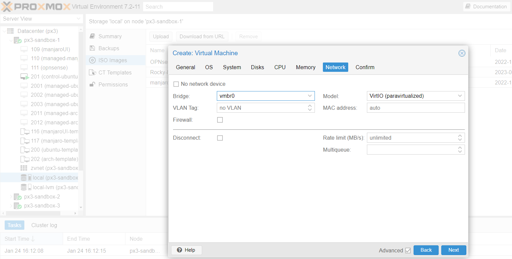
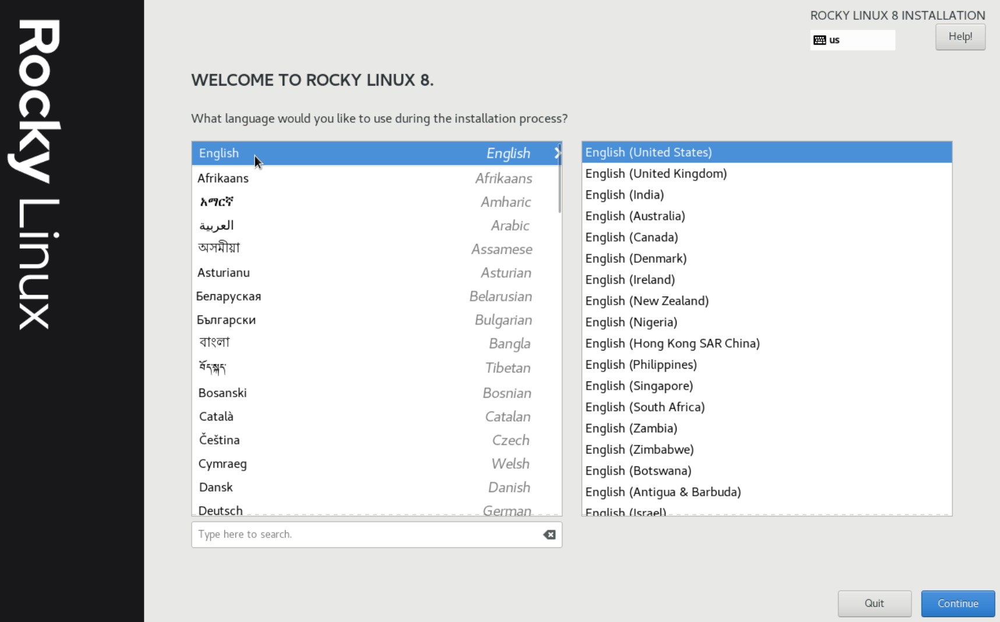
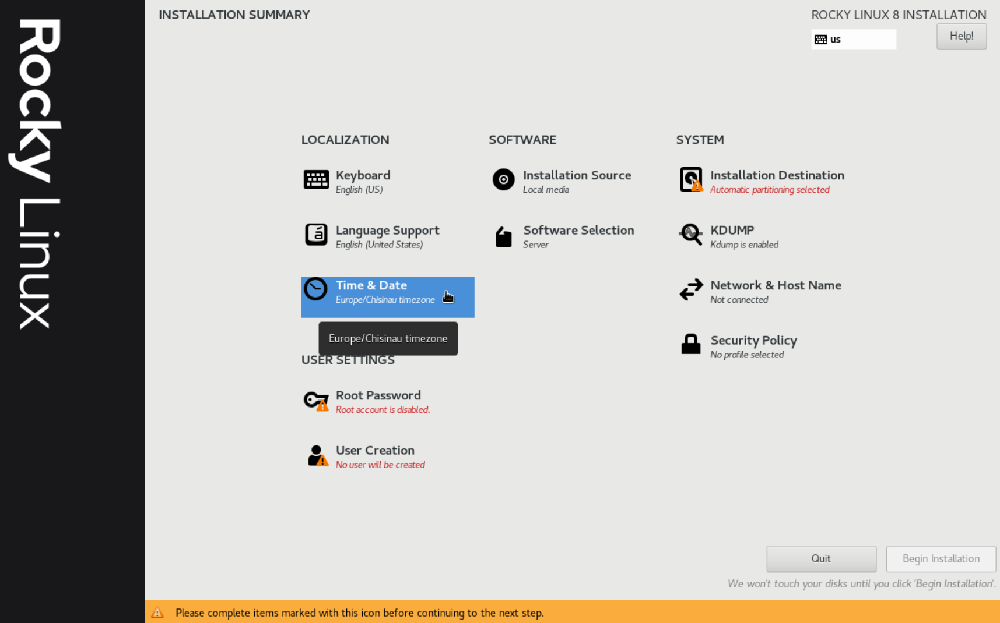
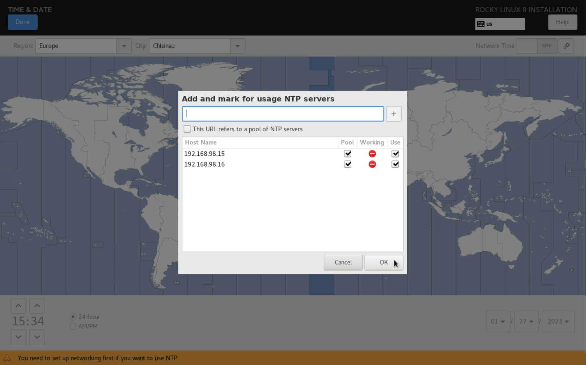
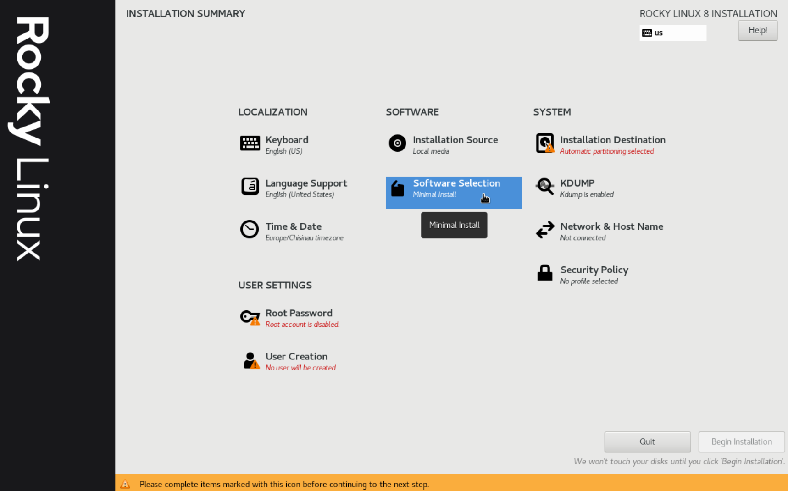
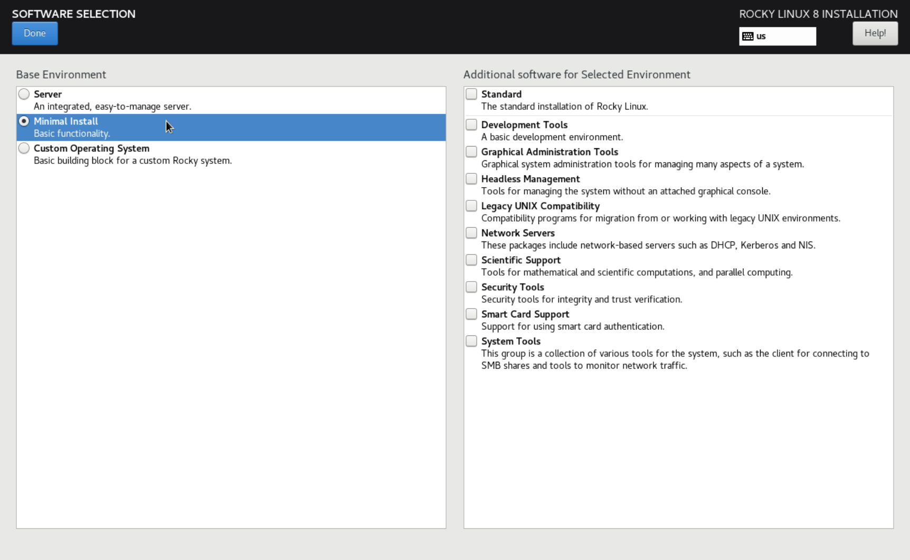
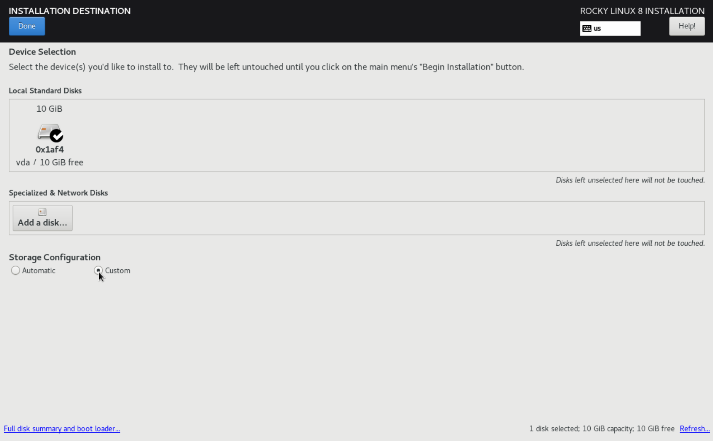
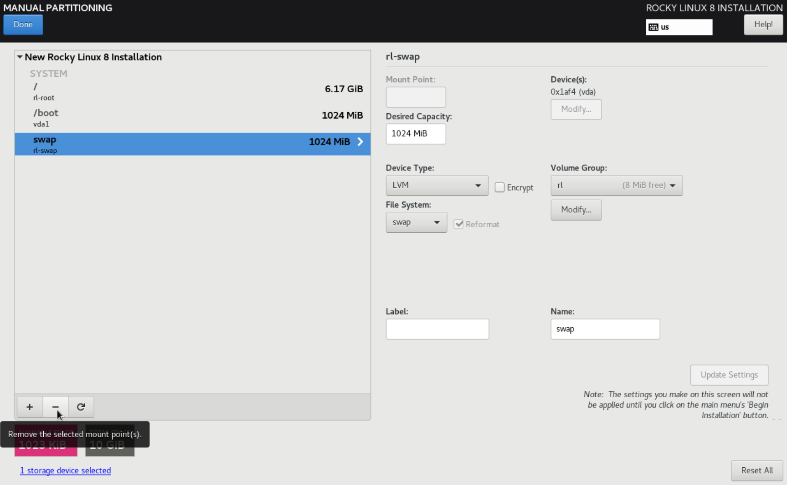
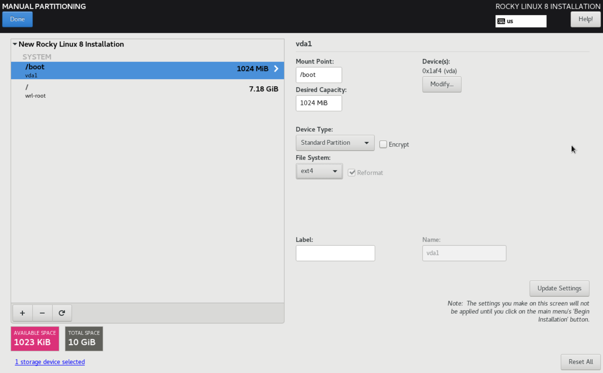
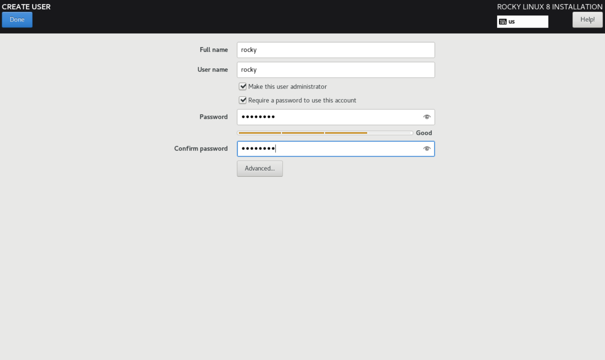

## DevOps Introductory and Virtualization ##

Practice part for this lesson includes creation of virtual machine (hereinafter called VM) on Proxmox.

### Prerequisites ###

- Proxmox node (read the full [installation guide in the Proxmox VE documentation](https://pve.proxmox.com/pve-docs/chapter-pve-installation.html))
- Download and add [Rocky Linux ISO](https://download.rockylinux.org/pub/rocky/9/isos/x86_64/Rocky-9.1-x86_64-minimal.iso) to Proxmox default storage location:
    - local > ISO Images > click 'Upload':
    
    Once uploaded you will see the image in the list of available ISO files under the ISO Images section.

### Virtual Machine Creation on Proxmox Node ###

1. Right-click on the node and select 'Create VM':
    
2. Enter a name for the new VM, check the 'Advanced' checkbox to see more settings and click 'Next':
    
3. Choose the previously uploaded ISO file from the 'ISO Image' drop-down box and click 'Next':
    
4. Choose the system hardware details (graphic card, BIOS, SCSI controller > VirtIO SCSI). If no preferences leave the defaults. Check 'Qemu Agent' checkbox to enable it once installed (qemu-guest-agent is used to properly shutdown the quest and to freeze the system when making a backup):
    
5. Select the 'Bus/Device' value 'VirtIO Block' (or 'SCSI'), enter the disk size for your VM, check the 'Discard' checkbox (to allow the node to reclaim the free space), 'SSD Emulation' (necessary in case of SCSI device value), 'IO thread' checkbox, click 'Next':
    
6. Enter the CPU cores = 8, click 'Next':
    
7. Enter the Memory size of the VM, uncheck the 'Ballooning Device' checkbox (to disallow the guest to change dynamically its memory usage) and click 'Next':
    
8. Choose network bridge and other network settings like VLAN tag, disable Firewall, click 'Next':
    
9. Review your choice, check 'Start after created' to start VM immediately after creation, click 'Finish' button to confirm the VM creation:
    
10. Once the VM is created it will be displayed under the Proxmox node dashboard.
11. Click on the newly created VM to view the summary. Some settings might be changed from the center pane: Access Console, Network, DNS, Firewall, Snapshot, Backup etc.

### Rocky Linux Installation ###

1. Select language:
    
2. Click Time & Date on the main menu:
    
3. Select timezone & add relevant NTP servers > click \[Done\]:
    
4. Click Software Selection from the main menu:
    
5. Select minimal installation > click \[Done\]:
    
6. Click Installation Destination on the main menu and point in Custom Storage Configuration > click \[Done\]:
    
7. Click \[Done\] & select partitioning scheme:
    
8. Let's suppose we chose LVM Thin Provisioning. Click \<Create them automatically\>:
    
9. Now we can remove swap in order to get more space (but it's optional, we just don't need it):
    
10. If we need to have a particular order (root to be the last), we might also modify volume group name like this:
    
11. To recalculate root size after swap removal, enter a lot greater size and click \[Update settings\], and the maximum available amount will be displayed & applied.
12. Now select file system both on boot & root (ext4 was selected in this example) > click \[Done\]:
    
    
13. Click \[Done\] & confirm your choice once again after the summary review:
    
14. Click Network Settings on the main menu, turn the network on & edit the hostname > click \[Done\]:
    
15. Click Root Password on the main menu and set the password > click \[Done\]:
    
16. Click User Creation on the main menu, make the new user administrator and set the password > click \[Done\]:
    
17. Click Begin Installation:
    

### Resources ###

1. [Top 10 Best Container Software In 2023](https://www.softwaretestinghelp.com/container-software)
2. [Creating Thinly-Provisioned Logical Volumes](https://access.redhat.com/documentation/en-us/red_hat_enterprise_linux/6/html/logical_volume_manager_administration/thinly_provisioned_volume_creation)
3. [QEMU/KVM — Virtualization on Linux](https://casinesque.medium.com/first-approach-with-qemu-kvm-virtualization-on-linux-733ba2ffb739)
4. [KVM / QEMU / qemu-kvm / libvirt concept полное решение](https://russianblogs.com/article/45781292408)
5. [Proxmox Clustering with 2 Nodes](https://www.apalrd.net/posts/2022/pve_quorum)
6. [The Corosync Cluster Engine](https://github.com/corosync/corosync)
7. [XEN PROJECT NOW IN OPENSTACK NOVA HYPERVISOR DRIVER QUALITY GROUP B](https://xenproject.org/2015/05/20/xen-project-now-in-openstack-nova-hypervisor-driver-quality-group-b)
8. [How To Create Proxmox Virtual Machines From Proxmox VE Web UI Dashboard](https://ostechnix.com/create-proxmox-virtual-machines)

