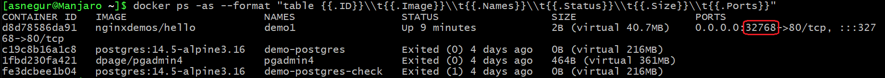
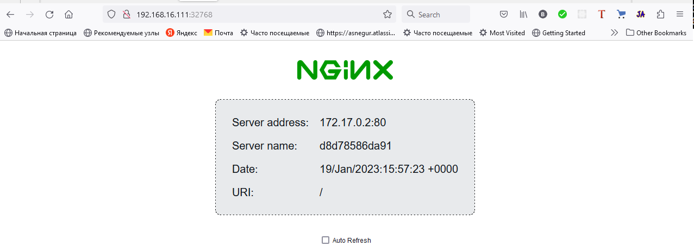
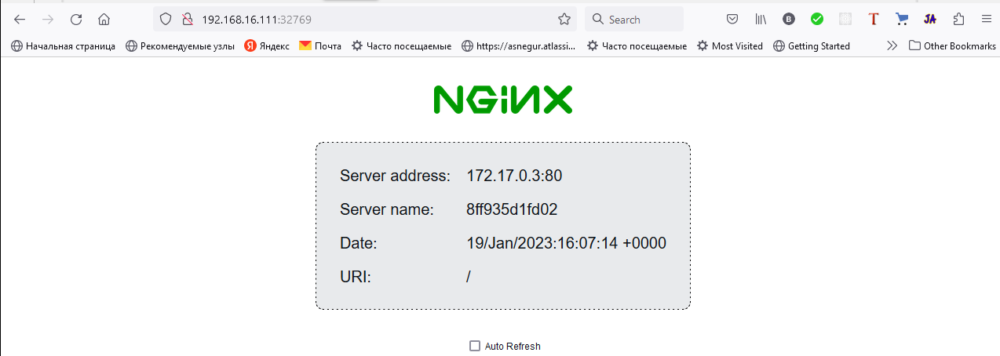
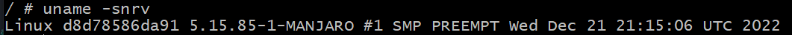
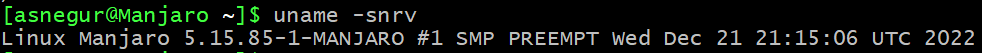
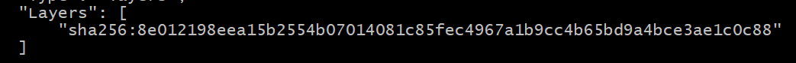
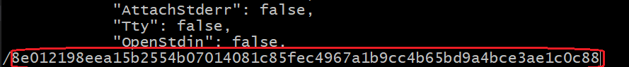
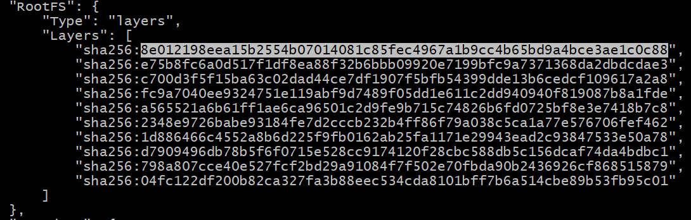

# Containers - basic commands

Project [Alliedium/awesome-linux-config](https://github.com/Alliedium/awesome-linux-config) will be used for installing docker tool

## Prerequisites

All commands run on `Manjaro` Linux distribution.

  - Install git and clone repository
  
  ```
  sudo pacman -S git --noconfirm
  git clone https://github.com/Alliedium/awesome-linux-config $HOME/awesome-linux-config
  ```

  - Install docker
  
  ```
  ~/awesome-linux-config/manjaro/basic/install_docker.sh
  ```

## Docker commands

### Docker info

  ```
  docker info
  ```
### Get docker image list

  ```
  docker images
  ```

  or

  ```
  docker image ls
  ```

### Get list of running containers

  ```
  docker ps
  ```

### Get list of all containers

  ```
  docker ps -a
  ```

### Run docker container

  We will use image [nginxdemos/hello](https://hub.docker.com/r/nginxdemos/hello/). It starts a web service on a specific port

  ```
  docker run --name demo1 -P -d nginxdemos/hello
  ```

  flag `-d` background mode

  Get list of all containers and define output format

   ```
   docker ps -as --format "table {{.ID}}\\t{{.Image}}\\t{{.Names}}\\t{{.Status}}\\t{{.Size}}\\t{{.Ports}}"
   ```

   

   Check container from your work station, in browser open http://192.168.16.111:32768

   `192.168.16.111` - `Manjaro` IP Address

   `32768` - host port

   

### Run docker container on a predefined port

  ```
  docker run --name demo2 -p 32769:80 -d nginxdemos/hello
  ```
  Host port `32769` maps on docker `80` port

   

### The container uses the same Linux kernel as on the host machine

  - Go in container `demo1`
  
  ```
  docker exec -it demo1 "/bin/sh"
  ```

  In container run command

  ```
  uname -snrv
  ```

  

  Exit from container and run command

  ```
  uname -snrv
  ```

  
  
### Stop container

  ```
  docker stop demo2
  ```

### Start container

  ```
  docker start demo2
  ```

### Show that the container is built on the basis of layers

  We will use `alpine` image

  ```
  docker pull alpine
  ```

  Display detailed information on `alpine` image

  ```
  docker inspect alpine
  ```

 

 Copy layer identifier `8e012198eea15b2554b07014081c85fec4967a1b9cc4b65bd9a4bce3ae1c0c88`

  Display detailed information on `nginxdemos/hello` image

  ```
  docker inspect nginxdemos/hello | less
  ```
  then enable search - click \[`/`] and past copied layer identifier

  
  
  

  There is coincidence of `nginxdemos/hello` and `alpine` image layers


## Links for reference:

1. [What Are Containers? And Why Should You Use Them?](https://jfrog.com/knowledge-base/what-are-containers/)
2. [Containers 101: An Introduction to Improving Your Technical Performance](https://www.avatier.com/blog/containers-improve-technical-performance/)
3. [How to Choose a Container Registry: The Top 9 Picks](https://bluelight.co/blog/how-to-choose-a-container-registry)
4. [Best Container Registry Software](https://www.g2.com/categories/container-registry)
5. [Open Container Initiative](https://opencontainers.org/)
6. [LXC](https://wiki.gentoo.org/wiki/LXC)
7. [What's LXC?](https://linuxcontainers.org/lxc/)
8. [LXC vs Docker: Why Docker is Better in 2023](https://www.upguard.com/blog/docker-vs-lxc)
9. [What is Docker?](https://www.ibm.com/cloud/learn/docker)
10. [Docker Desktop](https://docs.docker.com/desktop/#download-and-install)
11. [The differences between Docker, containerd, CRI-O and runc](https://www.tutorialworks.com/difference-docker-containerd-runc-crio-oci/)
12. [Kubernetes, Overview](https://kubernetes.io/docs/concepts/overview/what-is-kubernetes/)
13. [Kubernetes и другие оркестраторы](https://habr.com/ru/company/kts/blog/591355/)
14. [What is Podman?](https://docs.podman.io/en/latest/)
15. [Основы контейнеризации (обзор Docker и Podman)](https://habr.com/ru/post/659049/)
16. [Podman vs Docker: A Comparison](https://www.liquidweb.com/kb/podman-vs-docker/)
17. [Podman vs Docker: What are the differences?](https://www.imaginarycloud.com/blog/podman-vs-docker/)


 


