# Virtualization on Windows, ZFS file system

## Prerequisites
  1. Enable in `bios` virtualization
  
  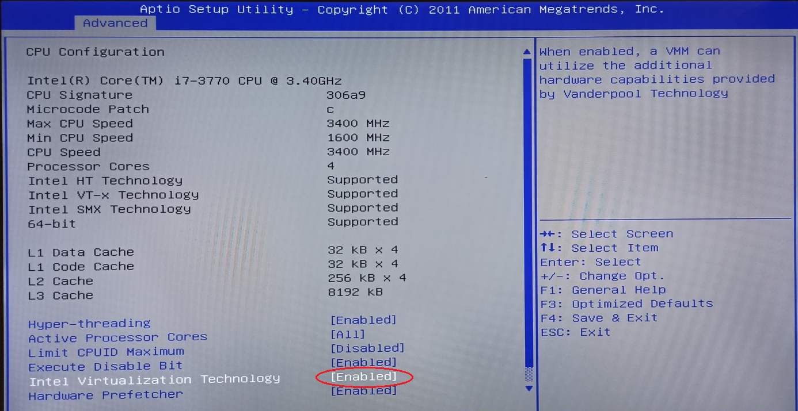

  2. Enable virtualization on `Windows` OS
   
   * Run the command

   ```
   appwiz.cpl
   ```
   and click `Turn Windows features on or off`. Check `Hyper-v` and `Windows Hypervisor Platform`, 
   
   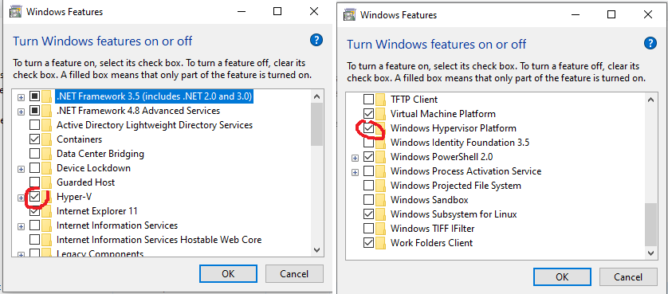  

   click `OK` and reboot station.

   3. Configure `Hyper-V Manager`
   
   * Open `Hyper-V Manager` settings
  
  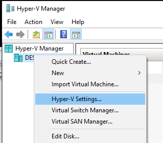

  Setup `Virtual Hard Disk` - VM storage and `Virtual Machines` - storage of VM configuration files

  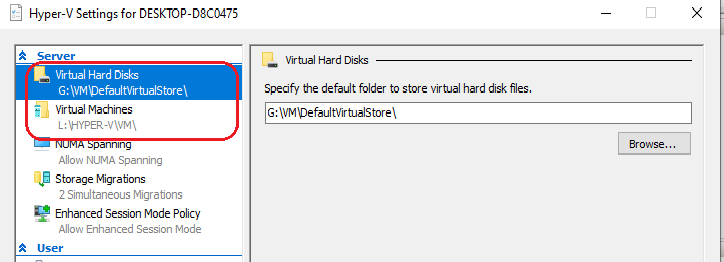

  * Open `Virtual Switch Manager`

  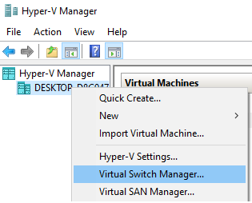

  * Create new `External` virtual switch to access the Internet
  
  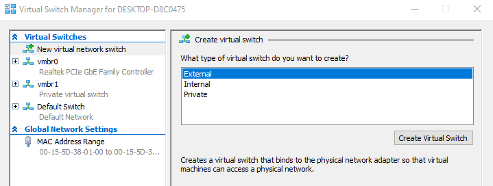
  
  * Setup name `New Virtual Switch`
  
  

  ## Create VMs in `Hyper-V`
  1. ### Create `Manjaro` Linux VM
     1.1 [Download minimal `Manjaro`](https://manjaro.org/download/) iso file `manjaro-kde-<version>.iso`.

     1.2 Create new Virtual Machine in `Hyper-V`

     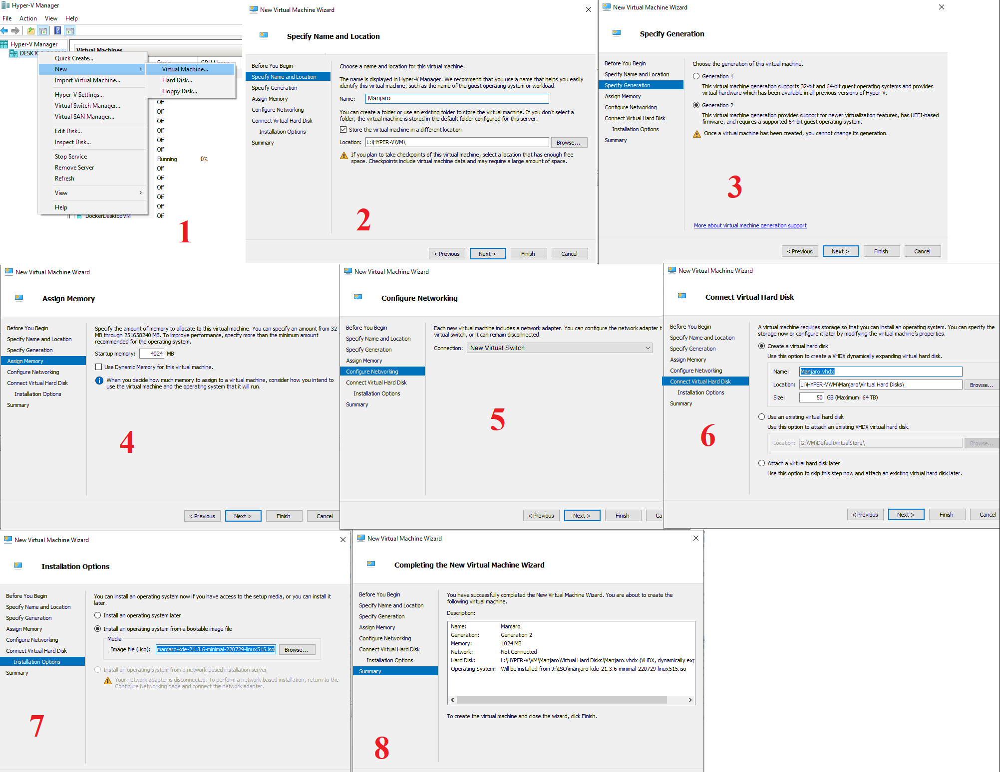

     1.3  Change VM settings

     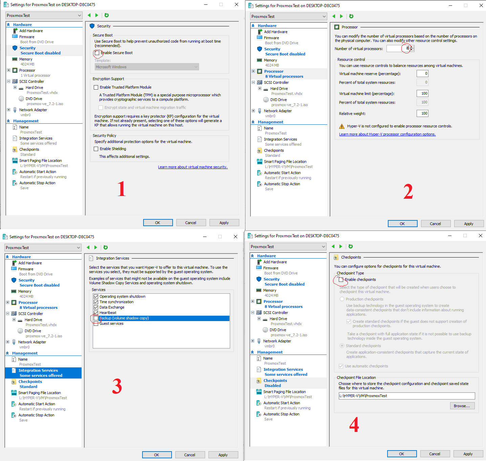

     1.4 Start created VM

     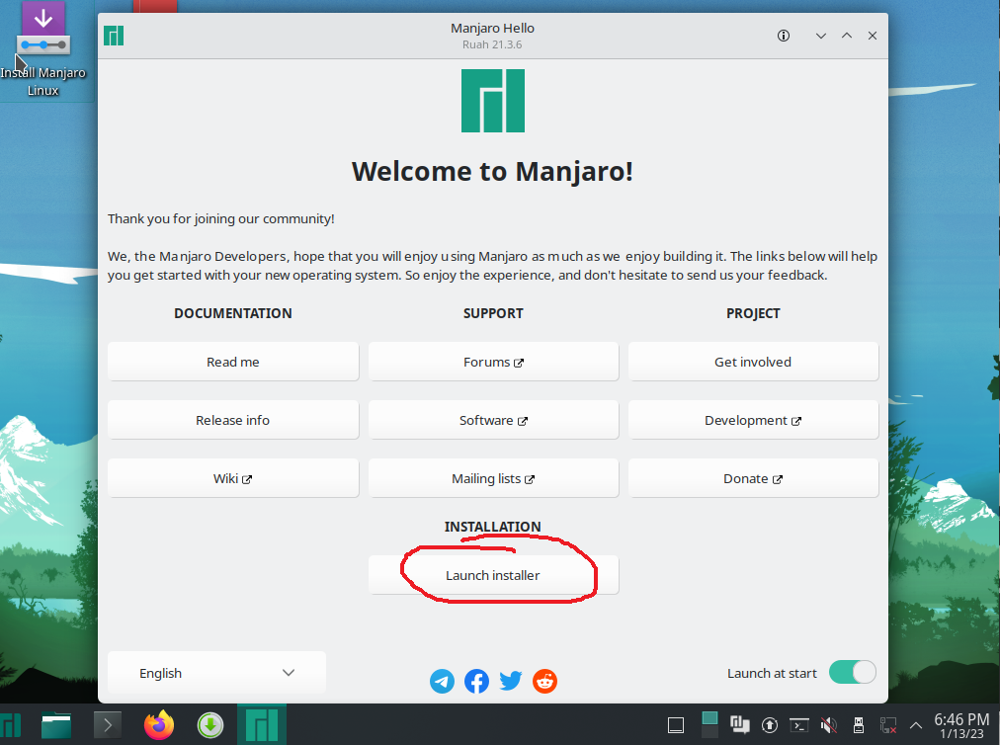

     1.5 Follow the installation instructions

     1.6 Reboot VM

     1.7 Install and enable `ssh` on `Manjaro`

     ```
     sudo pacman -S openssh
     sudo systemctl enable --now sshd
     ```
     * Check `ssh` status
     
        ```
        sudo systemctl status sshd
        ```
     * Configure access from outside via `ssh`, edit `/etc/ssh/sshd_config` file
     
        `PermitRootLogin yes`

        `PasswordAuthentication yes`

     * Restart `sshd` service

        ```
        sudo systemctl restart sshd
        ``` 

     * From hosted station connect to VM via `ssh`
   
        ```
        ssh asnegur@192.168.16.188
        ```

        where `asnegur` - is user of VM, `192.168.16.188` - VM IP address.
     
     1.8 Disable password confirmation in `Manjaro`
        
        Run [awesome-linux-config/manjaro/basic/sudo_nopasswd.sh](https://github.com/Alliedium/awesome-linux-config/blob/master/manjaro/basic/sudo_nopasswd.sh)
  
  2. ### Create `Proxmox` VM with `ZFS`

     2.1 [Download `Proxmox`](https://www.proxmox.com/en/downloads/category/iso-images-pve) iso file. 

     2.2 Follow 1.2 - 1.3 steps.

     2.3 Setting up nested virtualization for Windows, open WindowsPowerShel as administrator and enter the command

        ```
        Set-VMProcessor -VMName <VMName> -ExposeVirtualizationExtensions $true
        ```

        where `<VMName>` is the name `ProxmoxTest` of your VM

        

     2.4 Start created VM

        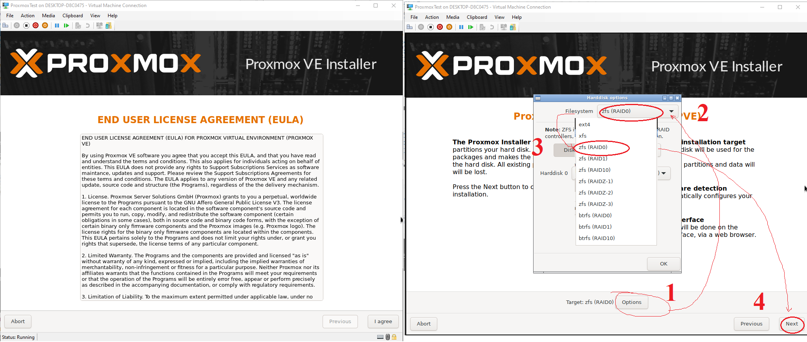

     2.5 Set up `Proxmox` subscription

       * Open terminal in `Proxmox`. Comment line in `/etc/apt/sources.list.d/pve-enterprise.list` file

         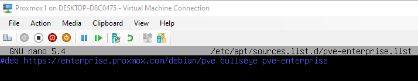
         
       * Add line in `/etc/apt/sources.list` file

          `deb http://download.proxmox.com/debian/pve bullseye pve-no-subscription`

          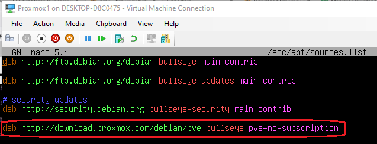

     2.6 Update package in `Proxmox`

        ```
        apt update
        apt upgrade
        ```
     2.7 Open `Proxmox` in browser 

        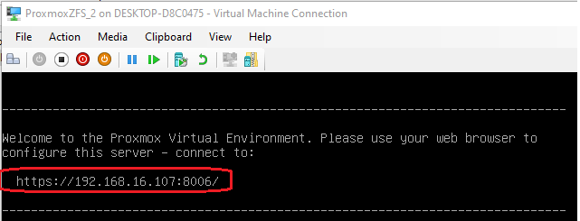

        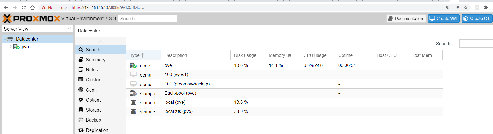

  ## References ##

  1. [Install Hyper-V on Windows 10](https://learn.microsoft.com/en-us/virtualization/hyper-v-on-windows/quick-start/enable-hyper-v)
  2. [How to Enable Virtualization on Windows 10](https://mashtips.com/enable-virtualization-windows-10/)
  3. [Run Hyper-V in a Virtual Machine with Nested Virtualization](https://learn.microsoft.com/en-us/virtualization/hyper-v-on-windows/user-guide/nested-virtualization)
  4. [Manjaro](https://manjaro.org/download/)
  5. [Proxmox](https://www.proxmox.com/en/)
  6. [Package Repositories](https://pve.proxmox.com/wiki/Package_Repositories)


     

     