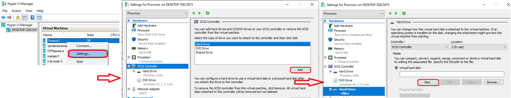
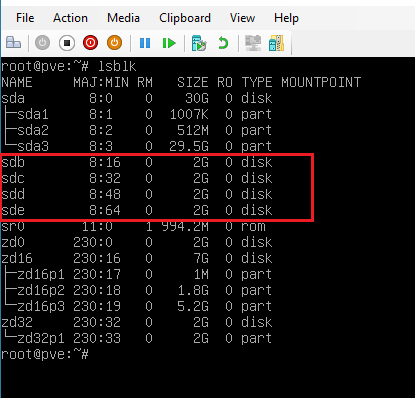

# Demo on: ZFS file system - creating zpool, dataset, snapshots, setting some zfs attributes, 18 Aug 2022

## Prerequisites

  * In `Windows` OS in `hyper-v` create and start `Proxmox` VM with ZFS file system.
  * Add four 2GB hard drivers in `Proxmox` VM settings
  

  * List of block storage devices
  
  ```
  lsblk
  ```

  

### RAID10 ###
		
* Creating a `zpool` of four added disks
		
```
zpool create mypool mirror /dev/sdb /dev/sdc mirror /dev/sdd /dev/sde
```

* show `zpool`

```
zpool list
```
			
### Data set ###

* When creating a `zpool`, the file system automatically creates a root dataset with the same name as the created zpool, `/mypool`, and mounts it in the root folder of the system. In it, we can create any files and directories.

  ```
  mkdir /mypool/data
  touch /mypool/data/file1
  touch /mypool/data/file2
  ```

  * However, in addition to this, inside the created dataset, you can create your own datasets
  
  ```
  zfs create mypool/data
  ```

  * In these data sets, you can also create files. To a first approximation, a dataset behaves like a directory. The date set cannot be in a simple directory.
Date sets allow you to take snapshots of the file system. To list the dataset use the command.

  ```
  zfs list
  ```

  * Let's choose one of the data sets - `/mypool/data` and create a `file1` file.
  
  ```
  dd if=/dev/urandom of=/mypool/data/file1 bs=1M count=500
  ```

  * Let's take a snapshot
  
  ```
  zfs snapshot mypool/data@snap1
  ```

  This command creates a special read-only date set that cannot be changed. It is a complete copy of `/mypool/data`. To see it on the list

  ```
  zfs list -t all
  ```

  When creating a snapshot, data is not copied, only the metadata of the data set is copied with all the information, what files it contains and what blocks these files consist of.

  * Let's create another `file2` file.
  
  ```
  dd if=/dev/urandom of=/mypool/data/file2 bs=1M count=100
  ```

  * Let's delete the file `mypool/data/file1`

  ```
  rm /mypool/data/file1
  zfs list -t all
  ```

  * We see that the snapshot is the size of the deleted file. The snapshots are available as directories of this dataset.
  
  ```
  ls /mypool/data/.zfs/snapshot/snap1
  ```

  You can copy the deleted file to a new location or rollback the dataset state from any version.

  ```
  zfs rollback mypool/data@snap2
  ```
					
## Attributes ##
  This will determine in what mode the file system will work.

  * Get all attributes of `ZFS`
  
  ```
  zfs get all
  ```

  Some attributes cannot be changed.

  Attributes are inherited for internal attributes unless explicitly overridden.

  ### **Quota** ### 
    
  A quota is a limit on the use of disk space. To set a quota for a dataset, you must set an attribute.

  ```
  zfs set quota=1G mypool
  ```

  Restrictions apply to all date sets in total. The limits refer to the actual disk space.

  * Let's try to write the `file3` file to the `/mypool/data` dataset
  
  ```
  dd if=/dev/urandom of=/mypool/data/file3 bs=1M count=1000
  ```
  Log output - quota exceeded

  ### **Data Deduplication** ###

  Different users copy the same files to their folders. Therefore, when creating a new data block, it is checked if it already exists in the system. If there is, it is not written but reused using the pointer. To do this, the file system keeps a hash table of all blocks and uses it to find duplicates.

  * Activate deduplication.
  
  ```
  zfs set dedup=on mypool
  ```

  * Let's create a simple  `/mypool/test` text file and copy any text to the file, save it.
  
  ```
  nano /mypool/test
  ```

  * Copy the file several times
  
  ```
  cp /mypool/test /mypool/test1
  cp /mypool/test /mypool/test2
  cp /mypool/test /mypool/test3
  cp /mypool/test /mypool/test4
  ```

  Let's look at the result (column DEDUP)

  ```
  zpool list mypool
  ```

  ### **Data compression** ###

  * Let's delete the pool and create a new one.
  
  ```
  zpool destroy mypool
  ```
  ```
  zpool create mypool mirror /dev/sdb /dev/sdc mirror /dev/sdd /dev/sde
  ```

  * Let's create a dataset `mypool/data`
  
  ```
  zfs create mypool/data
  ```

  * Let's display the attributes associated with data compression
  
  ```
  get compression mypool
  ```

  ```
  get compression mypool/data
  ```

  * Set the compression attribute
  
  ```
  zfs set compression=zstd mypool
  ```

  We see that the algorithm type has changed to zstd.

  * Let's create a text file

  ```
  nano /mypool/deta/text
  ```

  * Display attributes related to data compression

  ```
  zfs get compressratio mypool
  zfs get compressratio mypool/data
  ```

## References on: ZFS file system - creating zpool, dataset, snapshots, setting some zfs attributes, 18 Aug 2022 ##

1. [wikipedia ZFS](https://en.wikipedia.org/wiki/ZFS)
2. [What is ZFS? Why are People Crazy About it?](https://itsfoss.com/what-is-zfs/)
3. [ZFS performance](https://serverfault.com/questions/511154/zfs-performance-do-i-need-to-keep-free-space-in-a-pool-or-a-file-system)
4. [ZFS 80 Percent Rule](https://www.45drives.com/community/articles/zfs-80-percent-rule/)
5. [OpenZFS](https://en.wikipedia.org/wiki/OpenZFS)
6. [The ZFS filesystem](https://www.ithands-on.com/2020/09/linux-101-zfs-filesystem-cow-system.html)
7. [ZFS Education](https://nexenta.com/company/downloads/zfs-education)
8. [ZFS, Capacity](https://en.wikipedia.org/wiki/ZFS#:~:text=256%20quadrillion%20zebibytes%20(2128%20bytes)%3A%20maximum%20size%20of%20any%20zpool)
