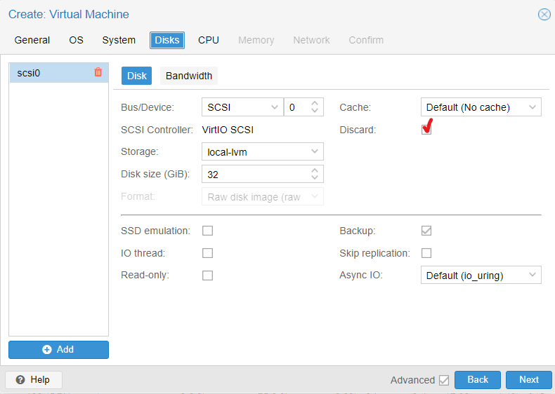
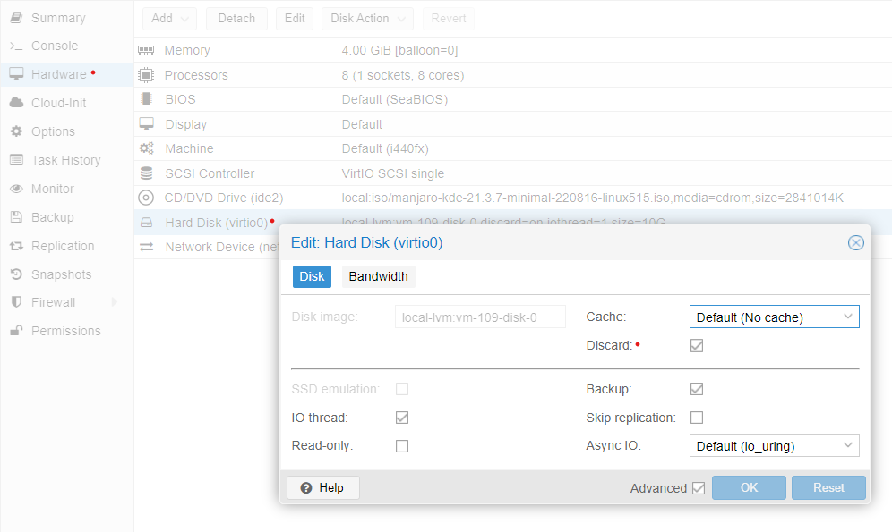

# Proxmox resize storage, SSH access, Proxmox backups #

### Table of contents ###

- [How to resize storage on Proxmox](#resize)
- [Setting up SSH access](#ssh)
- [Setting up backups on Proxmox](#backup)

---

## <a id="resize"></a>How to resize storage on Proxmox ##

### Prerequisites: ###

- The following commands were executed on VM with [Rocky 8 Linux distribution](https://download.rockylinux.org/pub/rocky/8/isos/x86_64/Rocky-8.7-x86_64-minimal.iso) with _ext4_ filesystem (however, almost the same commands might be performed on a machine with other Linux distribution OS).
- Partition scheme (*Standard Partition*, *LVM* or *LVM Thin Provisioning*) is chosen on [step 7 of Lesson 1](../01_devops_introductory_virtualization_09-aug-2022/README.md#scheme_selection).
- In this example we have root partition the last by order.
    #### Note: However, this is not critical as long as we are using _growpart_ utility. Otherwise, the order matters (e.g., if we use _fdisk_ or _gparted_) ####
- Discard checkbox should be checked (for _fstrim_ usage) like this:
    - This setting is here when creating your VM:
    
    - This setting is here if you want to edit it later:
    

### Resize LVM Thin Pool: ###

_lsblk_ lists information about all available or the specified block devices. The command prints all block devices (except RAM disks) in a tree-like format by default.

```
lsblk
```

Resize disk in Proxmox UI: \[Hard Disk] > \[Disk Action] > \[Resize].

Install the _growpart_ utility:

```
sudo dnf install cloud-utils-growpart
```

Check info in the partitions table:

```
sudo fdisk -l
```

Check block devices details:

```
lsblk
```

Resize partition:

```
sudo growpart /dev/vda 2
```

```
sudo fdisk -l
```

```
lsblk
```

```
sudo lvs
```

```
df -hT
```

```
sudo pvs
```

Resize physical volume:

```
sudo pvresize /dev/vda2
```

```
sudo pvs
```

```
sudo vgs
```

```
sudo lvdisplay
```

Resize pool:

```
sudo lvextend -l +100%FREE /dev/wrl/pool00
```

```
sudo lvs -a
```

Resize root:

```
sudo lvextend -L 13.96g /dev/wrl/root
```

Resize file system:

```
sudo resize2fs /dev/wrl/root
```

Go to the node's shell & check VM size and data percentage:

```
lvs -a
lvs -a | grep vm-<id>-disk
```

Go back into VM and run the command to create a file which would consume 2G:

```
dd if=/dev/urandom of=image.crypted bs=1M count=2048
```

Check percentage of used has increased in the VM:

```
df -h
```

Check percentage of used has increased on the node level:

```
lvs -a | grep vm-<id>-disk
```

Go back into VM and run the command to remove the file:

```
rm image.crypted
```

Check percentage of used has decreased in the VM:

```
df -h
```

Check percentage of used is the same on the node level:

```
lvs -a | grep vm-<id>-disk
```

Go back to VM console and run the command to discard blocks which are not used by filesystem:

```
sudo fstrim -a -v
```

Check percentage of used has decreased on the node level:

```
lvs -a | grep vm-<id>-disk
```

### Resize standard partition (no LVM) ### 

Check actual state:

```
df -hT
```

Resize disk in Proxmox UI: \[Hard Disk] > \[Disk Action] > \[Resize]

```
df -hT
```

Resize the partition:

```
sudo growpart /dev/vda 2
```

```
lsblk
```

Resize file system:

```
sudo resize2fs /dev/vda2
```

---

## <a id="ssh"></a>Setting up SSH access ##

There are several ways to set up access via SSH.

### Using SSH agent: ###

Check actual state of _sshd_:

```
sudo systemctl status sshd
```

Generate SSH keys

```
ssh-keygen
```

In order to copy public SSH key to the machine we are going to access, we need to take the following actions.
- Enable SSH on your target VM:

```
sudo systemctl enable sshd --now
```

- Then edit `sshd_config` file on your target VM:

```
sudo sed -i "s/#Port 22/Port 22/; s/#PubkeyAuthentication yes/PubkeyAuthentication yes/" /etc/ssh/sshd_config
```

- Run `sudo cat /etc/ssh/sshd_config` in order to make sure that the following lines are not commented have the values as below:

```
Port 22
PubkeyAuthentication yes
PasswordAuthentication yes
```

- In the case you made any changes restart the _sshd_:

```
sudo systemctl restart sshd
```

- Then establish the connection from the node via SSH (you will be asked to enter password):

```
ssh <manjaro-user>@<manjaro-ip>
```

- Then you can run `ssh-copy-id` command as following (you will be asked to enter password as well) in order to send public key to the machine we want to access:

```
ssh-copy-id -i <path> <user>@<ip>
```

Enter with the key:

```
ssh -i <path> <user>@<ip>
```

Run agent:

```
eval `ssh-agent`
```

Add user identity:

```
ssh-add <path>
```

Access the machine:

```
ssh <ip>
```

Exit the VM:

```
exit
```

### Using alias from config file: ###

Add entry to the config file:

```
cat <<EOF > ~/.ssh/config
Host <alias>
HostName <ip of the machine we are going to access>
User <user>
IdentityFile <path>
EOF
```

Edit permissions:

```
sudo chown -R <user>:<user> ~/.ssh
sudo chmod 600 ~/.ssh/config
```

Check you can access the VM:
```
ssh <alias>
```

Now you can disable access by password.
To do this, edit the `sshd_config` file on the machine you are connecting to:

```
sudo sed -i "s/PermitRootLogin yes/PermitRootLogin no/; s/PasswordAuthentication yes/PasswordAuthentication no/" /etc/ssh/sshd_config
```

Run `sudo cat /etc/ssh/sshd_config` in order to make sure that the following lines are not commented and have the values as below:

```
PermitRootLogin no
PubkeyAuthentication yes
PasswordAuthentication no
```

Restart _sshd_ to apply the changes:

```
sudo systemctl restart sshd
```

Check you can still access the VM from the host after the changes:

```
ssh <alias>
```

---

## <a id="backup"></a>Setting up backups on Proxmox ##

### Prerequisites: ###

Add 2 hard disks 20G VirtIO Block each to the cluster which needs to be set for backups.

### Steps: ###

Run _lsblk_ in the node's shell to check the names the disks got.

```
lsblk
```

Create pool:

```
zpool create bpool mirror vdb vdc
```

```
lsblk
```

```
zfs list
```

Create dataset:

```
zfs create bpool/backups
```

Set quota:

```
zfs set quota=20G bpool
```

Check quota:

```
zfs get quota bpool
```

Set compression:

```
zfs set compression=zstd bpool
```

Check compression:

```
zfs get compression bpool
```

Create user:

```
useradd backup_user
```

```
passwd backup_user
```

Check ZFS properties:

```
zfs list
```

Set user as backups folder owner:

```
cd /bpool/
```

```
chown -R backup_user:backup_user ./backups
```

```
cd ..
```

Install _samba_:

```
apt install samba
```

Make user samba user:

```
smbpasswd -a backup_user
```

View samba config file:

```
cat /etc/samba/smb.conf
```

Edit samba config by adding following section to it:

```
cat << EOF >> /etc/samba/smb.conf
server role = standalone server
create mask = 0777
directory mask= 0777
[share]
comment = root share
browseable = yes
path = /storage/share
guest ok = no
read only = no
EOF
```

Test the config file:

```
testparm
```

Restart the service:

```
systemctl restart smbd
```

Check the service status:

```
systemctl status smbd
```

Save the IP address for further setting in UI:

```
ip a
```

---

## References ##

1. [File storage, block storage, or object storage?](https://www.redhat.com/en/topics/data-storage/file-block-object-storage)
2. [How To Use SSH to Connect to a Remote Server](https://www.digitalocean.com/community/tutorials/how-to-use-ssh-to-connect-to-a-remote-server)
3. [Proxmox: Backup and Restore](https://pve.proxmox.com/wiki/Backup_and_Restore)
4. [Samba Documentation](https://www.samba.org/samba/docs/current/man-html/smbd.8.html)
5. [Server Message Block](https://en.wikipedia.org/wiki/Server_Message_Block)
6. [Microsoft SMB Protocol and CIFS Protocol Overview](https://docs.microsoft.com/en-us/windows/win32/fileio/microsoft-smb-protocol-and-cifs-protocol-overview)