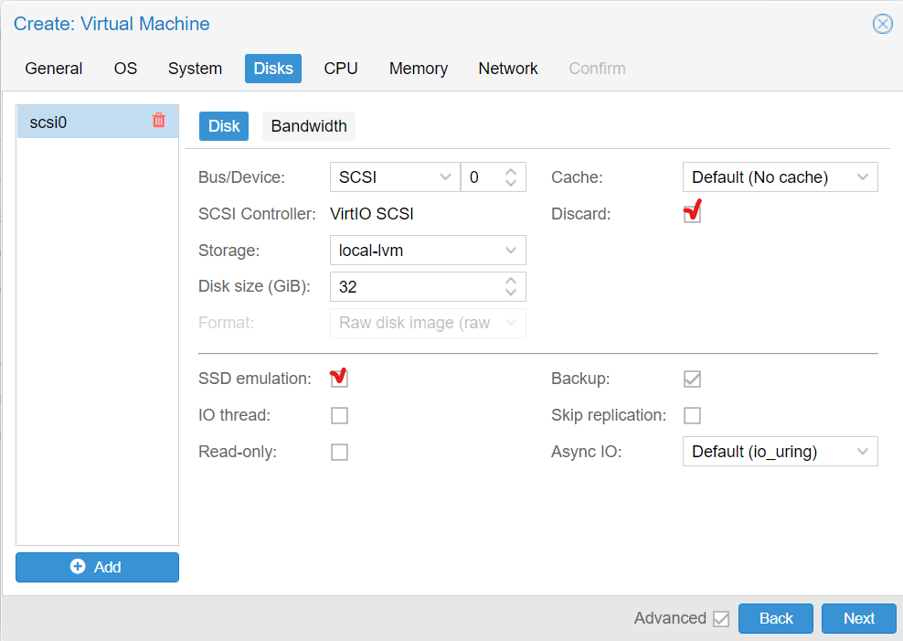

##  Why and how to use Trim/Discard ## 

LVM normally allocates blocks when a volume is created. 
LVM thin pools instead allocates blocks when they are written. 
This behaviour is called thin-provisioning, because volumes can be much larger than physically available space.

It is good practice running _fstrim_ (discard) regularly on VMs and containers. 
This releases data blocks that the filesystem isn’t using anymore. 
It reduces data usage and resource load. 
Most modern operating systems issue such discard commands to their disks regularly. 
It's only necessary to ensure that the Virtual Machines enable the disk discard option.

According to official documentation,`Discard` and `SSD Emulation` flags for drive have to be enabled.
- To enable discard check the according checkbox:
  - The setting is here when creating a VM:
    - 
  - The setting is here when editing:
    - 
- The SSD emulation is enabled by default at VirtIO Block devices. If other type is used (e.g., SCSI) it's necessary to enable it explicitly as shown below:
  - 
- Regularly run `fstrim` inside guest OS (doesn't matter whether hdd or ssd is used on the host machine)

### Setting up fstrim ###

Check if fstrim.timer is enabled:
```
[user@rocky]$ sudo systemctl status fstrim.timer
● fstrim.timer - Discard unused blocks once a week
Loaded: loaded (/usr/lib/systemd/system/fstrim.timer; disabled; vendor preset: disabled)
Active: inactive (dead)
Trigger: n/a
Docs: man:fstrim
```
Enable & start fstrim.timer:
```
[user@rocky]$ sudo systemctl enable --now fstrim.timer
```

Make sure it got started now:
```
[user@rocky]$ sudo systemctl status fstrim.timer
● fstrim.timer - Discard unused blocks once a week
Loaded: loaded (/usr/lib/systemd/system/fstrim.timer; disabled; vendor preset: disabled)
Active: active (waiting) since Thu 2022-09-08 03:26:48 EEST; 4s ago
Trigger: Mon 2022-09-12 00:35:31 EEST; 3 days left
Docs: man:fstrim

Sep 08 03:26:48 rocky systemd[1]: Started Discard unused blocks once a week.
```

Edit fstrim.timer settings (if necessary):
```
[user@rocky]$ sudo nano /lib/systemd/system/fstrim.timer
```

Save the file (Ctrl+S), exit nano (Ctrl+X), restart fstrim.timer to apply new settings:
```
[user@rocky]$ sudo systemctl restart fstrim.timer
```