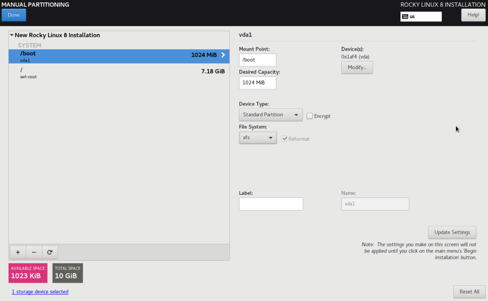
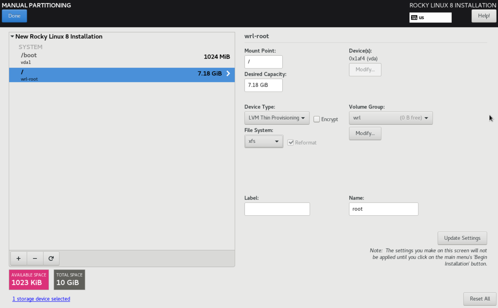

## How to resize a logical volume with LVM ##

### Prerequisites ###

- The following commands were executed on VM with [Rocky 8 Linux distribution](https://download.rockylinux.org/pub/rocky/8/isos/x86_64/Rocky-8.7-x86_64-minimal.iso) with _xfs_ filesystem (however, almost the same commands might be performed on a machine with other Linux distribution OS).
    See the general instructions on VM creation & OS installation in [Lesson 1](../../01_devops_introductory_virtualization_09-aug-2022/README.md).
- On [step 12 of Lesson 1](../../01_devops_introductory_virtualization_09-aug-2022/README.md#filesystem_selection) select _xfs_:
    
    

### Summary ###

What needs to be done: 
1. Attach a new storage to the system. 
2. Create a new Physical Volume (PV) from that storage. 
3. Add the PV to the Volume Group (VG) 
4. Extend the Logical Volume (LV).

The xdb disk is the new disk attached to it. 
Extend the root partition to make it 11G in size (initially 9 in our example).

_lsblk_ command displays volume sizes:
```
lsblk
```

### Create Physical Volume ###

_pvcreate_ command to create a new physical volume
Use the _pvcreate_ command to designate a disk as a PV.
```
sudo pvcreate /dev/xdb
```

Physical volume "/dev/xdb" is successfully created.

When a new storage /dev/xdb is attached, it's necessary to use the _pvcreate_ command in order for the disk to be initialized and seen by the Logical Volume Manager (LVM).

### Identify Volume Group ###

Identify the Volume Group (VG) which the new disk is extending with the _vgs_ command. 
```
sudo vgs
```
_vgs_ command displays volume group information

### Extend Volume Group ###

The _vgextend_ adds one or more initialized Physical Volumes to an existing VG to extend its size.

We are going to extend the rl Volume Group.

The _vgextend_ command adds capacity to the VG.
```
sudo vgextend rl /dev/xdb
```
_vgdisplay_ provides a detailed overview of the VG (all the VGs in the LVM and the complete information about them)
```
sudo vgs
```
_vgs_ command displays volume group information
```
sudo vgdisplay
```

Now we have 2GB free. 
It is possible to extend all or some amount of storage size to it.

### Identify Logical Volume ###

The _lvs_ or _lvdisplay_ command shows the Logical Volume associated with a Volume Group. 
We've already extended the VG, so now it's necessary to extend the Logical Volume.
```
sudo lvs
```

### Extend Logical Volume ###

Extend the LV from the Volume Group with the _lvextend_ command:
```
sudo lvextend -l +100%FREE /dev/rl/root
```

### Extend filesystem ###

Check current file system type with one of the following commands:
```
lsblk -f
```
 or 
```
df -Th.
```

Resize the filesystem on the Logical Volume after it has been extended to show the changes. 
Resize the XFS filesystem by using the _xfs_growfs_ command.
```
sudo xfs_growfs /dev/rl/root
```

Finally, verify the size of the extended partition using the _df -h_ command to display storage information:
```
df -h
```

