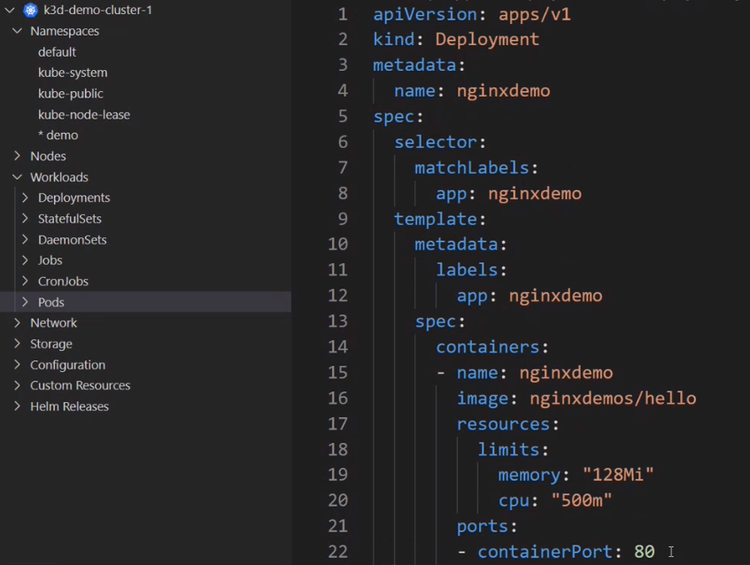
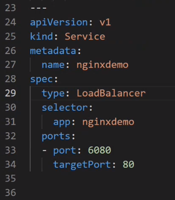

## Kubernetes Development Basic Tools, 15 Sep 2022 ##

### Prerequisites ###

- The following commands were executed on VM with [Manjaro Linux distribution](https://manjaro.org/download/) (however, they might be performed on another Linux distribution, but the command might differ, e.g. another package manager etc.)
- Docker installed (see [Lesson 5 prerequisites](../05_docker_basic_commands_postgres_23-aug-2022/README.md))
- _k3d_ Kubernetes realization (k3s-in-Docker) installed 
    * If you have run [Alliedium scripts](https://github.com/Alliedium/awesome-linux-config/tree/master/manjaro#instructions) for Manjaro, `k3d` should be already installed. You can check the installation by the command:

        ```
        k3d version
        ```
      
    * If _k3d_ is not installed follow the [instructions](https://k3d.io/v5.4.6/#requirements)
- administrative command line tool _kubectl_ installed
    * If you have run [Alliedium scripts](https://github.com/Alliedium/awesome-linux-config/tree/master/manjaro#instructions) for Manjaro, _kubectl_ should be already installed. Check if available with the command (list of available commands and usage information should be displayed as a result):
        
        ```
        kubectl
        ```
      
    * If _kubectl_ is not installed follow the [instructions](https://kubernetes.io/ru/docs/tasks/tools/install-kubectl/)
- plugin manager _krew_ for _kubectl_ installed
    * If you have run [Alliedium scripts](https://github.com/Alliedium/awesome-linux-config/tree/master/manjaro#instructions) for Manjaro, _krew_ should be already installed. Check if available with the command:

        ```
        kubectl krew version
        ```
      
    * If _krew_ is not installed follow the [instructions](https://krew.sigs.k8s.io/docs/user-guide/setup/install/)
    * Once _krew_ is installed, run the command:

        ```
        kubectl krew update
        ```

- three plugins for kubectl installed via _krew_:
    * _ctx_ for easy change of context. To install the plugin run the command:

        ```
        kubectl krew install ctx
        ```
      
    * _ns_ for easy change of namespace. To install the plugin run the command:

        ```
        kubectl krew install ns
        ```
      
    * _konfig_ helps to merge, split or import kubeconfig files. To install the plugin run the command:

        ```
        kubectl krew install konfig
        ```

**Remark:** _kubectx_ is a separate tool with almost the same functionality as the plugins `ctx` and `ns`. 
In this instruction the plugin-style commands `kubectl ctx`, `kubectl ns` are used as equivalents to `kubectx` and `kubens` respectively.

- Actualize the project code:
```
cd $HOME/devops-course-2022
git pull
```

### Steps ###

1. Check if there exists a default `kubectl` configuration file:

```
ls $HOME/.kube/config
```

The output is `No such file or directory` as at the very beginning there is no `~/.kube` directory. 
Once the file is created, its contents might be validated with `cat $HOME/.kube/config`.

2. Create Kubernetes one-node cluster named `demo-cluster-1` with local container registry named `demo-registry`:

```
k3d cluster create demo-cluster-1 --registry-create demo-registry:12345
```

Creation takes about one minute.

3. See the cluster in the cluster list:  

```
k3d cluster list
```

4. Get the contents of the default `kubectl` configuration file:

```
cat ~/.kube/config
```

At the very beginning, there should be one cluster `k3d-demo-cluster-1`, one context `k3d-demo-cluster-1`, one user. 
Take into account the `k3d-` prefix to the cluster name, which is used by _kubectl_.

5. Since _k3d_ is "_k3s_ in Docker", let's see the containers that are used for the cluster   

```
docker ps --format "table {{.ID}}\t {{.Image}}\t {{.Ports}}\t {{.Names}}"
```

Container named `k3d-demo-cluster-1-serverlb` includes the external LoadBalancer, `k3d-demo-cluster-1-server-0` contains the cluster node, and `demo-registry` includes the local container registry created with the cluster

6. Create one more cluster:

```
k3d cluster create demo-cluster-2
```

7. See the contents of the `kubeconfig` file:

```
cat ~/.kube/config
```

There are two clusters, two contexts, two users. 
The current context points to the cluster created later: `current-context: k3d-demo-cluster-2`.

8.	Get the current context by _kubectl config_:

```
kubectl config current-context
```

Output: `k3d-demo-cluster-2`

9. Switch the current context by _kubectl config_:
	
```
kubectl config use-context k3d-demo-cluster-1
```

Switched to the context `k3d-demo-cluster-1`.

10. Try easy context switching by _ctx_ plugin command:

```
kubectl ctx
```

List of two records, `k3d-demo-cluster-1`, `k3d-demo-cluster-2`, is displayed. 
You can choose a record by `<Up>` and `<Down>` arrow keys.

Choose `k3d-demo-cluster-2`, hit `<Enter>`. Switched to the context `k3d-demo-cluster-2`

```
kubectl ctx
```

Choose `k3d-demo-cluster-1`, hit `<Enter>`. Switched to the context `k3d-demo-cluster-1`

11. Get list of namespaces in the current context cluster:

```
kubectl get namespaces
```

List of namespaces is displayed.

12. Try easy namespace switching by _ns_ plugin command:

```
kubectl ns
```

List of namespaces, the same as in the previous step, is displayed. 
You can choose a record by `<Up>` and `<Down>` arrow keys.

Choose `default`, hit `<Enter>`.

Output: 

```
Context "k3d-demo-cluster-1" modified.
Active namespace is "default".
```
  
13. See the modified context in the `kubeconfig` file:

```
cat ~/.kube/config
```

Added field `namespace: default` to the context `k3d-demo-cluster-1`.


14. Look for container image to deploy in Kubernetes cluster: 

```
docker images
```

If there is no image `demo-multi-stage`, e.g.

```
bkarpov/demo-multi-stage   0.1
```

it can be built by running the following commands:

```
cd $HOME/devops-course-2022/08_docker_best_building_practices_06-sep-2022/demo-multi-stage-improved
docker build -t bkarpov/demo-multi-stage:0.1 --build-arg BASE_IMAGE=gradle:7.5.1-jdk11-alpine .
```

Finally, there should be an image `demo-multi-stage`.

15. Add a tag to the image for pushing it to local container registry:

```
docker tag bkarpov/demo-multi-stage:0.1 localhost:12345/demo-multi-stage:0.1
```

Make sure that the tag has been added:

```
docker images
```

There should be at least two images `demo-multi-stage`, one of them `localhost:12345/demo-multi-stage:0.1`.


16. Push the image to the local container registry:

```
docker push localhost:12345/demo-multi-stage:0.1
```

17. See manifest file for deploying the image to the Kubernetes cluster:

```
cd $HOME/devops-course-2022/11_k8s_dev_tools_kubectl_krew_vscode_15-sep-2022/demo
cat ./manifest-demo-multi-stage.yaml
```

18. Apply the manifest:

```
kubectl apply -f ./manifest-demo-multi-stage.yaml
```

Output:

```
namespace/demo created
deployment.apps/demo-multi-stage created
service/demo-multi-stage created
```

19. Switch to the `demo` namespace:

```
kubectl ns
```

List of namespaces is displayed, with the new namespace `demo` at the bottom of the list. 

Choose `demo`, hit `<Enter>`

Output: 

```
Context "k3d-demo-cluster-1" modified.
Active namespace is "demo".
```

20. Check the pods in the active namespace:

```
kubectl get pods
```

There should be at least one running pod with name starting at `demo-multi-stage-...`, the end part of the name being generated by Kubernetes

21. Check the services in the active namespace:

```
kubectl get services
```
There should be at least one service named `demo-multi-stage`.

22. See the logs of the pod `demo-multi-stage-...`.

If there is only one such a pod, run the command:

```
kubectl logs $(kubectl get pods -o name | grep demo-multi) --tail=3
``` 

Otherwise, you should use the pod name, i.e. complete name with Kubernetes-generated end part:

```
kubectl logs <pod_name> --tail=3
```

The last 3 lines of the pod logs should be displayed.

23. Forward the host port 7080 to the port 8080, which is listening by the service:

```
k3d cluster edit demo-cluster-1 --port-add 7080:8080@loadbalancer
```

Kubernetes renames existing loadbalancer, creates a new one with ports forwarded, stops the existing one, starts the new one, and deletes the old one.  

24. See the containers that are used for the clusters: 

```
docker ps --format "table {{.ID}}\t {{.Image}}\t {{.Ports}}\t {{.Names}}"
```

Container named `k3d-demo-cluster-1-serverlb` now has forwarded ports `7080->8080`.

25. Test the Spring Boot application running in a container inside the pod:

```
curl http://127.0.0.1:7080
```
Output: `Greetings from Spring Boot!%` (The app is running)

SUCCESS

26. Delete the service to see that it is necessary for connect to the application:

```
kubectl delete service demo-multi-stage
```

27. Test the application again:

```
curl http://127.0.0.1:7080
```

Output: `curl: (52) Empty reply from server` (No connection to the app)

28. Restore the service by applying the manifest once again:

```
kubectl apply -f ./manifest-demo-multi-stage.yaml
```

Output:

```
namespace/demo unchanged
deployment.apps/demo-multi-stage unchanged
service/demo-multi-stage created
```

29. Extract a minimal `kubeconfig` for the context `k3d-demo-cluster-1`:

```
kubectl konfig export k3d-demo-cluster-1 > ~/.kube/k3d-demo-cluster-1.config
```

Output is written to file `~/.kube/k3d-demo-cluster-1.config`.

30. See the contents of the file `~/.kube/k3d-demo-cluster-1.config`:

```
cat ~/.kube/k3d-demo-cluster-1.config
```

Fix the host (VM) port of the cluster, e.g. 38857 for the following example:

```
apiVersion: v1
clusters:
- cluster:
    certificate-authority-data: LS0tLS...
    server: https://0.0.0.0:38857
  name: k3d-demo-cluster
...
```

31. Logout from the VM:

```
exit
```

SSH connection to the VM is closed. 
The terminal is running now on the local machine.

32. Use your SSH connection data and your HOME path on the VM to copy the extracted context via SSH to the local machine.

`<ssh_connection_data>` can have the form `<login_on_VM>@<IP_address_of_VM>` e.g. `bkarpov@192.168.1.208`, 
or be an alias configured for connection to VM in  `~/.ssh/config`.

`<HOME_path>` is the absolute path to your HOME directory on the VM, e.g. `/home/bkarpov`.

```
scp <ssh_connection_data>:<HOME_path>/.kube/k3d-demo-cluster-1.config .
```

The file should be copied to the working directory on the local machine.

33. Use your cluster port fixed on step 30 to forward to the VM via SSH tunnel:

```
ssh -L <cluster_port>:127.0.0.1:<cluster_port> <ssh_connection_data>
```

e.g. `ssh -L 38857:127.0.0.1:38857 bkarpov@192.168.1.208`

34. On local machine install [VS Code](https://code.visualstudio.com/Download).

35. Open VS Code, install _Kubernetes_ plugin.

36. Switch to the _Kubernetes_ plugin.

37. Connect to the cluster on VM:

In the KUBERNETES pane, at the right-hand side of the line CLUSTERS
- click button with three dots (hint: "More Actions...")
- choose "Set Kubeconfig" in dropdown list
- choose "+ Add new kubeconfig"
- open the file saved at the Step 32

There should appear cluster `k3d-demo-cluster-1` with available Namespaces, Nods, Workloads/Deployments, Workloads/Pods, Network/Services.

38. Create a manifest:

- Open the folder where the manifests will be kept
- File > New Text File > Select a language > `YAML` > enter \[D\] > select Kubernetes Deployment template.
- We are going to create an _nginx_ deployment. Edit the values of the template to match the following (the image is taken from dockerhub):
    - 
- Add delimiter `---` to the end of file
- Then add another resource: service. Enter \[S\] > select Kubernetes Service template.
- Edit the values of the template to match the following (the port is Kubernetes external port 6080; the target port should match the container port, so it is 80; spec type must be set):
    - 
- Add namespaces in metadata both in the deployment and service parts of the manifest
- Save the file
- Open palette via \[Ctrl\] + \[Shift\] + \[P\] > select Kubernetes: Apply
- Confirm the action in the pop-up > \[Apply\]
- Forward the host port 6080 to the port 6080, which is listening by the service (it stops the previously created loadbalancer and starts the new one):

    ```
    k3d cluster edit demo-cluster-1 --port-add 6080:6080@loadbalancer
    ```
  
- Test the newly created _nginx_ service:

    ```
    curl http://127.0.0.1:6080
    ```

    Output: the nginx html file is displayed.

### Cleaning actions ###

```
k3d cluster delete demo-cluster-1
k3d cluster delete demo-cluster-2
```

### References ###

1. [Kubernetes explained in pictures: the theme park analogy](https://danlebrero.com/2018/07/09/kubernetes-explained-in-pictures-the-theme-park-analogy/)
2. [Managed Kubernetes Services Comparison: EKE vs AKS vs GKE](https://www.cloudmanagementinsider.com/managed-kubernetes-services-comparison-eke-vs-gke-vs-aks/)
3. [Amazon Elastic Kubernetes Service (EKS)](https://aws.amazon.com/ru/eks/)
4. [Azure Kubernetes Service (AKS)](https://docs.microsoft.com/en-us/azure/aks/)
5. [Google Kubernetes Engine (GKE)](https://cloud.google.com/kubernetes-engine)
6. [Lightweight Kubernetes Showdown: Minikube vs. K3s vs. MicroK8s](https://www.itprotoday.com/cloud-computing-and-edge-computing/lightweight-kubernetes-showdown-minikube-vs-k3s-vs-microk8s)
7. [Local Kubernetes development clusters: the 5 best local cluster compared](https://www.augmentedmind.de/2022/07/24/kubernetes-development-clusters/)
8. [k3s](https://k3s.io/)
9. [k3d](https://k3d.io/)
10. [kind](https://kind.sigs.k8s.io/)
11. [Microk8s](https://microk8s.io/)
12. [minikube](https://minikube.sigs.k8s.io/docs/)
13. [Using Multi-Node Clusters in minikube](https://minikube.sigs.k8s.io/docs/tutorials/multi_node/)
14. [Docker Desktop](https://www.docker.com/products/docker-desktop/)
15. [Rancher Desktop](https://rancherdesktop.io/)
16. [kubectl and k3d Installation on Manjaro Linux in Alliedium script](https://github.com/Alliedium/awesome-linux-config/blob/master/manjaro/basic/install_k3d.sh)
17. [kubectl Installation](https://kubernetes.io/ru/docs/tasks/tools/install-kubectl/)
18. [k3d Installation on Linux](https://k3d.io/v5.4.6/#installation)
19. [Installing k3d on Windows](https://www.digestibledevops.com/devops/2021/03/24/k3d-on-windows.html)
20. [kubectl config: Configure Access to Multiple Clusters](https://kubernetes.io/docs/tasks/access-application-cluster/configure-access-multiple-clusters/)
21. [k3d kubeconfig: Manage kubeconfig(s)](https://k3d.io/v5.4.6/usage/commands/k3d_kubeconfig/)
22. [kubectx + kubens: Power tools for kubectl](https://github.com/ahmetb/kubectx#kubectx--kubens-power-tools-for-kubectl)
23. [Kubernetes best practices: Organizing with Namespaces](https://cloud.google.com/blog/products/containers-kubernetes/kubernetes-best-practices-organizing-with-namespaces)
24. [krew: Plugin manager for kubectl](https://krew.sigs.k8s.io/)
25. [krew: Installing](https://krew.sigs.k8s.io/docs/user-guide/setup/install/#bash)
26. [konfig: Installation](https://github.com/corneliusweig/konfig#installation)
27. [konfig: Usage](https://github.com/corneliusweig/konfig#usage)
28. [Visual Studio Code: Download](https://code.visualstudio.com/Download)
29. [Working with Kubernetes in VS Code](https://code.visualstudio.com/docs/azure/kubernetes)
30. [Kubernetes Tools for VS Code](https://vscode-kubernetes-tools.github.io/vscode-kubernetes-tools/#tools)
31. [Visual Studio Code and Kubernetes plugin for beginners (YouTube)](https://www.youtube.com/watch?v=Si6og3Wa2Hg)
32. [Kubernetes Extension for VSCode (YouTube)](https://www.youtube.com/watch?v=jYqWDUCJ9oM)
33. [Azure Kubernetes Services Tools extension in VS Code | Azure Friday (YouTube)](https://www.youtube.com/watch?v=V-y2r8DmmrE)
34. [Use Bridge to Kubernetes to run and debug locally with Kubernetes (VS Code)](https://docs.microsoft.com/en-us/visualstudio/bridge/bridge-to-kubernetes-vs-code)
35. [How to debug and run code locally with Bridge to Kubernetes for VS Code (YouTube)](https://www.youtube.com/watch?v=t_wtaOTaPuE)