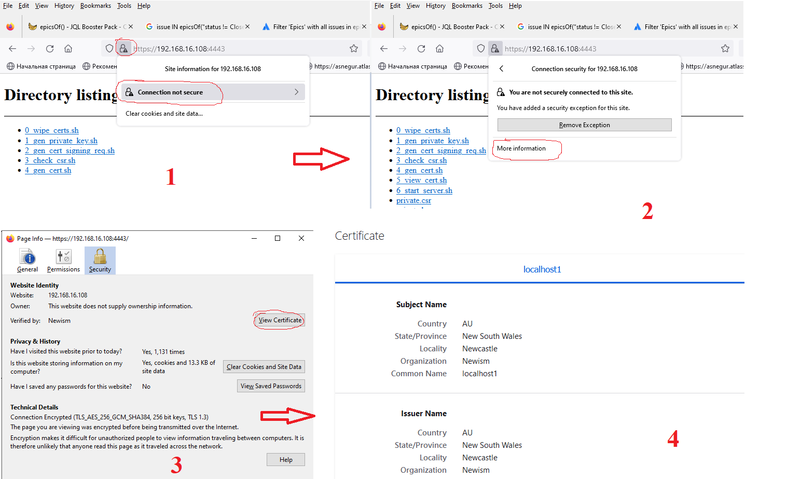

# How to generate self signed SSL Certificate

- The following commands were executed on VM with [Rocky8 Linux distribution](https://rockylinux.org/download/) (however, they might be performed on another Linux distribution, but the command might differ, e.g. another package manager etc.).
	
1. Prerequisites
		
Install python3

```
sudo dnf install python3 git -y
```

python3 is installed to `Manjaro`. To run `my-script.py` python script on `Manjaro` distribution use command

```
python ./my-script.py
```

2. Clone source files

```
git clone https://github.com/Alliedium/devops-course-2022 $HOME/devops-course-2022.git
```

3. Go to `devops-course-2022/15_networks_dsa_ca_ssl-certificates_opnsense_29-sep-2022/simple-https`
   
   ```
   cd $HOME/devops-course-2022/15_networks_dsa_ca_ssl-certificates_opnsense_29-sep-2022/simple-https
   ```
	
4. Run scripts from 0 to 6.
5. Disable `firewalld` service

```
sudo systemctl disable --now firewalld
```

6. In a browser on a host on the same subnet as the https-server, enter the address

`https://<ip_address_https_server>:4443`
	
6. Check the certificate by clicking on the padlock in the address bar of the browser.



## References ##

1. [TLS Handshake](https://www.youtube.com/watch?v=ZkL10eoG1PY&list=PLIFyRwBY_4bTwRX__Zn4-letrtpSj1mzY&index=1)
2. [What is Certificate chain? And how to validate Certificate chain](https://shagihan.medium.com/what-is-certificate-chain-and-how-to-verify-them-be429a030887)
3. [Digital Certificates — SAN, Wildcard, DV, OV, EV and SNI](https://deepaksinghwrites.medium.com/explained-digital-certificate-part-4-4d0767d857b0)
4. [Opnsense vs Pfsense](https://www.youtube.com/watch?v=Of0Zp8h258g)
5. [pfSense](https://en.wikipedia.org/wiki/PfSense)
6. [OPNsense](https://en.wikipedia.org/wiki/OPNsense)
7. [About OPNsense](https://opnsense.org/about/about-opnsense/)
8. [HSTS, Check prelad status](https://hstspreload.org/)
9. [VyOS](https://www.youtube.com/watch?v=GmGIIC7F1gU)
10. [SSL certificate revocation and how it is broken in practice](https://medium.com/@alexeysamoshkin/how-ssl-certificate-revocation-is-broken-in-practice-af3b63b9cb3)
11. [RSA public key : Behind the scene](https://medium.com/@bn121rajesh/understanding-rsa-public-key-70d900b1033c)
12. [Nginx Proxy Manager](https://nginxproxymanager.com/guide/#project-goal)
13. [What does "e is 65537 (0x10001)" mean?](https://stackoverflow.com/questions/10736382/what-does-e-is-65537-0x10001-mean)
14. [SSL validation methods](https://kb.realtimeregister.com/article/88-ssl-validation-methods)
15. [Let’s have a go at understanding what SSL validation is and the requirements that you’ll need to satisfy during the SSL validation process](https://cheapsslsecurity.com/blog/your-ssl-validation-guide/)
16. [List of router and firewall distributions](https://en.wikipedia.org/wiki/List_of_router_and_firewall_distributions)