# SSL termination with self-signed certificate #
- All Virtual machines were created in `Proxmox`, however, you might use another hypervisor (Hyper-v).
- The following commands were executed on VM with [Rocky Linux distribution](https://rockylinux.org/download/) (however, they might be performed on another Linux distribution, but the command might differ, e.g. another package manager etc.)
- `OPNsense` VM is used as firewall and router.
- The `Rocky` VM is located in a subnet that is accessed through a `OPNsense` VM. 	
- We will create the topology
  
  

## Prerequisites: ##
  - [Proxmox node](https://www.proxmox.com/en/proxmox-ve/get-started) with ~ 6 GiB RAM and ~ 30 GB local disk storage

## Create virtual machines in Proxmox

### 1. Create VM for `OPNsense`
  - Download `OPNsense` iso image, copy `https://mirror.ams1.nl.leaseweb.net/opnsense/releases/22.7/OPNsense-22.7-OpenSSL-dvd-amd64.iso.bz2` link here
  
  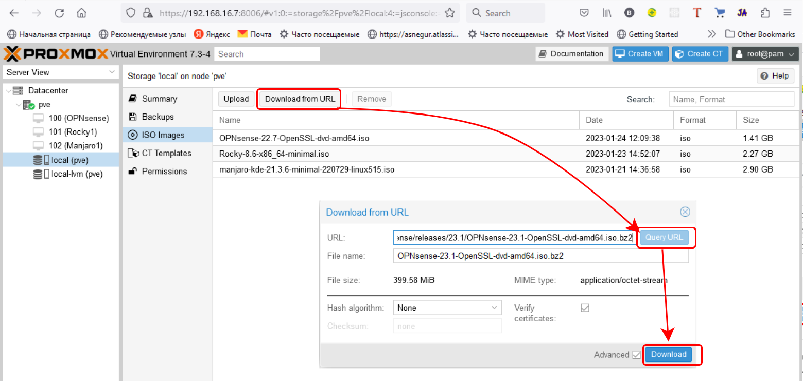

  - Download `Rocky` iso image, copy `https://download.rockylinux.org/pub/rocky/8/isos/x86_64/Rocky-8.7-x86_64-minimal.iso` link as shown above

  - Create new VM

  

  - In `Proxmox` add new `Linux` bridge

  

  - In created VM add new network interface and connect it to new `vmbr1` `Linux` bridge

  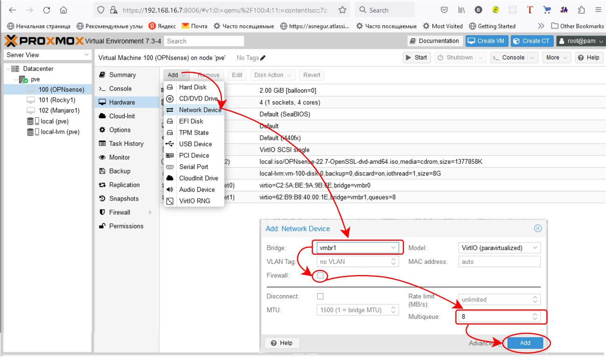

### 2.Install `OPNsense`

  - Run VM, start manual interface assignment and start `OPNsense` installation (password: `opnsense`).
  
  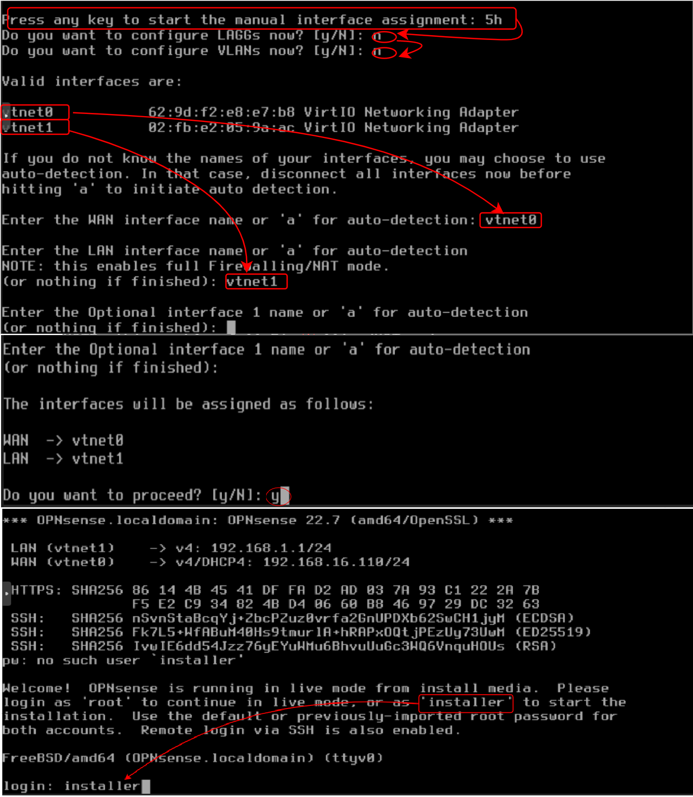

  - `OPNsense` installation

  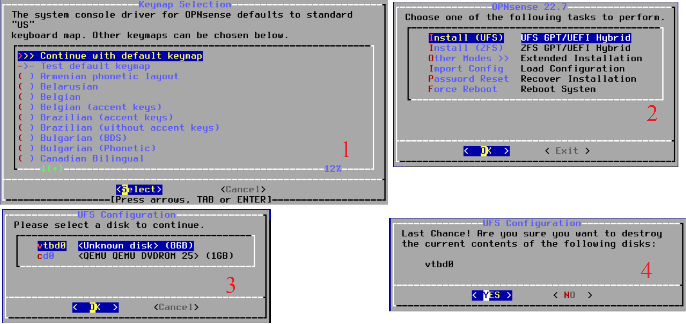

  - Reboot `OPNsense` VM.
  - Set interface LAN IP address. Login and click `2` then `enter`
  
  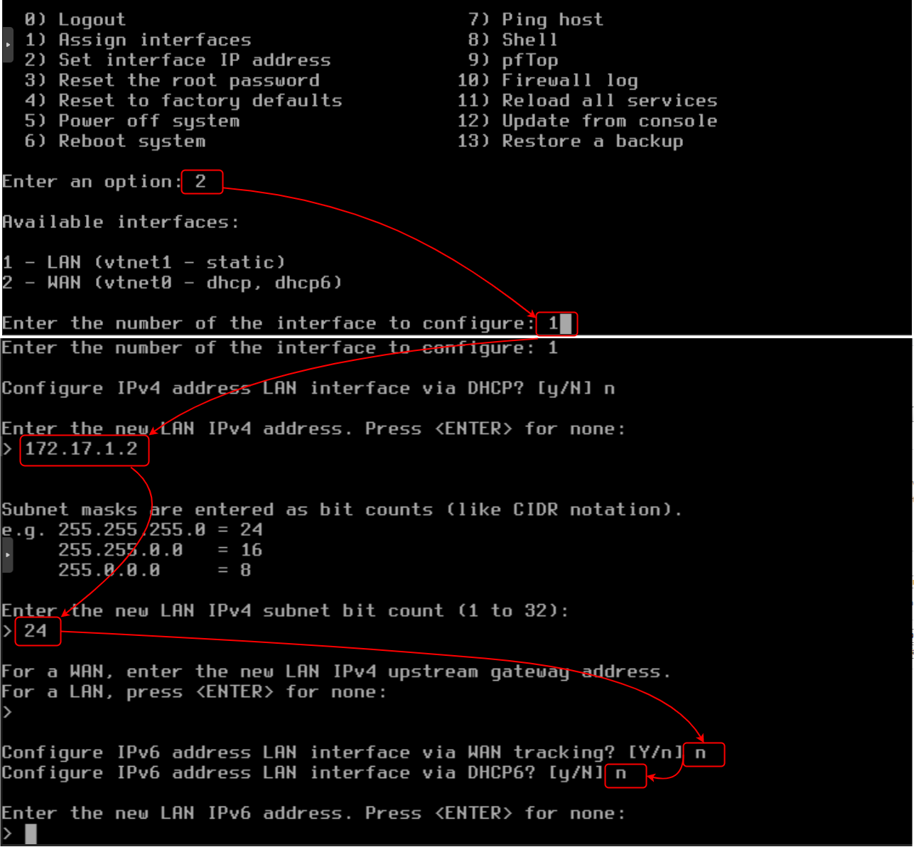

### 3. Create new `rocky-config` VM and connect network interface to `vmbr1` bridge

  

### 4. Create new  `manjaro1` VM for testing `http-server` in browser.

## Run http server on `Rocky` Linux.

### 1. Clone source files to `rocky-config` VM

  ```
  git clone https://github.com/Alliedium/devops-course-2022 $HOME/devops-course-2022.git
  ```

  Go to `~/devops-course-2022/15_networks_dsa_ca_ssl-certificates_opnsense_29-sep-2022/simple-https`
	
### 2. Run http server on `rocky-config` VM.

  ```
  python3 simple-server-http.py
  ```

### 3. In a browser on a host on the same subnet as the http-server, navigate to `http://<ip_address_http_server>:8081` and check the started http server. In my case - `http://172.17.1.100:8081`. You should see the files in the script folder it was run from.

  
 

## Configure `OPNsense`, `nginx` and create self-sign certificate.

  1. Allow access to `OPNsense` WEB GUI from  WAN network interface.
  
     This are my `OPNsense` WAN and LAN IP addresses.

     

     In a browser on a host on the same subnet as the `OPNsense` LAN navigate to `OPNsense` LAN network interface IP address (https://172.17.1.2). 

     

     - Add new Firewall rule

     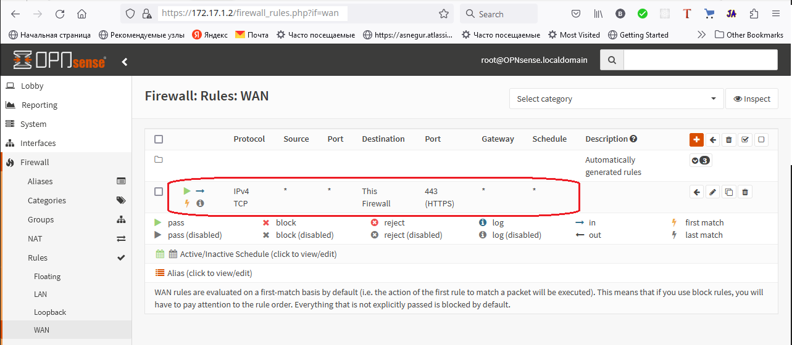

     - Disable reply-to on WAN rule
  
  

  - On your host, that is in WAN `OPNsense` subnet in browser navigate to `OPNsense` WAN IP address and login (login: root, password: opnsense, https://192.168.16.109)

### 2. Update `OPNsense`.
  
  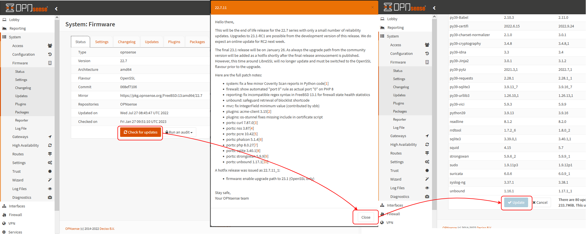

### 3. Install `qemu-guest-agent` and  `os-nginx` plugins in `OPNsense`.

  [`Qemu-guest-agent`](https://pve.proxmox.com/wiki/Qemu-guest-agent) - is used to exchange information between the host and guest, and to execute command in the guest. 

  [`Nginx`](https://en.wikipedia.org/wiki/Nginx) is a web server that can also be used as a reverse proxy, load balancer, mail proxy and HTTP cache.

  


### 4. Make port forwarding from 4822 port (WAN IP address) to `rocky-config` VM1 (http server) IP address on port 22 for `ssh` connection. 

  

  In you local machine terminal run the command and connect via `ssh` to `rocky-config` VM

  ```
  ssh user@<wan_opnsense_ip_address> -p 4822
  ```

### 5. Make port forwarding from 8081 port (WAN IP address) to VM1 `rocky-config` VM (http server) IP address on port 8081.

  

### 6. Check http server, on your work machine in a browser navigate to `http://<wan_opnsense_ip_address>:8081`

  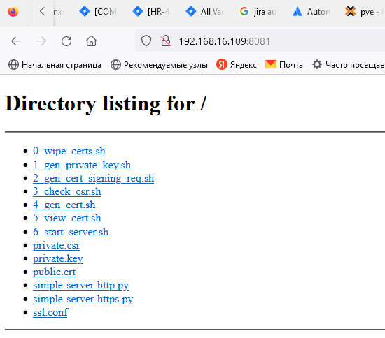

### 7. `Arp` table in `OPNsense`

  
	
### 8. DHCP Lease

  Lease - is a temporary assignment of an IP address to a device on the network

  

  You can assign some IP address to a specific mac address

### 9. Ping `rocky-config` VM from `OPNsense`

  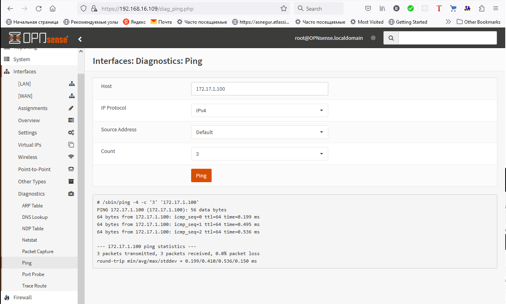

### 10. Get `OPNsense` firewall logs

  

### 11. In `OPNsense` create self-sign certificate

  - Add new authority
  
  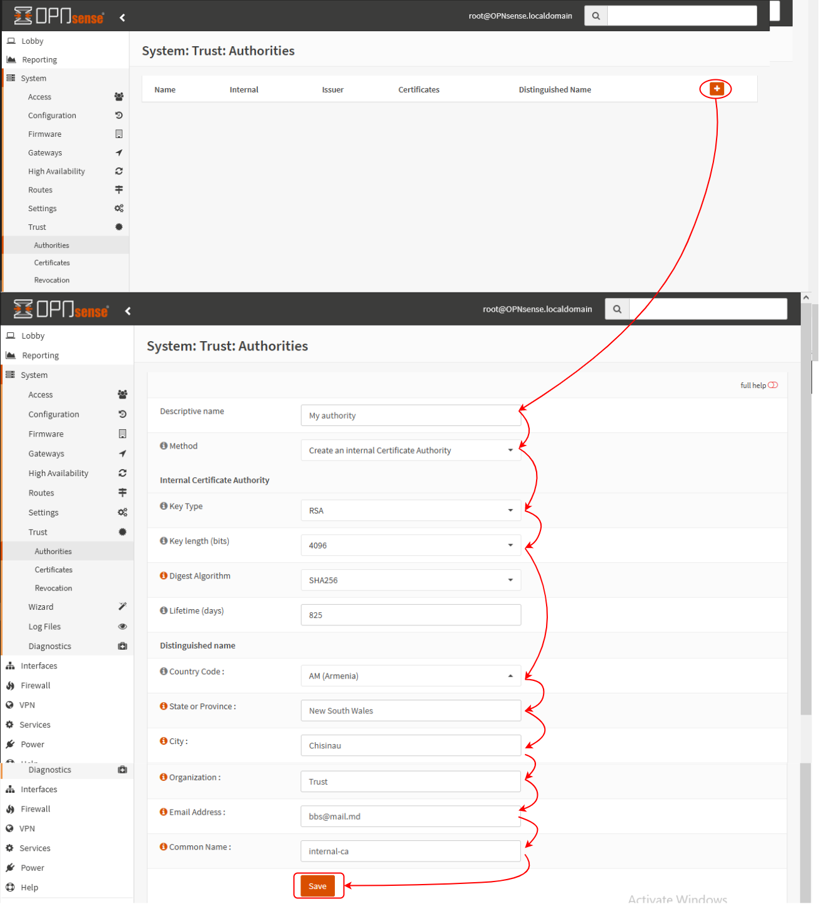

  - Add new certificate
  
  

### 12. Configure `nginx` Load Balancer

  - Add `upstream server`
  
  

  - Groupe `upstream servers`
  
  

  - Setup `location`
  
  

  - Setup `http-server`
  
  

  - Enable `nginx` Load Balancer
  
  

### 13. Open access from the outside of `OPNsense` to the port `8443`

  

### 14. In work station in `Firefox` browser navigate to `https://192.168.16.109:8443` and get certificate info.

  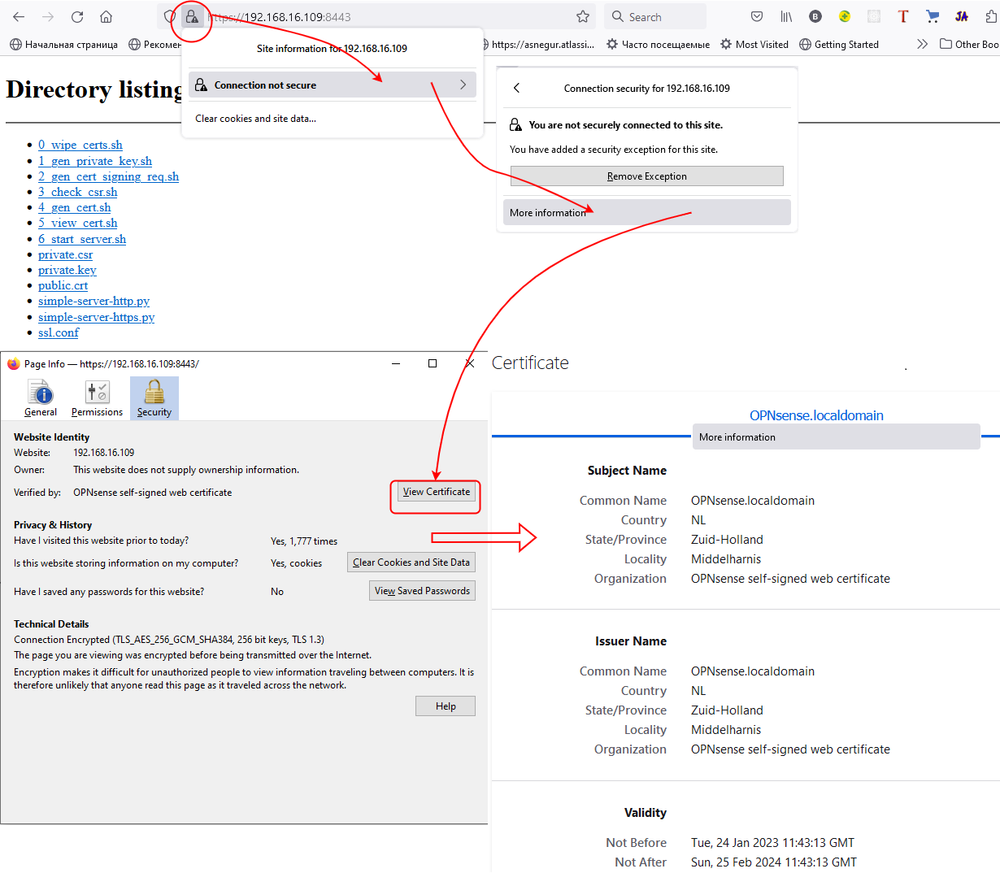
  

# References

1. [OPNsense](https://opnsense.org/about/about-opnsense/)
2. [Network Configuration](https://pve.proxmox.com/wiki/Network_Configuration)
3. [ifupdown2](https://cumulusnetworks.github.io/ifupdown2/ifupdown2/userguide.html#commands)
4. [OPNsense, Network Address Translation](https://docs.opnsense.org/manual/nat.html)
5. [Reply-to on WAN by default is bogus](https://forum.opnsense.org/index.php?topic=15900.0)
6. [NAT vs PAT](https://www.youtube.com/watch?v=KA56kj23RPU)
7. [Dynamic PAT](http://www.practicalnetworking.net/series/nat/dynamic-pat/)
8. [How does NAT conserve IP Address Space?](https://www.youtube.com/watch?v=BgtORKB0lls)