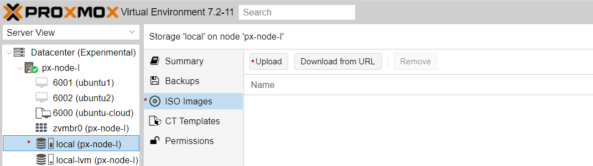

## How to set up VLANs ##

### Prerequisites: ### 
- [Proxmox node](https://www.proxmox.com/en/proxmox-ve/get-started) with ~ 16 GiB RAM and ~ 90 GB local disk storage
- [OPNsense ISO](https://mirror.fra10.de.leaseweb.net/opnsense/releases/22.7/OPNsense-22.7-OpenSSL-dvd-amd64.iso.bz2)
- [Manjaro ISO](https://download.manjaro.org/kde/22.0/manjaro-kde-22.0-minimal-221224-linux61.iso)

The ISO images should be uploaded in the local storage on Proxmox:
- 

### Steps: ### 

#### 1. Create linux bridge vmbr1
* Proxmox UI: System > Network > \[Create\] > Linux bridge
  - Name
  - VLAN aware - checked
---------------------------------------------------------------------------
#### 2. Create VM for OPNsense (see [Lesson 16](../16_networks_ssl-termination_self-signed_cert_04-oct-2022))
* Set vmbr0 as WAN
* Set vmbr1 as LAN
  - set up LAN (subnet mask)
* Go to OPNsense to set up the firewall:
  - Firewall > Rules: close web to LAN (enable the rule LAN to LAN only)
---------------------------------------------------------------------------
#### 3. Create VM for Manjaro > convert to template
* Create 1st linked clone from the Manjaro template
  - Name: manjaro1
  - Network device: untagged VLAN (vmbr1)

* Check connectivity via _ping_ command:
  - gateway
  - web

* Show logs:
  - Firewall > Live Log > filter by interface LAN
---------------------------------------------------------------------------
#### 4. Create 2nd linked clone from the Manjaro template
- Name: manjaro2

* Go to OPNsense to create VLAN 3:
  - Interfaces > Other Types > VLAN > \[+\]
  - Interfaces > Assignments > VLAN > \[+\]
  - In interfaces appeared new options, edit
    - enable
    - description
    - static IP
    - IPv4 - set address
  - Service > DHCPv4 *
  - Firewall > Aliases > RFC
  - Firewall > Rules > \[+\]
* Go back to Manjaro:
  - Open Network Manager (nmtui)
    - edit a connection
    - wired connection to know parent edit
    - add a connection > vlan
      - device vlan03
      - parent ens18
    - activate connection
    - deactivate wired connection
    - activate vlan 3 > Ok
    - Check IP address
    ```
    ip a
    ```

* Check connectivity:
  - manjaro1 to manjaro2, gateway, web
  - manjaro2 to manjaro1, gateway, web
* Show logs:
  - Firewall > Live Log > filter by interface

---------------------------------------------------------------------------
#### 5. Create 3rd linked clone from the Manjaro template
* Go to OPNsense to create VLAN 21:
  - Interfaces > Other Types > VLAN > \[+\]
  - Interfaces > Assignments > VLAN > \[+\]
  - In interfaces appeared new options, edit
    - enable
    - description
    - static IP
    - IPv4 - set address
  - Service > DHCPv4
  - Firewall > Aliases > RFC
  - Firewall > Rules > \[+\]
* Create linked clone from the Manjaro template:
  - Name: manjaro3
  - Connect it to VLAN 20 via Proxmox UI (Network settings)
* Check connectivity:
  - manjaro3 to manjaro2, manjaro1, gateway, web
  - manjaro1 to manjaro2, manjaro3
  - manjaro2 to manjaro3, manjaro1
---------------------------------------------------------------------------
- Set up network connection via _nmtui_
  - edit a connection
  - wired connection to know parent edit
  - add a connection
    - type VLAN 
    - device vlan03
    - parent ens18
  - activate connection
  - deactivate wired connection
  - activate VLAN3
- Check IP address:
```
ip a
```

### References ###

1. [What are VLANs? - The simplest explanation](https://www.youtube.com/watch?v=MmwF1oHOvmg)
2. [Native VLAN - the DEFINITIVE illustration](https://www.youtube.com/watch?v=Fmq1E1Qr2W4)
3. [Set-VMNetworkAdapterVlan](https://learn.microsoft.com/en-us/powershell/module/hyper-v/set-vmnetworkadaptervlan?view=windowsserver2022-ps)
4. [Proxmox Network Configuration: VLAN](https://pve.proxmox.com/wiki/Network_Configuration#_vlan_802_1q)
5. [Software Defined Network (SDN) integration with Proxmox](https://pve.proxmox.com/pve-docs/chapter-pvesdn.html)
6. [Cloud-Init Support in Proxmox](https://pve.proxmox.com/wiki/Cloud-Init_Support)
7. [How to Configure Networking on Ubuntu with Netplan](https://vitux.com/how-to-configure-networking-with-netplan-on-ubuntu/)
8. [Configuring IP Networking with nmtui](https://access.redhat.com/documentation/en-us/red_hat_enterprise_linux/7/html/networking_guide/sec-configuring_ip_networking_with_nmtui)