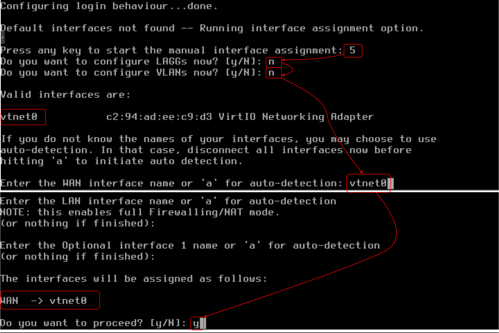
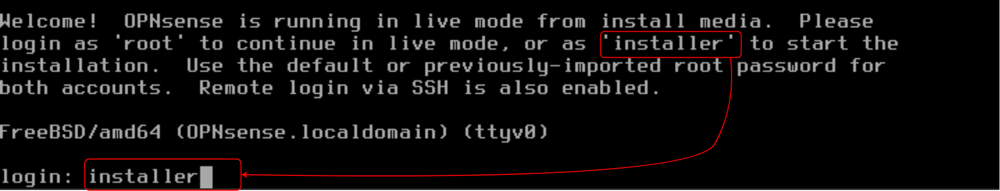
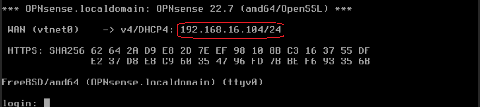
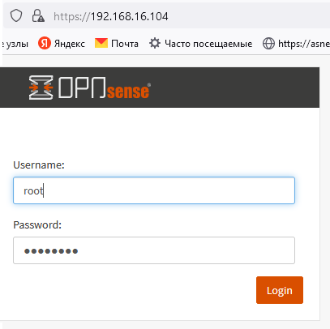

# Kubernetes, Setting up K3s prod-like: OPNsense template configuration, part 1#

## Prerequisites ##

- [Proxmox node](https://www.proxmox.com/en/proxmox-ve/get-started) with ~ 16 GiB RAM and ~ 90 GB local disk storage

## Create, configure and update OPNsense VM ##

### 1. In `Proxmox` create pool k3s-simple1, install SDN and setup VLAN 10, as in the following steps: 9 - [Create resource pool](../23_networks_vlan_nested_proxmox_cloud-init_27-oct-2022/README.md#9-create-ubuntu-vms-on-1st-node), 6 - [Install SDN](../23_networks_vlan_nested_proxmox_cloud-init_27-oct-2022/README.md#6-prepare-proxmox-template), 10 - [Create VLAN20](../23_networks_vlan_nested_proxmox_cloud-init_27-oct-2022/README.md#10-set-up-ubuntu1) in SDN (in our case create VLAN 10).

### 2. In `Proxmox` create ***[OPNsense](../16_networks_ssl-termination_self-signed_cert_04-oct-2022/README.md#1-create-vm-for-opnsense-with-wan-and-lan-network-interfaces)*** VM, without creating new `Linux` bridge and adding new network interface, start it, set the single network interface as WAN

- Login as `installer` and continue installation. 

- After installation, in browser go to `https://192.168.16.104`
 
 

- and login as root

 

### 3. Follow 1-2 steps from [Configure OPNsense, nginx and create self-sign certificate.](../16_networks_ssl-termination_self-signed_cert_04-oct-2022/README.md#configure-opnsense-nginx-and-create-self-sign-certificate) to configure and update `OPNsense`.
   
`OPNsense -> System -> Updates`

- Install plugins `os-nginx` and `os-qemu-guest-agent`.

    `OPNsense -> System -> Plugins`

- Add rule for WAN in Firewall for ensure web GUI access

    `OPNsense -> Firewall -> Rules -> WAN`

### 4. Turn ***OPNsense*** off, Right click on ***OPNsense*** VM and create template `opnsense-template`. 

## References ##

1. [Lesson_22 How to set up VLANs](../22_networks_vlan_opnsense_vms_25-oct-2022/README.md)
2. [Lesson_23 How to set up VLANs](../23_networks_vlan_nested_proxmox_cloud-init_27-oct-2022/README.md)

