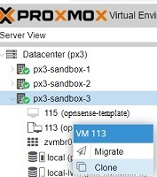
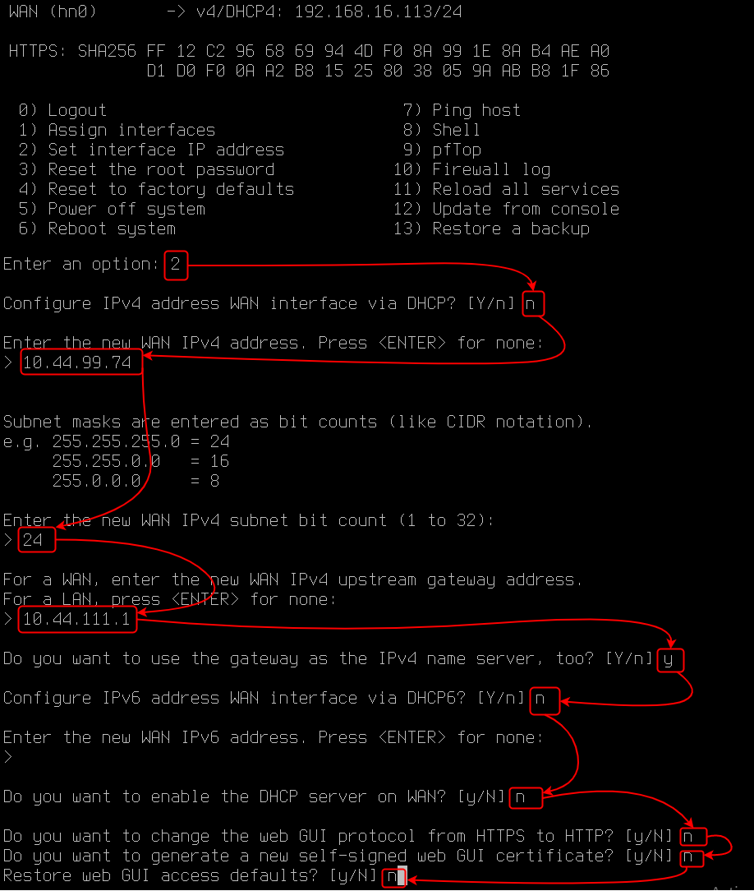

# Kubernetes, Setting up K3s prod-like: Configuring OpnSense, creating K3s nodes, part 2, 10 Nov 2022 #

## Prerequisites: ##
- [Proxmox node](https://www.proxmox.com/en/proxmox-ve/get-started) with ~ 16 GiB RAM and ~ 90 GB local disk storage

- We will use the following network topology
  
  

- These rules will be configured on the firewall for network traffic
  
  

## 1. Execute all the steps from [Lesson 28](../28_k8s_setting_up_k3s_prod_like_opnsense_template_configuration_part_1_10-nov-2022)

## 2. From created template `opnsense-template` clone new VM - `k3s-lb`.



- We will use as ***<font color="green">OPNsense</font>*** WAN IP address - `10.44.99.74`. Start `k3s-lb`, login as `root` user, pw: `opnsense` and set in terminal WAN interface IP address `10.44.99.74`  -> enter 2 option.
  
  

-  In browser navigate to `https://10.44.99.74`, login as `root` user, pw: `opnsense`. Setup 
  [VLAN 10](../23_networks_vlan_nested_proxmox_cloud-init_27-oct-2022/README.md#11-set-up-ubuntu2), follow step 11 - Set up VLAN21 in ***<font color="green">OPNsense</font>***, change from 21 to 10 VLAN.

- Сreate an alias and add 3 subnet ranges there from RFC1918 - `OPNsense -> Firewall -> Aliases` 
  *  `10.0.0.0/8`
  *  `172.16.0.0/12`
  *  `192.168.0.0/16` 
  
- Add rule for WAN in Firewall - allow access from anywhere to `LAN10 net`

    `OPNsense -> Firewall -> Rules -> WAN` 


- Add two rules for LAN10 in Firewall - allow access from `LAN10 net` to `LAN10 net` and from `LAN10 net` to internet only

    `OPNsense -> Firewall -> Rules -> WAN` 


* Configure Nginx plugin. Go to `OPNsense -> Services -> Nginx -> Configuration` and setup `Upstream Server`


- Add three `Upstream Servers` on 6443 and 22 ports for every IP address
* `10.10.0.11`
* `10.10.0.12`
* `10.10.0.13`

- Group by port every `Upstream Server`.

- 
  
- Add `Data Servers` for each group

- 

- Go to `General Settings` tab, check - `Enable nginx` and click `Apply`
  
## 3. On your workstation in terminal, generate ssh keys

  - [Generate ssh](../06_proxmox_lvm_resize_disk_ssh_access_backups_25-aug-2022/README.md) keys for authentication via ssh

   ```
   ssh-keygen -t rsa -f `~/.ssh/id_rsa_cloudinit`
   ```

  - Send public key to the Proxmox we want to access (IP address - 10.44.99.3):
  
  ```
  ssh-copy-id -i ~/.ssh/id_rsa_cloudinit root@10.44.99.3
  ```

  - Generate ssh keys for authentication via ssh to k3s-nodes
  
  ```
   ssh-keygen -t rsa -f ~/.ssh/id_rsa_cloudinit_k3s
   ```

   and copy `~/.ssh/id_rsa_cloudinit_k3s.pub` to Proxmox node (Proxmox node IP address - 10.44.99.3)

   ```
   scp -i ~/.ssh/id_rsa_cloudinit ~/.ssh/id_rsa_cloudinit_k3s.pub root@10.44.99.3:/root/.ssh 
   ```

   `~/.ssh/id_rsa_cloudinit` - the key by which you authenticate via ssh on Proxmox

## 4. Use these [awesome-proxmox/tree/main/vm-cloud-init-shell](https://github.com/Alliedium/awesome-proxmox/tree/main/vm-cloud-init-shell) scripts for create VMs on Proxmox. Read the README before using these scripts. Copy the configuration and adjust it to match your case

   ```
   cp ./.env.example ./.env.k3s-simple
   nano ./.env.k3s-simple
   ```
   `Pz_CLOUD_INIT_IMAGE_DIR=/root/cloud-init-images`

   `Pz_LINK_LIST="(https://cloud-images.ubuntu.com/jammy/current/jammy-server-cloudimg-amd64.img.custom)"`

   `Pz_CLOUD_INIT_INSTALL_PKG_LIST="qemu-guest-agent"`

   `Pz_VM_TEMPLATE_NAME=k3s-template`

   `Pz_POOL_ID=k3s-simple1`

   `Pz_VM_TEMPLATE_ID=3000`

   `Pz_USER_NAME=k3s-user`

   `Pz_USER_PW=k3s-user`
   
   `Pz_USER_PUB_KEY_FILE_NAME=/root/.ssh/id_rsa_cloudinit_k3s.pub`

   `Pz_DATA_STORAGE_ID=local-lvm`

   `#Pz_DATA_STORAGE_ID=black-nfs-0`

   `#Pz_DISK_FORMAT='qcow2'`

   `Pz_DISK_FORMAT='raw'`

   `Pz_DISK_SIZE_INCREASE=+4G # <== ONLY POSITIVE VALUES`

   `Pz_NET_BRIDGE=v10`

   `Pz_RAM=4096  # <== IN MEBIBYTES !!!`

   `Pz_VCPU=12`

   `Pz_VM_NAME_PREFIX=k3s-node-`

   `Pz_VM_ID_PREFIX=300`

   `Pz_IP_MODE=static`

   `Pz_VM_IP_PREFIX=10.10.0.1 # <== 10.1.2.3 PREFIX WOULD RESULT IN IPs 10.1.2.31, 10.1.2.32, ... !!!`

   `Pz_IP_MASK_N_BITS=24`

   `Pz_GATEWAY=10.10.0.1`

   `Pz_DNS=10.10.0.1`

   `Pz_N_VMS=4                 # <== SHOLD BE LESS OR EQUAL TO THE LENGTH LENGTH OF TARGET_NODE_LIST !!!`

   `Pz_TARGET_NODE_LIST="(px3-sandbox-3 px3-sandbox-3 px3-sandbox-3 px3-sandbox-3)"`

<hr>

- Export environment variables from your `.env.k3s-simple` file:

   ```
   set -a; source ./.env.k3s-simple; set +a
   ```

- Customize cloud init images.
  
   ```
   ./customize-cloud-init-images.sh
   ```
- Create the template, create and start VMs
  
  ```
  ./batch-create-start.sh
  ```

- Rename `k3s-node-4` VM to `k3s-config`, edit Name
  
  `px3-sandbox-3 -> k3s-node-4 -> Options -> Name -> Edit`

- Change on `k3s-config` hostname to `k3s-config`
  
  ```
  sudo hostnamectl set-hostname k3s-config
  ```
- Check hostname, run on `k3s-config`
  ```
  logout
  ```
  and
  
  ```
  login
  ```
## 5. Manual creation cloud-init VM
   - In Proxmox crate VM with ID - 9000 without hard disk
   - In Proxmox terminal run command
  
  ```
  qm importdisk 9000 /root/cloud-init-images/jammy-server-cloudimg-amd64.img.orig local-lvm
  ```

   - Edit `Unused Disk 0` 

     `9000 (manual-vm)-> Hardware -> Unused Disk 0 -> Edit -> Add`

   - Add CloudInit Drive

     `9000 (manual-vm)-> Hardware -> Add -> CloudInit Drive`

     `Storage: local-lvm`

  - Set user and user and password

    `9000 (manual-vm)-> Cloud-Init`
  
    `User: cloud-user`

    `Password: cloud-user`

  - Set boot order, first - virtio1 

    `9000 (manual-vm)-> Options -> Boot Order`

  - Start `9000 (manual-vm)` VM
  - Check cloud init Status
  
  ```
  cloud-init status
  ```

  - On the running `9000 (manual-vm)` VM, change the cloud-init parameters  
  
    `9000 (manual-vm)-> Cloud-Init`

   and click `Regenerate Image` button.

   In `9000 (manual-vm)` terminal run commands

   ```
   sudo cloud-init clean

   sudo cloud-init init
   ```

# References #

1. [k3s in docker](https://github.com/k3d-io/k3d)
2. [K3S + K3D](https://en.sokube.ch/post/k3s-k3d-k8s-a-new-perfect-match-for-dev-and-test-1)
3. [Alliedium/awesome-proxmox](https://github.com/Alliedium/awesome-proxmox/tree/main/vm-cloud-init-shell)
4. [Lesson_22 How to set up VLANs](../22_networks_vlan_opnsense_vms_25-oct-2022/practice.md)
5. [Lesson_23 How to set up VLANs](../23_networks_vlan_nested_proxmox_cloud-init_27-oct-2022/practice.md)
