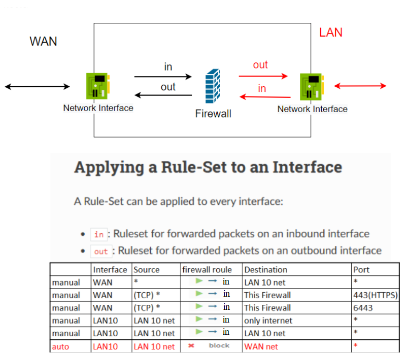
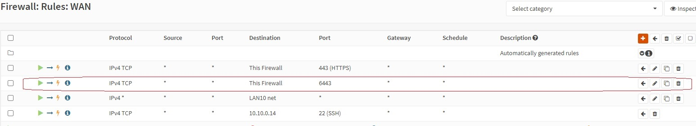
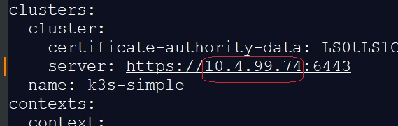

# Setting up a production-like Kubernetes cluster for the first time, part 2, 15 Nov 2022

## Prerequisites: ##

- We use the following network topology
  
  

- Firewall rules for network traffic
  
  

### 1. Add route for `10.10.0.0/24` subnet.
  `10.10.0.0/24` - LAN subnet, `10.44.99.74` - ***<font color="green">OPNsense</font>*** WAN IP address.
  - You can add route on workstation
  
   for `Windows` OS run PowerShell as administrator
  ```
  route add 10.10.0.0 MASK 255.255.255.0 10.44.99.74
  ```
  
  check 
```
route print | Findstr "10.10"
```

delete route
```
route delete 10.10.0.0
```
for `Lnux` OS add route for subnet `10.10.0.0/24`
```
sudo ip r add 10.10.0.0/24 via 10.44.99.74 dev eth0
```
and you can delete route
```
sudo ip r delete 10.10.0.0/24
```

- Or you can add route on your router


### 2. Check from your workstation connectivity to `LAN10` subnet
   
   ```
   ping 10.10.0.11
   ping 10.10.0.12
   ping 10.10.0.13
   ping 10.10.0.14
   ```
   
### 3. Copy private key `~/.ssh/id_rsa_cloudinit_k3s` to `k3s-config` VM
   
   ```
   scp -o StrictHostKeyChecking=no -i ~/.ssh/id_rsa_cloudinit_k3s ~/.ssh/id_rsa_cloudinit_k3s k3s-user@10.10.0.14:/home/k3s-user/.ssh
   ```

### 4.  Install `k3sup` on `k3s-config` and install k3s cluster via `k3sup` tool
   - go to `k3s-config` VM
  
  ```
  ssh -i ~/.ssh/id_rsa_cloudinit_k3s k3s-user@10.10.0.14 -o StrictHostKeyChecking=no	

  chmod 600 ~/.ssh/id_rsa_cloudinit_k3s
  ```

   - install [k3sup](https://github.com/alexellis/k3sup)
  
  ```
  curl -sLS https://get.k3sup.dev | sh
  sudo install k3sup /usr/local/bin/
  ```

  - Install first k3s on `10.10.0.11` via k3sup `k3s-config` VM
  
  ```
  k3sup install --ip 10.10.0.11 --user k3s-user --cluster --k3s-version v1.24.7+k3s1 \
  --k3s-extra-args '--disable traefik --disable servicelb --disable local-storage' --ssh-key ~/.ssh/id_rsa_cloudinit_k3s
  ```
 
 - Install second k3s on `10.10.0.12` via k3sup `k3s-config` VM
  
  ```
  k3sup join --ip 10.10.0.12 --user k3s-user --server-user k3s-user --server-ip 10.10.0.1 --server --k3s-version v1.24.7+k3s1 \
  --k3s-extra-args '--disable traefik --disable servicelb --disable local-storage' --ssh-key ~/.ssh/id_rsa_cloudinit_k3s	
  ```
 - check logs on `k3s-node-2`
  
  ```
  ssh -i ~/.ssh/id_rsa_cloudinit_k3s k3s-user@10.10.0.12 -o StrictHostKeyChecking=no	
  
  journalctl -xeu k3s.service | less
  ```

  - Install third k3s on `10.10.0.13` via k3sup `k3s-config` VM
  
  ```
  k3sup join --ip 10.10.0.13 --user k3s-user --server-user k3s-user --server-ip 10.10.0.1 --server --k3s-version v1.24.7+k3s1 \
  --k3s-extra-args '--disable traefik --disable servicelb --disable local-storage' --ssh-key ~/.ssh/id_rsa_cloudinit_k3s
  ```

  - Install [kubectl](https://kubernetes.io/docs/tasks/tools/install-kubectl-linux/#install-using-native-package-management) on `k3s-config`
  
  ```
  sudo curl -fsSLo /usr/share/keyrings/kubernetes-archive-keyring.gpg https://packages.cloud.google.com/apt/doc/apt-key.gpg
  
  echo "deb [signed-by=/usr/share/keyrings/kubernetes-archive-keyring.gpg] https://apt.kubernetes.io/ kubernetes-xenial main" | sudo tee /etc/apt/sources.list.d/kubernetes.list
  
  sudo apt-get update

  sudo apt-get install -y kubectl
  ```

  - Check `k3s` clusters `/etc/rancher/k3s/k3s.yaml`
  
  ```
  kubectl --kubeconfig=./kubeconfig get nodes
  ```

  go to `k3s-node-1`

  ```
  ssh -i ~/.ssh/id_rsa_cloudinit_k3s k3s-user@10.10.0.11 -o StrictHostKeyChecking=no	
  ```

  you can find kubeconfig file is here

  ```
  /etc/rancher/k3s/config.yaml
  ```
  or to get kubeconfig file run command

  ```
  k3sup install --skip-install --ssh-key ./id_rsa_cloudinit_k3s  --user k3s-user
  ```
  
  * To uninstall K3s from the server node, run on target node:
  
  ```
  /usr/local/bin/k3s-uninstall.sh
  ```

### 5. Copy kubeconfig from `k3s-config` VM to workstation

```
scp -o StrictHostKeyChecking=no -i ~/.ssh/id_rsa_cloudinit_k3s k3s-user@10.10.0.14:/home/k3s-user/kubeconfig ~/.kube/k3s-simple
```

### 6. Add rule to firewall for 6443 port on WAN interface

`OPNsense -> Firewall -> Rules -> WAN`


- 

### 7. Connect to kubernetes in OpenLens using `~/.kube/k3s-simple` file.

- 
- 

### 8. On server node add external load ip to kubernetes tls certificate

- go to server node `k3s-node-1`

```
ssh -i ~/.ssh/id_rsa_cloudinit_k3s k3s-user@10.10.0.11 -o StrictHostKeyChecking=no

curl -vk --resolve 10.44.99.74:6443:127.0.0.1  https://10.44.99.74:6443/ping
```

- 	add domain to hosts file `/c/Windows/System32/drivers/etc/hosts`
  
  ```
  10.44.99.74 supercluster.localdomain
  ```

- Go to server node `k3s-node-1` and add domain `supercluster.localdomain` to certificate

```
ssh -i ~/.ssh/id_rsa_cloudinit_k3s k3s-user@10.10.0.11 -o StrictHostKeyChecking=no

curl -vk --resolve supercluster.localdomain:6443:127.0.0.1  https://supercluster.localdomain:6443/ping
```
### 9. [Download](https://github.com/MuhammedKalkan/OpenLens/releases) and install `OpenLens`
- Alternatively, on a Windows system, you can install [chocolatey](https://chocolatey.org/install) and run
  
```
choco install openlens
```

- Connect to kubernetes in `OpenLens` using `~/.kube/k3s-simple` file.


### 10. Edit `~/.kube/k3s-simple` file and specify the external `Load Balancer` IP address instead of the `k3s-node-1` IP address.

- 


### 11. On the server node `k3s-node-1` add external load ip to kubernetes tls certificate

- go to the server node `k3s-node-1` and run

```
ssh -i ~/.ssh/id_rsa_cloudinit_k3s k3s-user@10.10.0.11 -o StrictHostKeyChecking=no

curl -vk --resolve 10.44.99.74:6443:127.0.0.1  https://10.44.99.74:6443/ping
```

- 	on your workstation add domain to the hosts (`Windows`) file `C:\Windows\System32\drivers\etc\hosts`
  
  ```
  10.44.99.74 supercluster.localdomain
  ```

- Go to the server node `k3s-node-1` and add domain `supercluster.localdomain` to the certificate

```
ssh -i ~/.ssh/id_rsa_cloudinit_k3s k3s-user@10.10.0.11 -o StrictHostKeyChecking=no

curl -vk --resolve supercluster.localdomain:6443:127.0.0.1  https://supercluster.localdomain:6443/ping
```

### 12. Install `longhorn` chart in kubernetes.
- In `OpenLens` add [longhorn helm repository](https://charts.longhorn.io). Go to Preferences,


in `Kubernetes -> Helm Charts` menu click `Add Custom Helm Repo`, add name `longhorn` and url `https://charts.longhorn.io`, click `Add` button.

- in `Namespaces -> + ` add new namespace `longhorn`
  
- in `Helm -> Charts -> Search Helm Charts` input `longhorn`

- Select found chart and

click `Install`


- Set `Namespace: longhorn` and `name: longhorn`

and click `Install`


