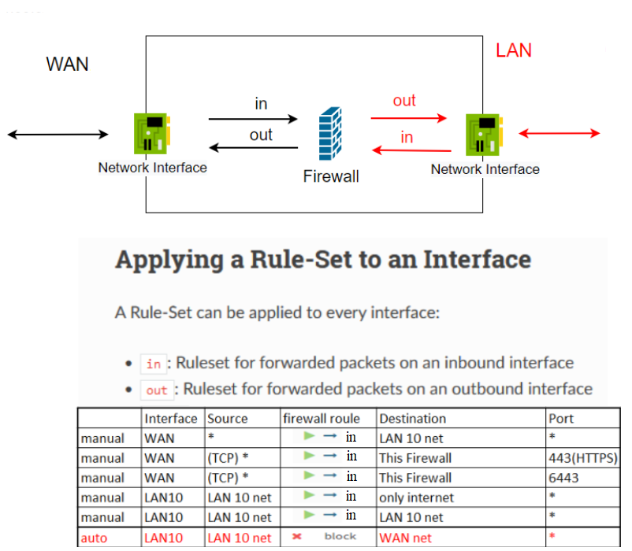

# Setting up a production-like Kubernetes cluster for the first time, part 3, 17 Nov 2022

## Prerequisites: ##

- We will use the following network topology
  
  

- These rules will be configured on the firewall for network traffic
  
  
  
## Context.
### 1. Install [`WSL`](https://learn.microsoft.com/en-us/windows/wsl/install) in `Windows` OS

- Open PowerShell as administrator.
- Setup [Execution Policy](https://learn.microsoft.com/en-us/windows/wsl/install)
  ```
  Set-ExecutionPolicy -ExecutionPolicy Bypass -Scope Process -Force
  ```

- Get a list of available Linux distributions to install 

  ```
  wsl --list --online,  wsl -l -o
  ```

- Install wsl

  ```
  wsl --intsall -d Ubuntu
  ```

  then restart your machine.

  - for updating wsl

  ```
  wsl --update
  ```

- Check which version of WSL you are running
  
  ```
  wsl -l -v
  ```

- To set the default version to WSL 1 or WSL 2 when a new Linux distribution is installed, use the command: 
  
  ```
  wsl --set-default-version 2
  ```

- Click `start` menu and type `ubuntu`, in opened terminal you can access windows files (basic use cases)
  
  ```
  ls -a /mnt/c
  ```

### 2. Install [kubectl](https://kubernetes.io/docs/tasks/tools/install-kubectl-linux/#install-using-native-package-management)  

- In `Windows` open wsl -> click `start` menu and type `ubuntu`, in opened terminal

  ```
  sudo curl -fsSLo /usr/share/keyrings/kubernetes-archive-keyring.gpg https://packages.cloud.google.com/apt/doc/apt-key.gpg

  echo "deb [signed-by=/usr/share/keyrings/kubernetes-archive-keyring.gpg] https://apt.kubernetes.io/ kubernetes-xenial main" | sudo tee /etc/apt/sources.list.d/kubernetes.list

  sudo apt-get update

  sudo apt-get install -y kubectl

  ```

### 3. Install [krew](https://krew.sigs.k8s.io/docs/user-guide/setup/install/)

  - run
  
  ```
  (
	set -x; cd "$(mktemp -d)" &&
	OS="$(uname | tr '[:upper:]' '[:lower:]')" &&
	ARCH="$(uname -m | sed -e 's/x86_64/amd64/' -e 's/\(arm\)\(64\)\?.*/\1\2/' -e 's/aarch64$/arm64/')" &&
	KREW="krew-${OS}_${ARCH}" &&
	curl -fsSLO "https://github.com/kubernetes-sigs/krew/releases/latest/download/${KREW}.tar.gz" &&
	tar zxvf "${KREW}.tar.gz" &&
	./"${KREW}" install krew
  )
  ```
  
  - Check your command language interpreter
  
  ```
  echo $SHELL
  ```

  - If you have `/bin/bash` add to `~/.bashrc`
  
  ```
  export PATH="${KREW_ROOT:-$HOME/.krew}/bin:$PATH"
  ```

  and run

  ```
  source ~/.bashrc
  ```

  - Check krew 
  
  ```
  kubectl krew
  ```

  - Install `konfig` and `ctx`
  
  ```
  kubectl krew install konfig ctx
  ```

  - Go to ~/.kube and copy you context file
  
  ```
  cp ~/.kube/config ~/.kube/config-backup
  ```

  - import new context to ~/.kube/config	
  
  ```
  kubectl konfig import --save ~/.kube/k3s-simple-hyper-v
  ```

  - to change context	
  
  ```
  kubectl config use-context k3s-hyper-v
  ```

## Performance testing	
  ### 1. Clone [kubernetes-iperf3 project](https://github.com/Pharb/kubernetes-iperf3) and navigate to `kubernetes-iperf3` folder.
  ### 2. Switch to context

   ```
  kubectl config use-context k3s-hyper-v
  ```

  - run performance tests

  ```
  ./iperf3.sh
  ```

  - if something went wrong run script
  
  ```
  ./steps/cleanup.sh
  ```
	
## Automatic upgrades/downgrades kubernetes version

  - switch to desired context `k3s-simple`
  
  ```
  kubectl config use-context k3s-simple
  ```

  - Install the [system-upgrade-controller](https://docs.k3s.io/upgrades/automated)
  
  ```
  kubectl apply -f https://github.com/rancher/system-upgrade-controller/releases/latest/download/system-upgrade-controller.yaml
  ```
  
  - create file plan.yaml
  
  ```
  # Server plan
  apiVersion: upgrade.cattle.io/v1
  kind: Plan
  metadata:
    name: server-plan
    namespace: system-upgrade
  spec:
    concurrency: 1
    cordon: true
    nodeSelector:
      matchExpressions:
      - key: node-role.kubernetes.io/master
        operator: In
        values:
        - "true"
    serviceAccountName: system-upgrade
    upgrade:
      image: rancher/k3s-upgrade
    version: v1.24.8-rc2+k3s1
  ```

  - check k3s version
  
  

  - run command to upgrades version from v1.24.7+k3s1 to v1.24.8-rc2+k3s1
  
  ```
  kubectl apply -f ./plan.yaml
  ```
  
  - check k3s version

  - to 	downgrades version edit `./plan.yaml` file
  
  ```
  version: v1.24.7+k3s1
  ```

  and apply

  ```
  kubectl apply -f ./plan.yaml
  ```

## Hyper-V

  - Create `external` switch - `vmbr0`
  - Create new `k3s-lb` VM and install `OPNsense`
  - Update packages and install nginx.
  - Open `PowerShell` as administrator and run command to make network interface port - trunk
  
  ```
  Set-VMNetworkAdapterVlan -VMName k3s-lb -Trunk -AllowedVlanIdList 10-11 -NativeVlanId 0
  ```

  - On `k3s-lb` setup `VLAN 10` and for interfaces add corresponding firewall rules for traffic.
  - Configure nginx as Load Balancer on `6443` and  `22` ports.
  - Clone [Hyper-V-Automation](https://github.com/Alliedium/Hyper-V-Automation) project
  
  ```
  git clone https://github.com/Alliedium/Hyper-V-Automation.git
  ```

  - Copy files from [scripts](./scripts) to `Hyper-V-Automation` folder.
  - Install [Chocolatey](https://chocolatey.org/install). In PowerShell run
  
  ```
  Set-ExecutionPolicy Bypass -Scope Process -Force; [System.Net.ServicePointManager]::SecurityProtocol = [System.Net.ServicePointManager]::SecurityProtocol -bor 3072; iex ((New-Object System.Net.WebClient).DownloadString('https://community.chocolatey.org/install.ps1'))
  ```

  - Install `qemu-img`
  
  ```
  choco install qemu-img -y
  ```

  - Adjust values if you need in [createVM.ps1](./scripts/createVM.ps1) file.
  - Use [mkpasswd](https://www.mkpasswd.net/index.php) to generate password hash for `$userPassword`
  
  

  - Open PowerShell as administrator and run commands to create VMs
  
  ```
  Set-ExecutionPolicy -ExecutionPolicy Bypass -Scope Process -Force

  .\createVMs.ps1 -vmNamePrefixes k3s-node-, k3s-node-, k3s-node-, k3s-config -vmIds 1,2,3,4
  ```

  - Install [k3s cluster](../30_setting_up_production_like_kubernetes_cluster_10_nov_2022/README.md)