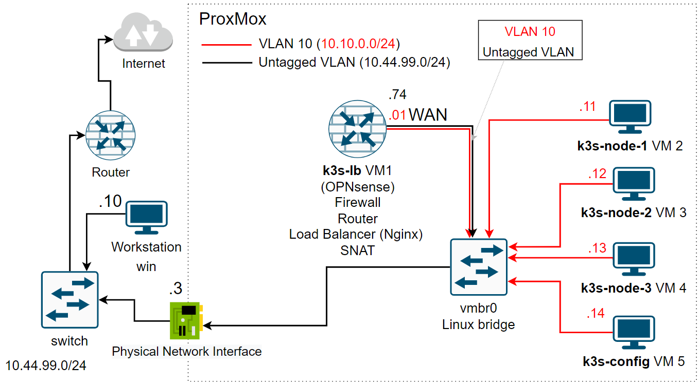

## Prerequisites: ##
  
  

# SLA 

- https://en.wikipedia.org/wiki/Service-level_agreement
- https://cloud.google.com/compute/sla
- https://aws.amazon.com/eks/sla/?nc1=h_ls
- https://aws.amazon.com/compute/sla/
- https://aws.amazon.com/blogs/publicsector/achieving-five-nines-cloud-justice-public-safety/
- https://en.wikipedia.org/wiki/High_availability

# High Availability 
- https://en.wikipedia.org/wiki/High_availability
- https://apps.kaonadn.net/5181491956940800/index.html
- https://aws.amazon.com/about-aws/global-infrastructure/regions_az/?p=ngi&loc=2
- https://boostcommerce.net/blogs/all/aws-global-infrastructure-components-and-its-benefits-for-ecommerce

# WAF
- https://en.wikipedia.org/wiki/Web_application_firewall
- https://aws.amazon.com/waf/

# Certificates
- https://github.com/k3s-io/k3s/issues/2856
- https://en.wikipedia.org/wiki/Automatic_Certificate_Management_Environment
- https://docs.netgate.com/pfsense/en/latest/packages/acme/index.html
- https://github.com/acmesh-official/acme.sh
- https://github.com/cert-manager/cert-manager

# Kubernetes garbage collection
- https://github.com/k3s-io/k3s/issues/813
- https://kubernetes.io/docs/concepts/architecture/garbage-collection/#containers-images

# k8s distributions
- https://www.rancher.com/products/rke
- https://github.com/rancher/rke2
- https://docs.rke2.io/
- https://k0sproject.io/
- https://docs.k0sproject.io/v1.23.6+k0s.2/high-availability/
- https://github.com/k0sproject/k0s
- https://github.com/kubernetes-sigs/kubespray
- https://github.com/aws/eks-anywhere

# Hardening
- https://en.wikipedia.org/wiki/Hardening_(computing)
- https://www.cisecurity.org/about-us
- https://www.cisecurity.org/cis-hardened-images/amazon
- https://docs.aws.amazon.com/AWSEC2/latest/UserGuide/ec2-instances-and-amis.html
- https://docs.aws.amazon.com/AWSEC2/latest/UserGuide/usingsharedamis-finding.html

# Load balancers and Ingress
- https://www.densify.com/wp-content/uploads/article-k8s-capacity-kubernetes-service-overview.svg
- https://d2908q01vomqb2.cloudfront.net/fe2ef495a1152561572949784c16bf23abb28057/2021/03/19/Ingress1.png
- https://kubernetes.io/docs/concepts/services-networking/ingress/

# Cloud Native Ecosystem
- https://en.wikipedia.org/wiki/Cloud_Native_Computing_Foundation
- https://www.cncf.io/about/members/
- https://landscape.cncf.io/
- https://www.jaegertracing.io/
- https://www.fluentd.org/
- https://grafana.com/oss/loki/
- https://litmuschaos.io/
- https://prometheus.io/
- https://argoproj.github.io/
- https://istio.io/
- https://lfaidata.foundation/
- https://landscape.lfai.foundation/

# Persistent Storage
- https://pve.proxmox.com/wiki/Deploy_Hyper-Converged_Ceph_Cluster
- https://ceph.io/en/discover/technology/
- https://www.gluster.org/
- https://en.wikipedia.org/wiki/Comparison_of_distributed_file_systems
- https://aws.amazon.com/ebs/
- https://longhorn.io/docs/1.3.2/

# Backups
- https://docs.k3s.io/backup-restore#backup-and-restore-with-embedded-etcd-datastore
- https://github.com/etcd-io/etcd
- https://longhorn.io/docs/1.3.2/snapshots-and-backups/scheduling-backups-and-snapshots/
- https://github.com/vmware-tanzu/velero
- https://aws.amazon.com/blogs/containers/backup-and-restore-your-amazon-eks-cluster-resources-using-velero/
- https://portworx.com/products/px-backup/ (not free)
- https://www.kasten.io/ (not free)

# Private artifacts repositories
- https://www.sonatype.com/products/nexus-repository
- https://github.com/sonatype/nexus-public
- https://jfrog.com/artifactory

# Autoscaling
- https://kubernetes.io/docs/tasks/run-application/horizontal-pod-autoscale/
- https://aws.amazon.com/blogs/aws/introducing-karpenter-an-open-source-high-performance-kubernetes-cluster-autoscaler/
- https://cloud.google.com/kubernetes-engine/docs/concepts/autopilot-overview

