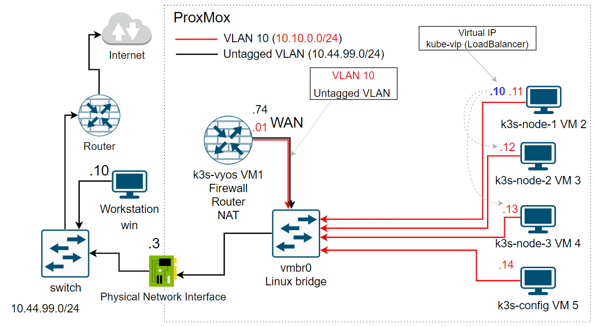
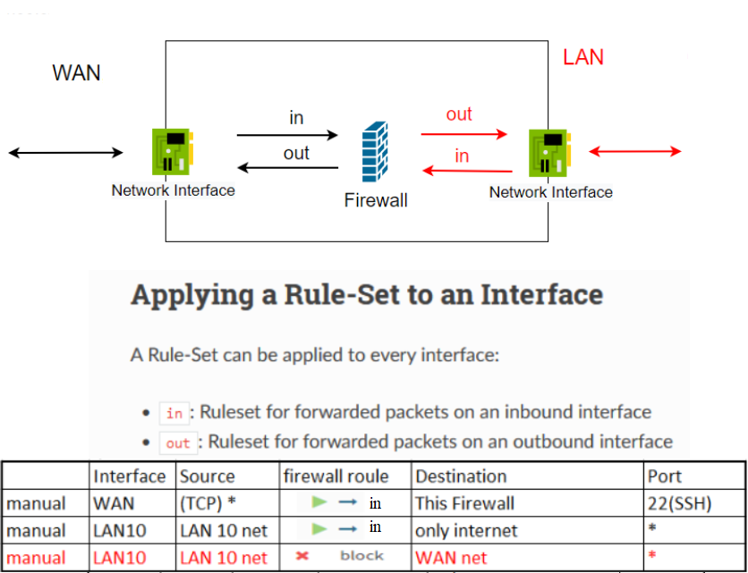

# Setting up a production-like Kubernetes cluster for the first time, part 4, 13 Dec 2022

## Prerequisites: ##
### We will use the following network topology
  

### These rules will be configured on the firewall for network traffic

  
  

## Creating VMs on Proxmox node
  
  ### Create 3 VMs on Proxmox node for `k3s` cluster via [awesome-linux-config's scripts](https://github.com/Alliedium/awesome-linux-config). Follow step 4 form [29 lecture](../29_k8s_setting_up_k3s_prod_like_configuring_opnsense_creating_k3s_nodes_part_2_10-nov-2022/README.md).

## Install and manual configure VyOS
  
  ### 1. [Download VyOS iso image](https://vyos.net/get/nightly-builds/)
  ### 2. [Install VyOS](https://docs.vyos.io/en/equuleus/installation/install.html).
  - In Proxmox create VM from VyOS image.
  - Start it.
  - Log into the VyOS live system (use the default credentials: `vyos`, `vyos`).
  - [Run command](https://docs.vyos.io/en/latest/installation/install.html)
  
  ```
  install image
  ```
  - Reboot the system.
  - Take snapshots 

  ### 3. VyOS configuration.
   - By default, VyOS is in operational mode, and the command prompt displays a $. To [configure VyOS](https://docs.vyos.io/en/equuleus/quick-start.html), you will need to enter configuration mode, resulting in the command prompt displaying a #, as demonstrated below:
  
  ```
  configure
  ```
  
  or

  ```
  config
  ```
   - Configure VyOS for `ssh` connection. Set WAN IP address
  
  ```
  set interfaces ethernet eth0 address '10.44.99.74/20'
  ```
   * Default getway
  
  ```
  set protocols static route 0.0.0.0/0 next-hop '10.44.111.1'
  ```
   * SSH Management
  
  ```
  set service ssh port '22'
  ```

  From your work station go to `VyOS` via ssh.

  ```
  ssh -o UserKnownHostsFile=/dev/null -i ~/.ssh/id_rsa_cloudinit_k3s vyos@10.44.99.74 -o StrictHostKeyChecking=no
  ```

   - enter configuration mode
  
  ```
  config
  ```

   - Interface Configuration

  * Your outside/WAN interface will be eth0. It will use a static IP address of 10.44.99.74/20.
  * Internal traffic in VLAN ID 10.
  * Your internal/LAN interface will be eth0.10. It will use a static IP address of 10.10.0.1/24.
  
  ```  
  set interfaces ethernet eth0 description 'OUTSIDE'
  set interfaces ethernet eth0 vif 10 address '10.10.0.1/24'
  set interfaces ethernet eth0 vif 10 description 'INSIDE'
  ```
  where `10` - is VLAN ID.

  * DHCP
  
  ```
  set service dhcp-server shared-network-name LAN subnet 10.10.0.0/24 default-router '10.10.0.1'
  set service dhcp-server shared-network-name LAN subnet 10.10.0.0/24 name-server '10.10.0.1'
  set service dhcp-server shared-network-name LAN subnet 10.10.0.0/24 domain-name 'vyos.net'
  set service dhcp-server shared-network-name LAN subnet 10.10.0.0/24 lease '86400'
  set service dhcp-server shared-network-name LAN subnet 10.10.0.0/24 range 0 start '10.10.0.100'
  set service dhcp-server shared-network-name LAN subnet 10.10.0.0/24 range 0 stop '10.10.0.200'
  ```

  * DNS 
  
  ```
  set service dns forwarding cache-size '0'
  set service dns forwarding listen-address '10.10.0.1'
  set service dns forwarding allow-from '10.10.0.0/24'
  set service dns forwarding system
  set system name-server '10.44.111.1'
  ```

  * NAT
  
  ```
  set nat source rule 100 outbound-interface 'eth0'
  set nat source rule 100 source address '10.10.0.0/24'
  set nat source rule 100 translation address 'masquerade'
  ```

  * Firewall
  
  Set net group 
  
  ```
  set firewall group network-group RFC1918 network '10.0.0.0/8'
  set firewall group network-group RFC1918 network '172.16.0.0/12'
  set firewall group network-group RFC1918 network '192.168.0.0/16'
  ```

  Add a set of firewall policies for our inside/LAN interface.
  This configuration creates a proper stateful firewall that blocks all traffic which was initiated from the internal/LAN side first and send to private subnets.

  ```
  set firewall name INSIDE-OUT default-action 'drop'
  set firewall name INSIDE-OUT rule 10 action 'accept'
  set firewall name INSIDE-OUT rule 10 state established 'enable'
  set firewall name INSIDE-OUT rule 10 state related 'enable'
  set firewall name INSIDE-OUT rule 20 action 'accept'
  set firewall name INSIDE-OUT rule 20 description 'accept internet'
  set firewall name INSIDE-OUT rule 20 destination group network-group '!RFC1918'
  ```

  Set firewall rule that blocks all traffic to VyOS, except on 22 port.
  
  ```
  set firewall name OUTSIDE-LOCAL default-action 'drop'
  set firewall name OUTSIDE-LOCAL rule 10 action 'accept'
  set firewall name OUTSIDE-LOCAL rule 10 state established 'enable'
  set firewall name OUTSIDE-LOCAL rule 10 state related 'enable'
  set firewall name OUTSIDE-LOCAL rule 31 action 'accept'
  set firewall name OUTSIDE-LOCAL rule 31 destination port '22'
  set firewall name OUTSIDE-LOCAL rule 31 protocol 'tcp'
  set firewall name OUTSIDE-LOCAL rule 31 state new 'enable'
  ```

  Apply the firewall policies:

  ```
  set firewall interface eth0 local name 'OUTSIDE-LOCAL'
  set firewall interface eth0 out name 'INSIDE-OUT'
  ```
  
  ## References on: Setting up a production-like Kubernetes cluster for the first time, part 4, 13 Dec 2022 ##

1. [download vyos image](https://vyos.net/get/nightly-builds/)
2. [Vyos Installation](https://docs.vyos.io/en/equuleus/installation/install.html)
3. [zengkid/build-vyos-lts](https://github.com/zengkid/build-vyos-lts/releases)