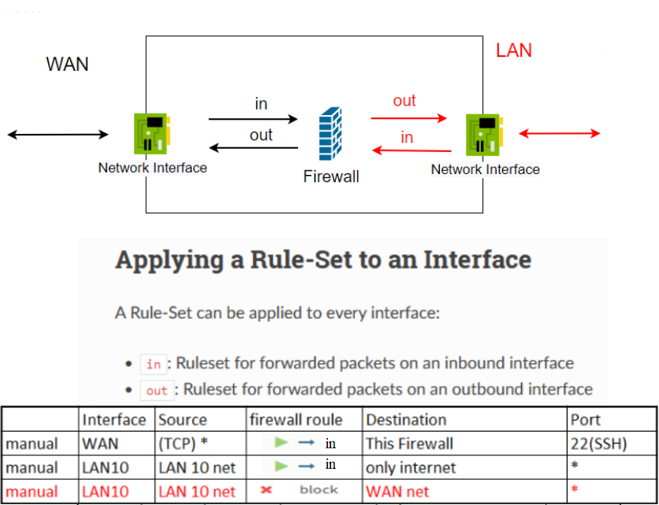
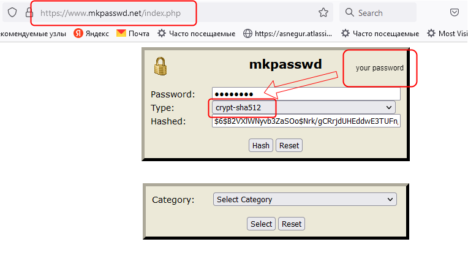

# Setting up a production-like Kubernetes cluster for the first time, part 5, 14 Dec 2022

  ## Prerequisites: ##

  ### We use the following network topology
  

  ### Firewall rules for network traffic

  
  
  ## Install and manual configure `VyOS`
  
  * See [firewall configuration](../38_setting_up_production_like_kubernetes_cluster_part_3_13-dec-2022/README.md) in step 3 of `Install and manual configure VyOS` section.
   
  * Hostname
  
  ```
  set system host-name 'vyos-1'
  ```
  * Add new user `vyos-user`
  
  ```
  set system login user vyos-user full-name 'vyos-user'
  set system login user vyos-user authentication plaintext-password 'vyos-user'
  set system login user vyos-user authentication public-keys Adam key 'AAAA ..... ik@DESKTOP-D8C0475'
  set system login user vyos-user authentication public-keys Adam type 'ssh-rsa'
  ```

  * NTP servers
  
  ```
  set system ntp server 1.pool.ntp.org
  set system ntp server 2.pool.ntp.org
  ```

  * Here is example for port forwarding. In the example below, traffic comes in from the WAN subnet on port 4722 and is redirected to port 22 on the LAN subnet for host 10.10.0.116, thus you can establish ssh connection  to LAN host 10.10.0.116 on 4722 port using WAN IP address.
  
  ```
  set nat destination rule 70 description 'Port Forward public ssh port 4722 to bastion 10.10.0.116 port 22'
  set nat destination rule 70 destination port '4722'
  set nat destination rule 70 inbound-interface 'eth0'
  set nat destination rule 70 protocol 'tcp'
  set nat destination rule 70 translation address '10.10.0.116'
  set nat destination rule 70 translation port '22'
  set nat destination rule 110 description 'NAT Reflection: INSIDE'
  set nat destination rule 110 destination port '8006'
  set nat destination rule 110 inbound-interface 'eth0'
  set nat destination rule 110 protocol 'tcp'
  set nat destination rule 110 translation address '10.10.0.116'
  ```

  * Show changes
  
  ```
  show
  ```

  * Show rules

  ### 4. Commit and Save

  * After every configuration change, you need to apply the changes by using the following command:

  ```
  commit
  ```

  * Once your configuration works as expected, you can save it permanently by using the following command:
  
  ```
  save
  ```

  * exit from configuration mode
  
  ```
  exit
  ```

  * If you do not want to commit and save changes run commands
  
  ```
  exit discard
  ```

  ### 5. Show `VyOS` configuration.

  ```
  show configuration commands
  ```

  ### 6. Save `VyOS` configuration to `config` file.

  ```
  show configuration commands>config
  ```

  ### 7. Rollback `VyOS` VM from snapshots to unconfigured state.
  * copy created `config` file to `VyOS` VM 

  ### 8. Configure  `VyOS` from `config` file.

  * login and enter configuration mode
  
  ```
  config
  ```

  * Apply configuration from files
  
  ```
  source config
  ```

  * Show network rules using [nftables](https://wiki.nftables.org/wiki-nftables/index.php/Quick_reference-nftables_in_10_minutes)
  
  ```
  sudo nft list ruleset
  ```

## Create `VyOS` VM on Proxmox node via [ansible playbook](https://github.com/Alliedium/awesome-proxmox)
  
  ### 1. Preparing [`VyOS` cloud-init image](https://github.com/vyos/vyos-vm-images).

  * Create `Debian` VM via [Scripts](../29_kubernetes_setting_up_k3s_prod_like_configuring_opnsense_creating_k3s_nodes_part_2_10-nov-2022/README.md#4-use-these-awesome-linux-configtreemasterproxmox7cloud-init-scripts-for-create-vms-on-proxmox-read-the-readme-before-using-these-scripts-copy-the-configuration-and-adjust-it-to-match-your-case) - follow step 4.
  * Copy `VyOS` iso image to `Debian` VM.
  * Go to `Debian` via ssh.
  
  ```
  ssh -o UserKnownHostsFile=/dev/null -i ~/.ssh/id_rsa_cloudinit_k3s k3s-user@10.44.99.81 -o StrictHostKeyChecking=no
  ```
  
  * Clone `vyos/vyos-vm-images` project
  
  ```
  git clone https://github.com/vyos/vyos-vm-images.git $HOME/vyos-vm-images
  ```

  * Follow steps from `Requirements` sections in .
  * Create `VyOS` cloud-init image.
  
  ```
  sudo ansible-playbook qemu.yml -e disk_size=2  -e iso_local=/tmp/vyos.iso -e grub_console=kvm -e vyos_version=1.4.5  -e cloud_init=true -e keep_user=true -e enable_ssh=true -e cloud_init_ds=NoCloud
  ```
  * Copy created image where you need
  
  ### 2. Clone [Alliedium/awesome-proxmox](https://github.com/Alliedium/awesome-proxmox/tree/main/vyos-proxmox-kvm) project on a certain Linux host from which Ansible playbooks are to be run, this host is called for brevity below `Ansible host`.

  ```
  git clone https://github.com/Alliedium/awesome-proxmox.github $HOME/awesome-proxmox
  ```

  ### 3. Follow steps in `README.md` from the `Prerequisites` and `Clone awesome-proxmox project and configure the files` sections

  ### 4. Enable ssh access on Proxmox node for `root` user
  * on Proxmox node edit `etc/ssh/sshd_config` file and uncomment the line
  
  ```
  PermitRootLogin yes
  ```

  * then run the command to restart sshd service
  
  ```
  systemctl restart sshd
  ```

  ### 5. Run ansible playbooks on `Ansible host`
  
  * navigate to `$HOME/awesome-proxmox/vyos-proxmox-kvm` folder
  * copy files from `./inventory/single_vyos_sample` folder to `./inventory/my-vyos`
  * Edit `./inventory/my-vyos/host.yml` and `./inventory/my-vyos/group_vars/all.yml` files as you need
  * Set your user vyos password in `./inventory/my-vyos/group_vars/all.yml` file. Use [mkpasswd.net](https://www.mkpasswd.net/index.php) site to encrypt your password

    

  Paste new created encrypted password in `./inventory/my-vyos/group_vars/all.yml` file

  

  * Run playbook

  ```
  ansible-playbook -i ./inventory/my-vyos ./playbooks/batch-create-start.yml
  ```

 ## References on: Setting up a production-like Kubernetes cluster for the first time, part 4, 13 Dec 2022 ##

1. [VyOS cloud-init](https://docs.vyos.io/en/latest/automation/cloud-init.html)
2. [vyos-vm-images project](https://github.com/vyos/vyos-vm-images)
3. [How to paste configuration in vyos](https://forum.vyos.io/t/how-to-paste-configuration-in-vyos/612/5)
4. [Alliedium/awesome-proxmox](https://github.com/Alliedium/awesome-proxmox)
5. [Ansible role proxmox_create_kvm](https://github.com/UdelaRInterior/ansible-role-proxmox-create-kvm)
6. [Provision Proxmox VMs with Ansible, quick and easy](https://vectops.com/2020/01/provision-proxmox-vms-with-ansible-quick-and-easy/)