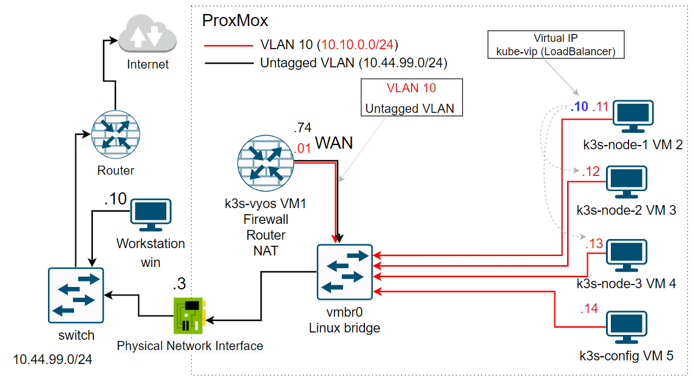
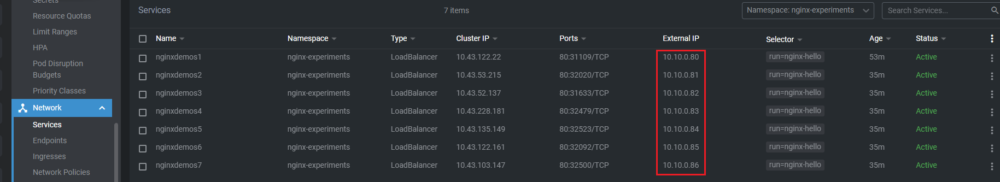

# Setting up a production-like Kubernetes cluster for the first time, part 5, 15 Dec 2022

## Prerequisites: ##

### We use the following network topology


### - Firewall rules


## Delete the `VyOS` firewall policy `INSIDE-OUT` for `eth0` and set it to `eth0.10` interface

* [So far we have configured](../38_setting_up_production_like_kubernetes_cluster_part_3_13_dec_2022/README.md) in step 3 of `Install and manual configure VyOS` section the `VyOS` firewall policy `INSIDE-OUT` for `eth0`.
  
  ```
  del firewall interface eth0 out name 'INSIDE-OUT'
  set firewall interface eth0.10 in name 'INSIDE-OUT'
  ```

* Note we have changed the direction of the packets from `out` to `in`
  
* For example, we could add rule to `INSIDE-OUT` policy that allow traffic from `VLAN 10` to `WAN` host with 
  IP address `10.44.99.81`
    
  ```
  set firewall name INSIDE-OUT rule 9 action 'accept'
  set firewall name INSIDE-OUT rule 9 destination address '10.44.99.81'
  ```

## Install `k3s` cluster via [ansible playbook](https://github.com/Alliedium/awesome-ansible/blob/main/README.md#setting-up-config-machine) on VMs 

### 1. Install ansible

  * For Debian Linux

  ```
  sudo apt update
  sudo apt install ansible
  ```
  
  * Follow step 2 of [`Setting up config machine`](https://github.com/Alliedium/awesome-ansible/blob/main/README.md) section to install the latest version of `Ansible`

  * For Arch Linux (including Manjaro)

  ```
  sudo pacman -Syyuu --needed --noconfirm
  sudo pacman -S ansible python-netaddr
  ```

### 2. Clone [techno-tim/k3s-ansible](https://github.com/techno-tim/k3s-ansible) project on your host.
  
  ```
  git clone https://github.com/techno-tim/k3s-ansible.git $HOME/k3s-ansible
  ```

### 3. Follow steps from [System requirements](https://github.com/techno-tim/k3s-ansible#-system-requirements) and [Preparation](https://github.com/techno-tim/k3s-ansible#-preparation)

  - Create new folder `my-cluster/group_vars` folder
  
  ```
  mkdir -p $HOME/k3s-ansible/inventory/my-cluster/group_vars
  ```

  - Copy [./resources/hosts.yaml](./resources/hosts.yml) file  to `$HOME/k3s-ansible/inventory/my-cluster` folder
  
  ```
  curl https://raw.githubusercontent.com/Alliedium/awesome-devops/main/40_setting_up_production_like_kubernetes_cluster_part_5_15_dec_2022/resources/hosts.yml --output $HOME/k3s-ansible/inventory/my-cluster/hosts.yml
  ```

  - Copy [./resources/all.yaml](./resources/all.yml) file to `$HOME/k3s-ansible/inventory/my-cluster/group_vars` folder
  
  ```
  curl https://raw.githubusercontent.com/Alliedium/awesome-devops/main/40_setting_up_production_like_kubernetes_cluster_part_5_15_dec_2022/resources/all.yml --output $HOME/k3s-ansible/inventory/my-cluster/group_vars/all.yml
  ```


  - In `./inventory/my-cluster/hosts.yml` file replace hosts IP addresses to your `Proxmox` nodes IP addresses and edit the path to private key to match it on your machine.
  - In `./inventory/my-cluster/group_vars/all.yml` file change variables if necessary.
  
### 4. Create `k3s` Cluster

  * Start provisioning of the cluster using the following command:
  
  ```
  ansible-playbook ./site.yml -i ./inventory/my-cluster/
  ```

### 5. Kube Config
  * To copy your kube config locally so that you can access your Kubernetes cluster run:
  
  ```
  scp -o StrictHostKeyChecking=no -i ~/.ssh/id_rsa_cloudinit_k3s k3s-user@10.10.0.11:~/.kube/config ~/.kube/config
  ```
### 6. Using `OpenLens` open `~/.kube/config` file.

### 7. Show how `metalLB` LoadBalancer work

  * In terminal switch to context you need. For example it's called `k3s-cluster`
  
  ```
  kubectl config use-context k3s-cluster
  ```

  * In k3s cluster create new `nginx-experiments` namespace and switch to it
  
  ```
  kubectl create ns nginx-experiments
  kubectl config set-context --current --namespace=nginx-experiments
  ```
  
  *  Run pod with command
  
  ```
  kubectl run nginx-hello --image=nginxdemos/hello --port=80
  ```
  
  * Create services `nginxdemos1` of type `LoadBalancer`

  ```
  kubectl expose pods nginx-hello --name nginxdemos1 --type=LoadBalancer
  kubectl expose pods nginx-hello --name nginxdemos2 --type=LoadBalancer
  kubectl expose pods nginx-hello --name nginxdemos3 --type=LoadBalancer
  kubectl expose pods nginx-hello --name nginxdemos4 --type=LoadBalancer
  kubectl expose pods nginx-hello --name nginxdemos5 --type=LoadBalancer
  kubectl expose pods nginx-hello --name nginxdemos6 --type=LoadBalancer
  kubectl expose pods nginx-hello --name nginxdemos7 --type=LoadBalancer
  ```

  * In `OpenLens` go `OpenLens -> Network -> Services`

  

  * Navigate in browser to `http://10.10.0.80/`
  
  `10.10.0.80` - IP address from address range configured in `metalLB`. The address range is specified in [./inventory/my-cluster/group_vars/all.yml](./resources/all.yml) file from [techno-tim/k3s-ansible](https://github.com/techno-tim/k3s-ansible) project.

  * Create services `nginxdemos90` of type `LoadBalancer` with certain IP address
  
  ```
  kubectl expose pods nginx-hello --name nginxdemos90 --type=LoadBalancer --load-balancer-ip 10.10.0.90
  ```

  * Create services `nginxdemos100` of type `LoadBalancer` with certain IP address, that is not included in `metalLB` IP address range
  
  ```
  kubectl expose pods nginx-hello --name nginxdemos100 --type=LoadBalancer --load-balancer-ip 10.10.0.100
  ```

  * In `OpenLens` go `OpenLens -> Network -> Services`

  

  * Show `arp table` on `k3s` nodes. Go to any `k3s` node and run 
  
  ```
  ip r
  ```
  We do not see IP address `10.10.0.80` of `nginxdemos1` service

  

  * Ping IP address `10.10.0.80`

  ```
  ping 10.10.0.80
  ```

  * Show `arp table` on `k3s` nodes. Go to any `k3s` node and run 
  
  ```
  ip r
  ```

  Now we can see the IP address `10.10.0.80` of `nginxdemos1` service in `arp` table and it belongs to the second node.

  

  * Change `metalLB` IP address range. Go to `OpenLens -> Custom Resources -> metallb.io -> IPAddressPool` and edit manifest of `first-pool` to `10.10.0.80-10.10.0.100`.
  
      

  * Click `save & Close`

  ## References on: Setting up a production-like Kubernetes cluster for the first time, part 4, 13 Dec 2022 ##

1. [techno-tim/k3s-ansible](https://github.com/techno-tim/k3s-ansible)
2. [kube-vip](https://kube-vip.io/)
3. [MetalLB](https://docs.k0sproject.io/head/examples/metallb-loadbalancer/)
4. [Roll Out the Red Carpet for Production Kubernetes Clusters with a Kube-vip](https://www.youtube.com/watch?v=JvDjQLrAGSY&t=1371s)
5. [Say good-bye to HAProxy and Keepalived with kube-vip on your HA K8s control plane](https://inductor.medium.com/say-good-bye-to-haproxy-and-keepalived-with-kube-vip-on-your-ha-k8s-control-plane-bb7237eca9fc)
6. [METALLB](https://metallb.universe.tf/)
7. [Deploy MetalLB as an on prem load-balancer for your Kubernetes services](https://devops.cisel.ch/deploy-metallb-as-an-on-prem-load-balancer-for-your-kubernetes-services)
8. [nginxdemos/hello](https://hub.docker.com/r/nginxdemos/hello/)