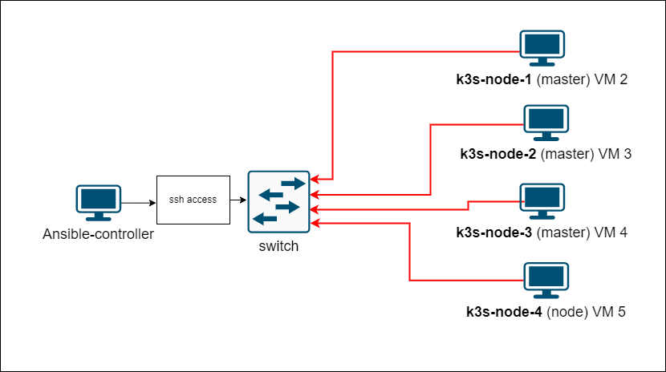

# Explain k3s `Ansible` playbook

### In our 40 lesson we have shown as run k3s `Ansible` playbook in [`Install k3s cluster via ansible playbook on VMs`](../40_setting_up_production_like_kubernetes_cluster_part_5_15_dec_2022/README.md) section.

In this tutorial we explained how [k3s `Ansible` playbook](https://github.com/techno-tim/k3s-ansible) works. When starting the `Ansible` playbook, as an example, we used the following [scheme](./images/Scheme_1.png).

  - 

      * `Ansible-controller`  - workstation on which we run the `Ansible` playbook
      * `k3s-node-x` - these are the VMs on which we install `k3s` cluster 
  
  * In our example we installed 3 `masters` and 1 `node` `k3s` cluster nodes, but you can install any number of nodes. It is recommended to install at least 3 `master` nodes. 
  * `Ansible-controller` should have `ssh` access to `k3s-node-x` VMs, VMs must have a network connection between themselves. Your can create in `Proxmox` all VMs using our [scripts](https://github.com/Alliedium/awesome-linux-config).

  * Before you start playbook see `System requirements` section.
  * How to install latest `Ansible` version on `Debian` or `Ubuntu` see [Install the latest version of Ansible](https://github.com/Alliedium/awesome-ansible) section.

  * `Inventary` was discussed in 33 lecture.
  * `Ansible` vars precedence was explained in 36 lecture.
  * `VIP` and `metallb` - 40 lecture.
  * `ssh-keygen` - 6 and 29 lessons.
  * `Systemd` - 9 lecture.
  

# References on #

1. [Alliedium/devops-course-2022](https://github.com/Alliedium/devops-course-2022)
2. [DevOps training on elearning](https://elearning.alliedtesting.com/course/view.php?id=107)
3. [techno-tim/k3s-ansible](https://github.com/techno-tim/k3s-ansible)
4. [Install the latest version of Ansible](https://github.com/Alliedium/awesome-ansible)
5. [Diagram k3d](https://www.sokube.ch/post/k3s-k3d-k8s-a-new-perfect-match-for-dev-and-test)
6. [kube-vip](https://kube-vip.io/)
7. [Kube-vip](https://www.youtube.com/watch?v=JvDjQLrAGSY)
8. [Say good-bye to HAProxy and Keepalived with kube-vip on your HA K8s control plane](https://inductor.medium.com/say-good-bye-to-haproxy-and-keepalived-with-kube-vip-on-your-ha-k8s-control-plane-bb7237eca9fc)
9. [Linux configuration: Understanding *.d directories in /etc](https://www.redhat.com/sysadmin/etc-configuration-directories)
10. [CONFIGURATION DIRECTORIES AND PRECEDENCE](https://man7.org/linux/man-pages/man5/sysctl.d.5.html)
11. [set -e, -u, -x, -o pipefail](https://gist.github.com/mohanpedala/1e2ff5661761d3abd0385e8223e16425)