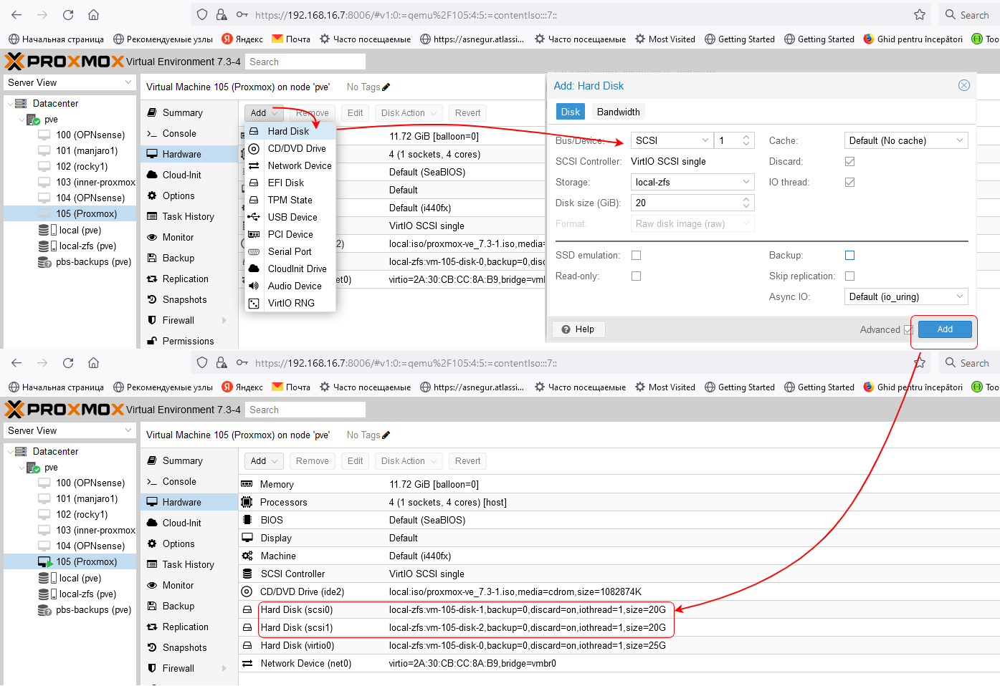

# Proxmox Backup Server #

## Prerequisites
- [Proxmox node](https://www.proxmox.com/en/proxmox-ve/get-started) with ~ 8 GiB RAM and ~ 20 GB local disk storage

## Installing a `Proxmox Backup Server` on a virtual machine.

### 1. Download `Proxmox Backup Server` iso image to Proxmox.


### 2. Add two "external" HDD disks to `Proxmox`

  - If your nested `Proxmox` is hosted in a `Proxmox`, then add disks like this

     

  - If your nested `Proxmox` is hosted in a `Hyper-V`, add disk in settings or your VM
   
     

  - In `Proxmox` terminal check added HDD disks
  
     

  - Create RAID1 zpool
  
     ```
     zpool create bpool mirror /dev/sda /dev/sdb
     zpool list
     ```

     

  - Export zpool
  
  ```
  zpool export bpool
  ``` 


### 3. Create `Proxmox Backup Server` VM


### 4. Pass two HDD disk to created `Proxmox Backup Server` VM

  - Find disk id of two disks
  
  ```
  find /dev/disk/by-id/ -type l|xargs -I{} ls -l {}|grep -v -E '[0-9]$' |sort -k11|cut -d' ' -f9,10,11,12
  ```

  

  - Pass HDD disks to `Proxmox Backup Server` VM
  
  ```
  qm set 100 -scsi1 /dev/disk/by-id/scsi-0QEMU_QEMU_HARDDISK_drive-scsi0
  qm set 100 -scsi2 /dev/disk/by-id/scsi-0QEMU_QEMU_HARDDISK_drive-scsi1
  ```
  
  

### 5. Install `Proxmox Backup Server` 

  - Start and install `Proxmox Backup Server` VM.


  - Import zpool
  
  ```
  zpool import bpool
  zpool list
  ```

  - In browser navigate to IP


### 6. Configure  `Proxmox Backup Server` 

  - Add datastore


  
  - Make no-subscription. Edit `/etc/apt/sources.list.d/pbs-enterprise.list` file, comment line and add new line
  
  ```
  deb http://download.proxmox.com/debian/pbs bullseye pbs-no-subscription
  ```
  


  - Update packages
  
  ```
  apt update
  apt upgrade
  ```
  - Add prune job


  - Add verify job
  


  - Traffic control


  - Reboot `Proxmox Backup Server` 

  - Install qemu-guest-agent

```
apt install qemu-guest-agent
systemctl start qemu-guest-agent
```

### 7. Configure  `Proxmox`

  - Add `Proxmox Backup Server` storage


  - Configure `Backup`

