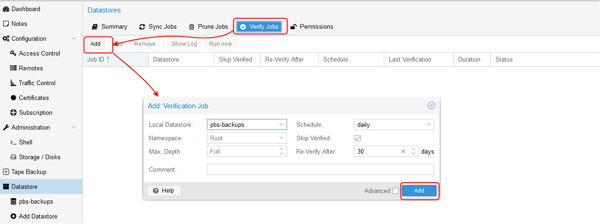

# Proxmox Backup Server #

## Prerequisites
- [Proxmox node](https://www.proxmox.com/en/proxmox-ve/get-started) with ~ 12 GiB RAM and ~ 50 GB local disk storage

## Installing a `Proxmox Backup Server` on a virtual machine.

### 1. Download `Proxmox Backup Server` iso image to Proxmox.


### 2. Add two "external" HDD disks to nested `Proxmox` node
  The `Proxmox` node can be installed on a physical computer or on virtual machine. `Proxmox` on VM we can call nested `Proxmox`. In our example in the "external" `Proxmox`, we have created an nested `Proxmox` in which we add two HDD disks and show the `Proxmox Backup Server` setup.

  - If your nested `Proxmox` is hosted in a `Proxmox`, then add disks to nested `Proxmox` in hosted `Proxmox` like this

     

  - If your nested `Proxmox` is hosted in a `Hyper-V`, add disks in settings of your VM
   
     

  - If your `Proxmox` is installed on hardware, physically connect two hard drives to `Proxmox` station.

  - In nested `Proxmox` terminal check added HDD disks
  
  ```
  lsblk
  ```

   

  - Create RAID1 zpool in nested `Proxmox` node
  
     ```
     zpool create bpool mirror /dev/sda /dev/sdb
     zpool list
     ```

     

  - Export zpool from nested `Proxmod` node  
  ```
  zpool export bpool
  ``` 
  
### 3. Create `Proxmox Backup Server` VM


### 4. Passthrough two Physical Disks to created `Proxmox Backup Server` VM

  - Find disk id of two disks in nested `Proxmox` node
  
  ```
  find /dev/disk/by-id/ -type l|xargs -I{} ls -l {}|grep -v -E '[0-9]$' |sort -k11|cut -d' ' -f9,10,11,12
  ```

  

  - Pass HDD disks to `Proxmox Backup Server` VM
  
  ```
  qm set 100 -scsi1 /dev/disk/by-id/scsi-0QEMU_QEMU_HARDDISK_drive-scsi0
  qm set 100 -scsi2 /dev/disk/by-id/scsi-0QEMU_QEMU_HARDDISK_drive-scsi1
  ```
  where `100` is id of `Proxmox Backup Server` VM in `Proxmod` node
  
  

### 5. Install `Proxmox Backup Server` 

  - Start and install `Proxmox Backup Server` VM.


  - Import zpool to `Proxmox Backup Server` VM, in terminal `Proxmox Backup Server` VM run
  
  ```
  zpool import bpool
  zpool list
  ```

  - In browser navigate to `https://192.168.16.109:8007`


### 6. Configure  `Proxmox Backup Server` 

  - Add datastore


  
  - Make no-subscription. Edit `/etc/apt/sources.list.d/pbs-enterprise.list` file, comment first line and add new line
  
  ```
  deb http://download.proxmox.com/debian/pbs bullseye pbs-no-subscription
  ```
  


  - Update packages
  
  ```
  apt update
  apt upgrade
  ```
  - Add prune job


  - Add verify job
  


  - Traffic control


  - Reboot `Proxmox Backup Server` 

  - Install qemu-guest-agent

```
apt install qemu-guest-agent
systemctl start qemu-guest-agent
```

### 7. Configure  `Proxmox` node

  - Add `Proxmox Backup Server` storage to `Proxmox` node


  - Configure `Backup`


# References

1. [Setting up backups on Proxmox](https://github.com/Alliedium/awesome-devops/tree/main/06_proxmox_lvm_resize_disk_ssh_access_backups_25-aug-2022#backup)
2. [Backup and Restore](https://pve.proxmox.com/wiki/Backup_and_Restore)
3. [Proxmox Backup Server](https://www.proxmox.com/en/proxmox-backup-server)
4. [Proxmox Backup Server, Get Started](https://www.proxmox.com/en/proxmox-backup-server/get-started)
5. [Welcome to the Proxmox Backup documentation!](https://pbs.proxmox.com/docs/)
6. [Backup Storage, Disk Management](https://pbs.proxmox.com/docs/storage.html)
7. [Passthrough Physical Disk to Virtual Machine (VM)](https://pve.proxmox.com/wiki/Passthrough_Physical_Disk_to_Virtual_Machine_(VM))
8. [How To Install Proxmox Backup Server Step by Step](https://ostechnix.com/install-proxmox-backup-server/)
9. [How To Install Proxmox Backup Server (PBS) As A VM On PVE](https://tekgru.com/how-to-install-proxmox-backup-server-pbs-as-a-vm-on-pve/)
10. [Beginner's guide to ZFS. Part 16: Importing and Exporting Pools](https://www.youtube.com/watch?v=lCTrx9g6C5Y)