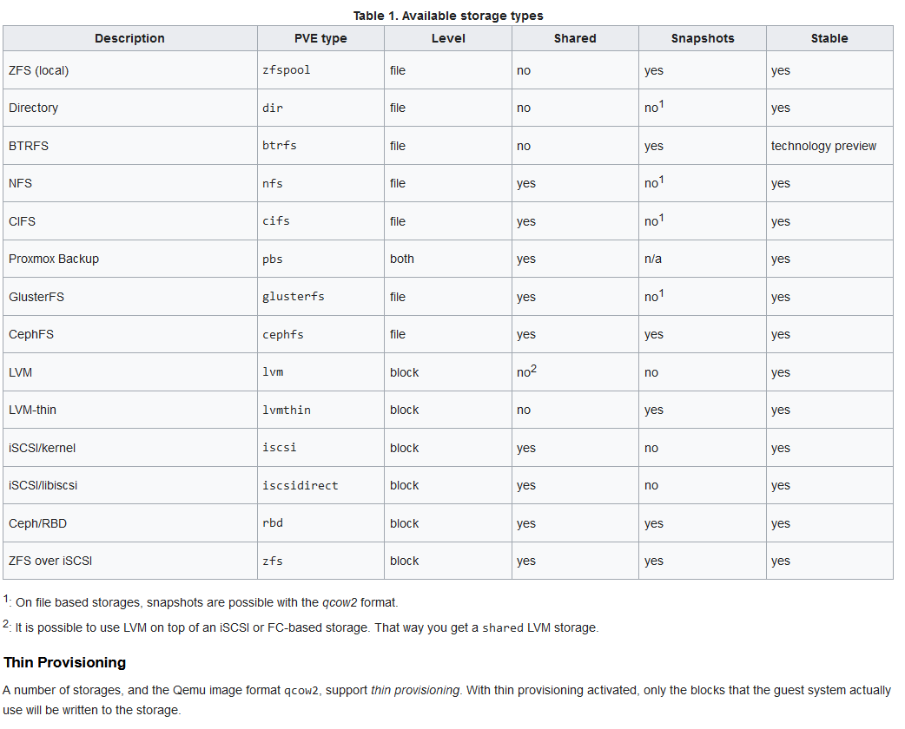

# Proxmox advanced email notifications, Ansible postfix playbook #

## Prerequisites
- [Proxmox node](https://www.proxmox.com/en/proxmox-ve/get-started) with ~ 8 GiB RAM and ~ 20 GB local disk storage.
- Follow [step to install](../49_advanced_backing_up_of_infrastruture_in_proxmox_23-feb-2023/README.md#installing-a-proxmox-backup-server-on-a-virtual-machine) `Proxmox Backup Server` in `Proxmox`

## 1. SSH known_hosts file

In the context of computer networking, known_hosts is a file used by SSH (Secure Shell) clients to verify the identity of a remote server before establishing a connection. 
When an SSH client connects to a server for the first time, the server’s public key is exchanged with the client and saved in the known_hosts file on the client’s system.
On subsequent connections, the client verifies the server’s identity by checking the key in the known_hosts file against the one presented by the server.
If there is a match, the connection will proceed. If the match fails, ssh will fail with an error message. When reinstalling the OS, the public key of the machine with the same IP addresses will already be different and the ssh connection will fail.


To fix this, you need to edit  the `$HOME/.ssh/known_hosts ` file

```
ssh-keygen -f "$HOME/.ssh/known_hosts" -R "10.44.99.89"
```

This command remove line in `$HOME/.ssh/known_hosts` file that start with "10.44.99.89" IP address. After changing the `$HOME/.ssh/known_hosts` file, you can connect to the remote host whose public key has changed.

## 2. Setting up email notification during backup `Proxmox` VMs to `Proxmox backup Service`

  - install dependencies
  
    ```
    apt update
    apt install -y libsasl2-modules mailutils
    ```

  - Enable two step verification in google account.
  
    

    

  - Configure app passwords on your Google account `https://myaccount.google.com/apppasswords`
 
  

  - Configure postfix

  ```
  echo "smtp.gmail.com ansnegur1@gmail.com:blanugjfgsmivxwr" > /etc/postfix/sasl_passwd
  ```

  - update permissions
  
  ```
  chmod 600 /etc/postfix/sasl_passwd
  ```

  - hash the file
  
  ```
  postmap hash:/etc/postfix/sasl_passwd
  ```

  - check to to be sure the db file was created
  
  ```
  cat /etc/postfix/sasl_passwd.db
  ```

  - edit postfix config
  
  ```
  nano /etc/postfix/main.cf
  ```

  ```
  relayhost = smtp.gmail.com:587
  smtp_use_tls = yes
  smtp_tls_session_cache_timeout = 3600s
  smtp_sasl_auth_enable = yes
  smtp_sasl_security_options =
  smtp_sasl_password_maps = hash:/etc/postfix/sasl_passwd
  smtp_tls_CAfile = /etc/ssl/certs/Entrust_Root_Certification_Authority.pem
  smtp_tls_session_cache_database = btree:/var/lib/postfix/smtp_tls_session_cache
  smtp_tls_session_cache_timeout = 3600s
  ```
 
  - reload postfix
  
  ```
  postfix reload
  ```

  - send a test emails
  
  ```
  echo "This is a test message sent from postfix on my Proxmox Server" | mail -s "Test Email from Proxmox" your-email@gmail.com
  ```

  - check email 
  
  

  - fix from name in email, install dependency
  
  ```
  apt update
  apt install postfix-pcre
  ```

  - edit config
  
  ```
  nano /etc/postfix/smtp_header_checks
  ```

  - add the following text
  
  ```
  /^From:.*/ REPLACE From: pve1-alert pve1-alert@something.com
  ```

  - hash the file
  
  ```
  postmap hash:/etc/postfix/smtp_header_checks
  ```

  - check the contents of the file
  
  ```
  cat /etc/postfix/smtp_header_checks.db
  ```

  - add the module to our postfix config
  
  ```
  nano /etc/postfix/main.cf
  ```

  - add to the end of the file
  
  ```
  smtp_header_checks = pcre:/etc/postfix/smtp_header_checks
  ```

  - reload postfix service
  
  ```
  postfix reload
  ```
  
## 3. Ansible `postfix` playbook

### **Clone Ansible  `postfix` playbook**

```
git clone https://github.com/Alliedium/awesome-proxmox.git $HOME/awesome-proxmox
```

Follow all [steps from Alliedium/awesome-proxmox](https://github.com/Alliedium/awesome-proxmox/tree/main/postfix#prerequisites) to run Ansible `postfix` playbook

## 4. Storage Types
### **Available storage types**

There are basically two different classes of storage types:

### 1. File level storage

  - File level based storage technologies allow access to a fully featured (POSIX) file system. They are in general more flexible than any Block level storage (see below), and allow you to store content of any type. ZFS is probably the most advanced system, and it has full support for snapshots and clones.

### 2. Block level storage

  - Allows to store large raw images. It is usually not possible to store other files (ISO, backups, ..) on such storage types. Most modern block level storage implementations support snapshots and clones. RADOS and GlusterFS are distributed systems, replicating storage data to different nodes.




# References

1. [Does ssh send the password over the network?](https://unix.stackexchange.com/questions/297847/does-ssh-send-the-password-over-the-network)
2. [ssh-keygen(1) - Linux man page](https://linux.die.net/man/1/ssh-keygen)
3. [What is the known_hosts File for ssh in Linux?](https://linuxhint.com/known-hosts-file-ssh-linux/)
4. [How to remove or update a single entry from the SSH known_hosts file](https://www.techrepublic.com/article/how-to-remove-or-update-a-single-entry-from-the-ssh-known-hosts-file/)
5. [Set up alerts in Proxmox before it's too late! youtube](https://www.youtube.com/watch?v=85ME8i4Ry6A)
6. [Set up alerts in Proxmox before it's too late!](https://docs.technotim.live/posts/proxmox-alerts/)
7. [Oefenweb/ansible-postfix ](https://github.com/Oefenweb/ansible-postfix)
8. [Protecting sensitive data with Ansible vault](https://docs.ansible.com/ansible/latest/vault_guide/index.html)
9. [ansible-vault](https://docs.ansible.com/ansible/latest/cli/ansible-vault.html)
10. [Encrypting content with Ansible Vault](https://docs.ansible.com/ansible/latest/vault_guide/vault_encrypting_content.html)
11. [Handling secrets in your Ansible playbooks](https://www.redhat.com/sysadmin/ansible-playbooks-secrets)
12. [How to encrypt sensitive data in playbooks with Ansible Vault](https://www.redhat.com/sysadmin/ansible-vault-secure-playbooks)
13. [Managing vault passwords](https://docs.ansible.com/ansible/latest/vault_guide/vault_managing_passwords.html)
14. [ansible-playbook](https://docs.ansible.com/ansible/latest/cli/ansible-playbook.html)
15. [Roadmap](https://pbs.proxmox.com/wiki/index.php/Roadmap)
16. [Storage](https://pve.proxmox.com/wiki/Storage)
17. [TrueNAS](https://en.wikipedia.org/wiki/TrueNAS)
18. [TrueNAS](https://www.truenas.com/)
19. [TheGrandWazoo/freenas-proxmox](https://github.com/TheGrandWazoo/freenas-proxmox)
20. [Network share: Performance differences between NFS & SMB](https://ferhatakgun.com/network-share-performance-differences-between-nfs-smb/)