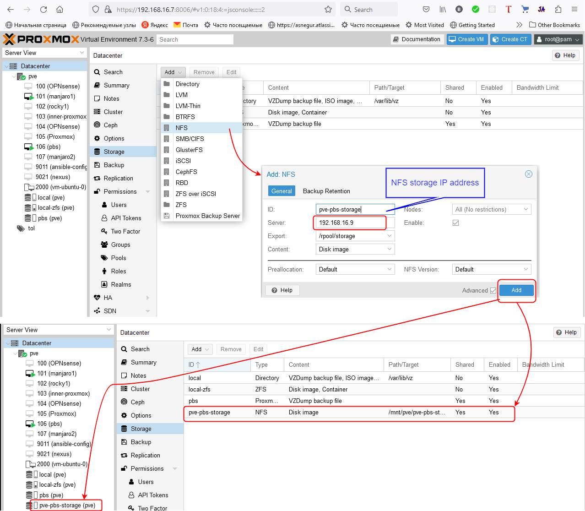
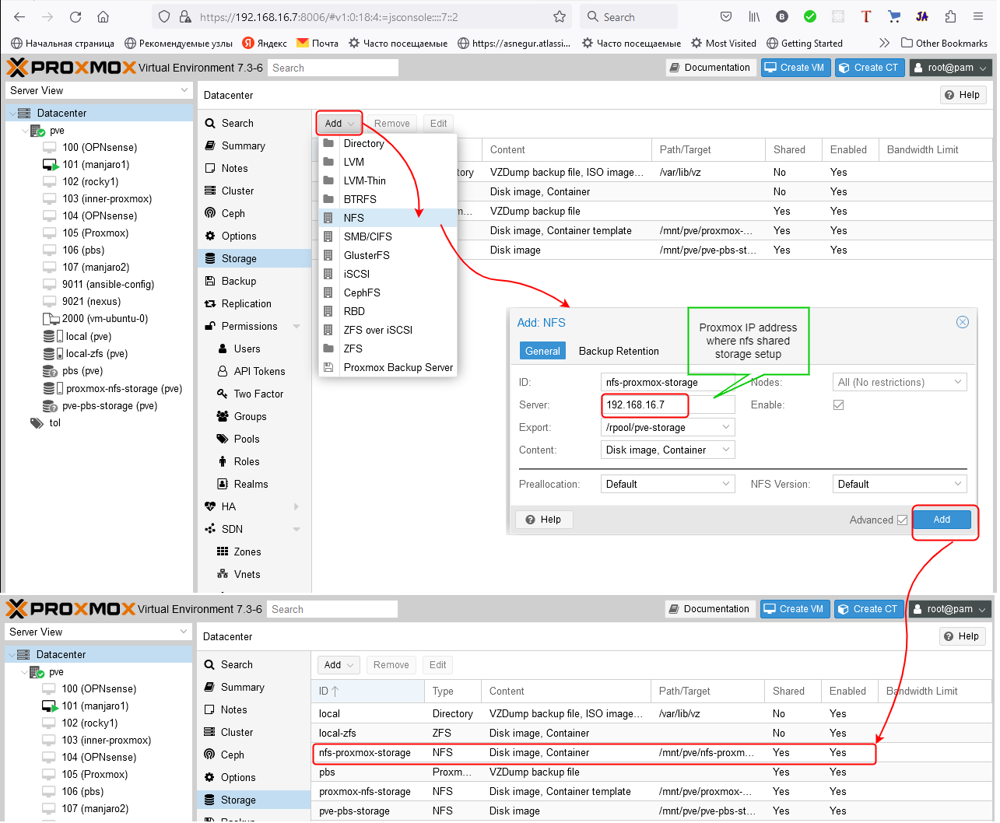
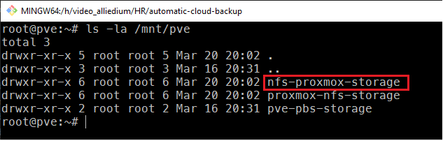
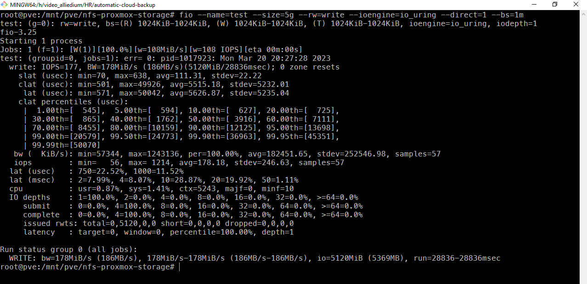
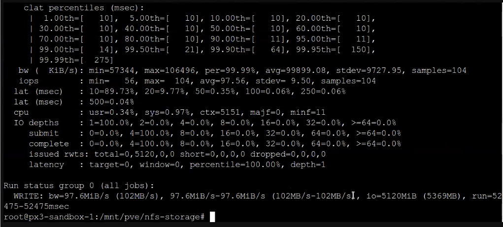
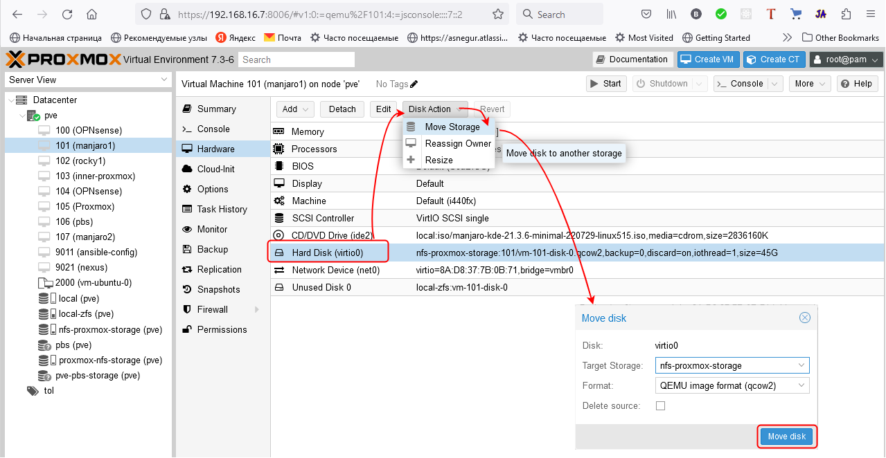
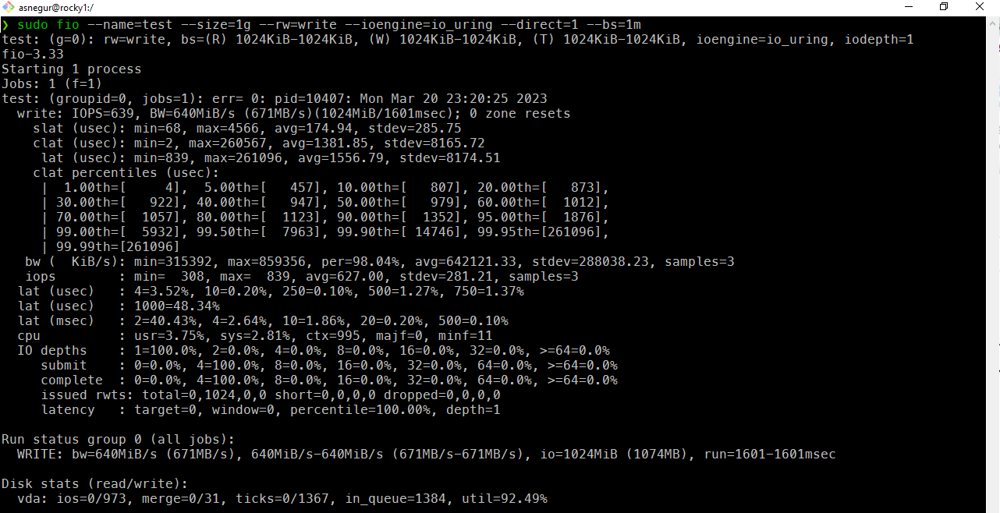
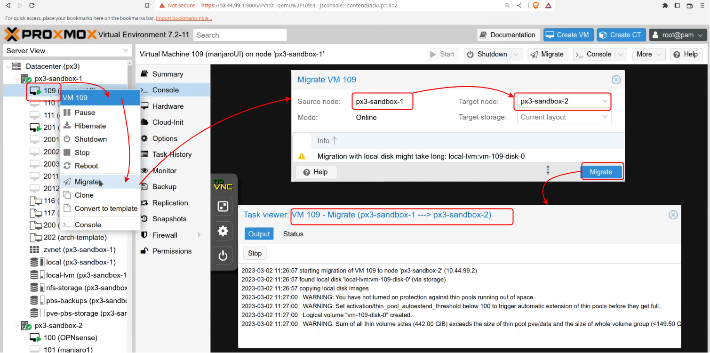
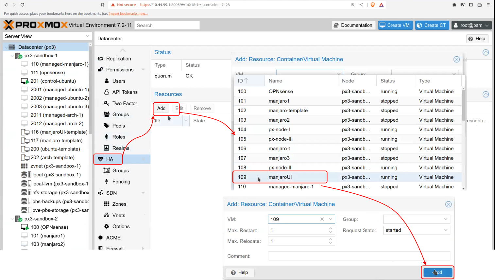
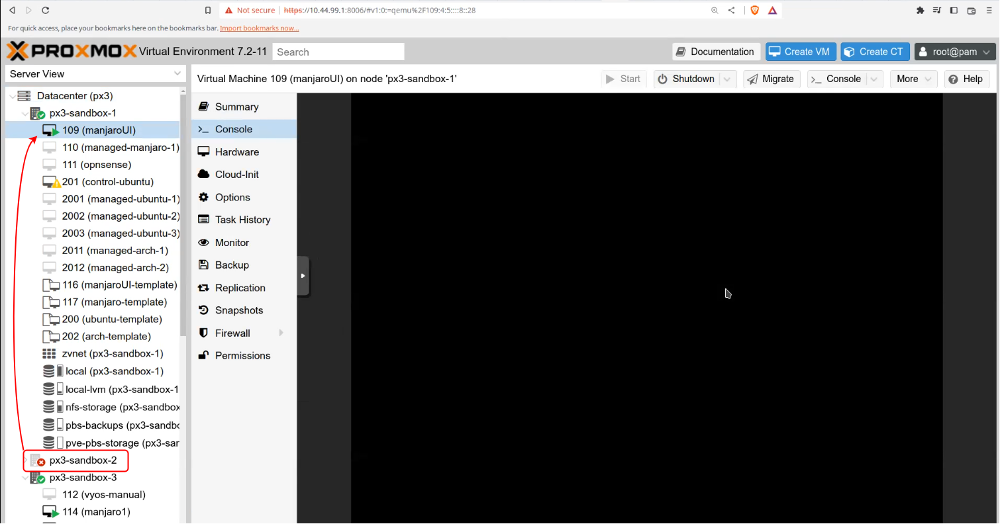

# NFS shared stored, HA in Proxmox #

## Prerequisites
- [Proxmox cluster](https://www.proxmox.com/en/proxmox-ve/get-started) with ~ 12 GiB RAM and ~ 50 GB local disk storage


## 1. Save ansible vault password from secrets in a file, e.g. `pw_vault.txt` and run ansible playbook using ansible-vault file.

```
ansible-playbook ./site.yaml -i ./inventory/ -e @secrets-file.enc --vault-password-file ./pw_vault.txt
```

`site.yaml` - ansible playbook

`inventory` - folder with `hosts.yml` file

`secrets-file.enc` - ansible vault file where secrets are stored

`pw_vault.txt` - where ansible vault file password is stored

## 2. Setting up NFS share storage on ZFS on `Proxmox Backup Server`.

 - Update packages
  
  ```
  apt update
  apt upgrade
  ```

 - Like in [How to set it up](https://github.com/Alliedium/awesome-linux-config/blob/master/proxmox7/zfs/how-to-share-zfs-via-nfs-on-linux.md#how-to-set-it-up) step set up `NFS`
  
  ```
  apt install -y nfs-kernel-server
  ```

  - Create zfs `rpool/storage` data set
  
  ```
  zfs create rpool/storage
  ```

  - Setting up `NFS`
  
  ```
  zfs set sharenfs="async,rw=@192.168.16.0/24,no_root_squash" rpool/storage
  ```

  NFS use 2049 port.

  ## 3. Add NFS storage in `Proxmox`

  

  ## 4. Setting up NFS share storage on ZFS in `Proxmox` node.

  - Like in [How to set it up](https://github.com/Alliedium/awesome-linux-config/blob/master/proxmox7/zfs/how-to-share-zfs-via-nfs-on-linux.md#how-to-set-it-up) step set up NFS on `Proxmox` node

  ```
  apt install -y nfs-kernel-server
  zfs create rpool/shared-storage
  zfs set sharenfs="async,rw=@192.168.16.0/24,no_root_squash" rpool/shared-storage
  ```

  

  ## 5. Testing the speed of writing/reading a file in NFS shared storage

  - Install `fio` tool on the host where NFS is configured
  
  ```
  apt install fio
  ```

  - Get NFS shared storage list
  
  ```
   ls -la /mnt/pve
  ```

  

  - Go to `/mnt/pve/nfs-proxmox-storage`
  
  ```
  cd /mnt/pve/nfs-proxmox-storage
  ```
  
  - run command on `Proxmod` node where NFS shared storage located
  
  ```
  fio --name=test --size=5g --rw=write --ioengine=io_uring --direct=1 --bs=1m
  ```

  

  - run command on `Proxmod` node which is connected to NFS shared storage
  
  ```
  fio --name=test --size=5g --rw=write --ioengine=io_uring --direct=1 --bs=1m
  ```

  


## 6. Testing the speed of writing/reading a file on VM

- Move VM HDD disk to `NFS` shared storage, in our case it is the 101(manjaro1)



- Installing `fio` on `Manjaro`

```
sudo pacman -S fio
```

- Run the commmand

  ```
  fio --name=test --size=5g --rw=write --ioengine=io_uring --direct=1 --bs=1m
  ```
 
 
 
## 7. Migrate VM to another `Proxmox` node

We used VM ID 109 for the migration.



## 8. HA in `Proxmox` cluster
 We will use VM id 109 on `px3-sandbox-2` node.



- Shut down `px3-sandbox-2` node



# References

1. [Managing vault passwords](https://docs.ansible.com/ansible/latest/vault_guide/vault_managing_passwords.html)
2. [ansible-playbook](https://docs.ansible.com/ansible/latest/cli/ansible-playbook.html)
3. [Storage](https://pve.proxmox.com/wiki/Storage)
4. [Setting up NFS share on ZFS](https://github.com/Alliedium/awesome-linux-config/blob/master/proxmox7/zfs/how-to-share-zfs-via-nfs-on-linux.md)
5. [fio(1) - Linux man page](https://linux.die.net/man/1/fio)
6. [fio - Flexible I/O tester rev. 3.33](https://fio.readthedocs.io/en/latest/fio_doc.html)
7. [axboe/fio](https://github.com/axboe/fio)
8. [ZFS Pool Performance vs LXC](https://forum.proxmox.com/threads/zfs-pool-performance-vs-lxc.104543/)
9. [High Availability](https://pve.proxmox.com/wiki/High_Availability)
10. [Proxmox VE Full Course: Class 16 - High Availability](https://www.youtube.com/watch?v=1nEs1ZvGbTM) 