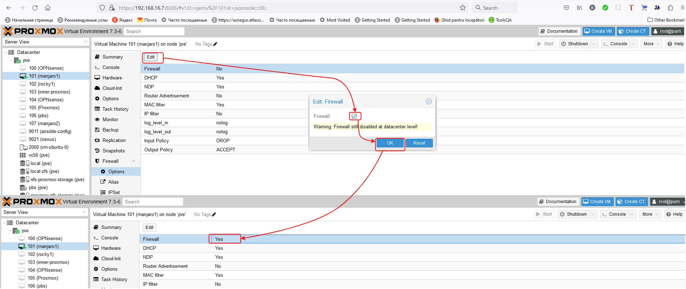
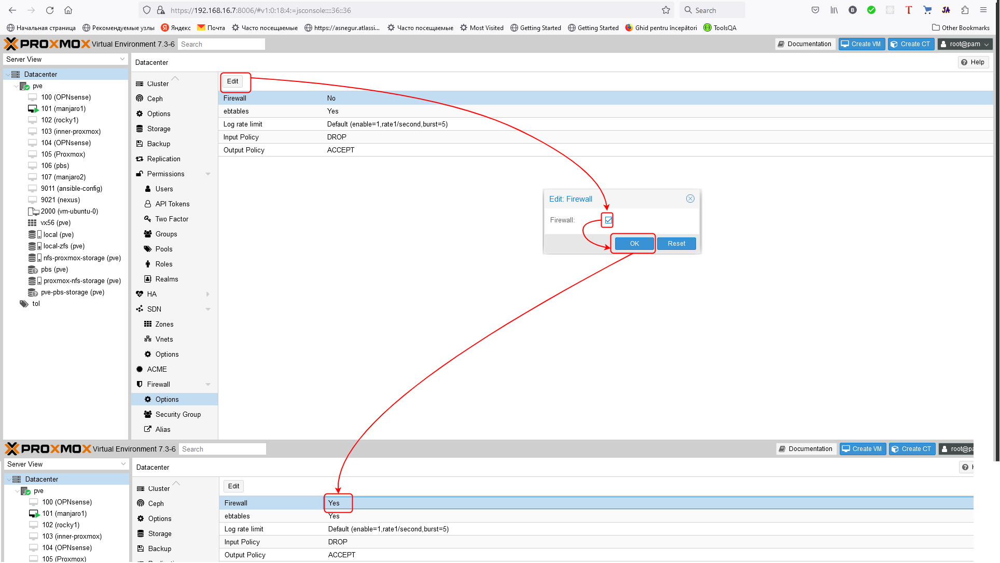
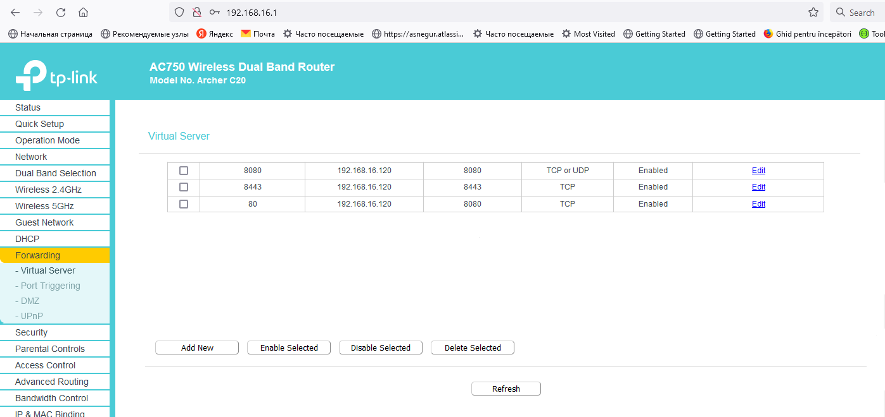
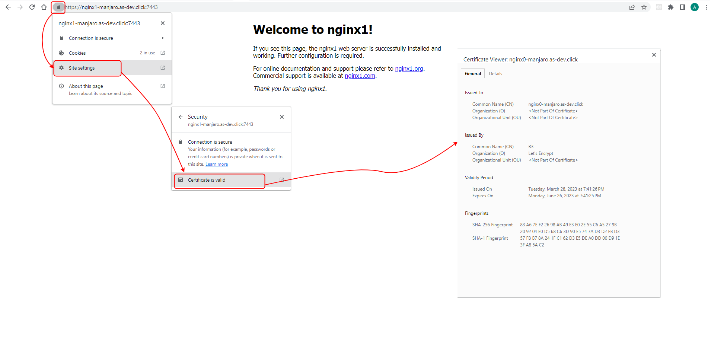

# Amazon NGINX, PART 3 #

 In this example, we are setting up nginx in the same way as in the second example, we will issue certificates for domain names: `nginx0-manjaro.devopshive.link` and `nginx1-manjaro.devopshive.link` which will be available from the Internet, and we will also automatically renew the certificate using the certbot, certbot-nginx and crontab tools.

## Prerequisites: ##

  The following commands were executed on VM with `Manjaro` Linux distribution (however, they might be performed on another Linux distribution, but the command might differ, e.g. another package manager etc.)

  - ### Clone [awesome-nginx](https://github.com/Alliedium/awesome-nginx) repo
  
  ```
  git clone https://github.com/Alliedium/awesome-nginx.git $HOME/awesome-nginx
  cd $HOME/awesome-nginx
  ```
  - ### Please follow the steps of [Example 7](https://github.com/Alliedium/awesome-nginx#7-virtual-hosting-with-letsencrypt-tls-certificate-generated-by-certbot-with-http-01-challange)

## 1. Create second-level subdomains in amazon. ##

  

  - `as-dev.click` is a domain. In the video example, a `devopshive.link` was used
  - `212.28.91.206` public IP address

 - ### To check domain name and IP address mappings install `bind`

  ```
  sudo pacman -S bind
  ```

  - after that, two tools will become available: `dig` and `lookup`
  
  ```
  nslookup nginx0-manjaro.as-dev.click
  ```

  

## 2. Proxmox firewall

  - Configure on your VM [iptables](https://github.com/Alliedium/awesome-nginx#make-sure-that-nginx-running-on-your-manjaro-host-is-reachable-from-other-vms-on-the-same-network)

  - Enable VM firewall in network interface
  
  

  - Enable VM firewall `Options`
  
  

  - Enable Datacenter firewall options

  

  
  - Add security group and two rules to Datacenter firewall `Security Group`
  
  

  - Add security group to VM firewall
  
  

## 3. Expose ports 8443 and 8080 on NGINX host to internet.



## 4. Check SSL certificate in browser



## 5. Certificate [renew automation](https://www.nginx.com/blog/using-free-ssltls-certificates-from-lets-encrypt-with-nginx/#auto-renewal)

  - Run the command
  
  ```
  crontab -e
  ```

  - Add the `certbot` command to run daily. In this example, we run the command every day at noon. The command checks to see if the certificate on the server will expire within the next 30 days, and renews it if so. The --quiet directive tells certbot not to generate output.
  
  ```
  0 12 * * * /usr/bin/certbot renew --quiet
  ```

# References #

- https://www.digitalocean.com/community/tools/nginx
- https://github.com/trimstray/nginx-admins-handbook
- https://github.com/h5bp/server-configs-nginx
- https://artifacthub.io/packages/helm/bitnami/nginx
- https://github.com/nginxinc/NGINX-Demos/tree/master/nginx-hello
- https://www.youtube.com/watch?v=7VAI73roXaY
- https://levelup.gitconnected.com/multiplex-tls-traffic-with-sni-routing-ece1e4e43e56
- https://github.com/Alliedium/awesome-devops/blob/main/17_networks_ssl-termination_acme_route53_06-oct-2022/README.md
- https://letsencrypt.org/docs/challenge-types/
- https://letsencrypt.org/docs/rate-limits/
- https://www.nginx.com/blog/using-free-ssltls-certificates-from-lets-encrypt-with-nginx/#auto-renewal
- https://nandovieira.com/using-lets-encrypt-in-development-with-nginx-and-aws-route53
- https://certbot-dns-route53.readthedocs.io/en/stable/#welcome-to-certbot-dns-route53-s-documentation
- https://certbot.eff.org/instructions?ws=nginx&os=arch
- https://ssl-config.mozilla.org/#server=nginx&version=1.17.7&config=intermediate&openssl=1.1.1k&guideline=5.6
- https://github.com/certbot/certbot/blob/master/certbot-nginx/certbot_nginx/_internal/tls_configs/options-ssl-nginx.conf
- https://scaron.info/blog/improve-your-nginx-ssl-configuration.html
- https://serverfault.com/questions/997614/setting-ssl-prefer-server-ciphers-directive-in-nginx-config
- https://wiki.archlinux.org/title/certbot#Automatic_renewal

