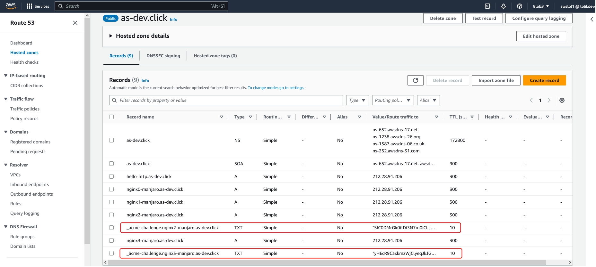

# Amazon NGINX, PART 4 #

 In this example, we will consider virtual hosting with LetsEncrypt TLS certificate generated by `certbot` with DNS-01 challenge. `nginx` configuration was based on example number seven.

 We will issue certificates for domain names: `nginx2-manjaro.devopshive.link` and `nginx3-manjaro.devopshive.link` which will be available from the Internet, and we will also automatically renew the certificate using the certbot, certbot-dns-route53, certbot-nginx, certbot-renew.timer and certbot-renew.service. See [Create second-level subdomains in amazon](../52_amazon-nginx_part-3_07-mar-2023/README.md#1-create-second-level-subdomains-in-amazon)

## Prerequisites: ##

  The following commands were executed on VM with `Manjaro` Linux distribution (however, they might be performed on another Linux distribution, but the command might differ, e.g. another package manager etc.)

  - ### Clone [awesome-nginx](https://github.com/Alliedium/awesome-nginx) repo
  
  ```
  git clone https://github.com/Alliedium/awesome-nginx.git $HOME/awesome-nginx
  cd $HOME/awesome-nginx
  ```
  - ### Please follow the steps of [Example 8](https://github.com/Alliedium/awesome-nginx#8-virtual-hosting-with-letsencrypt-tls-certificate-generated-by-certbot-with-dns-01-challange)


## Basic commands: ##

See all includes in nginx configuration

```
sudo nginx -T
```

Get all installed TLS certificates

```
sudo certbot certificates
```

Delete installed certificate

```
sudo certbot delete --cert-name nginx2-manjaro.devopshive.link
```

Configure credentials for aws-cli.

- First way - define environment variables:  `AWS_ACCESS_KEY_ID` and `AWS_SECRET_ACCESS_KEY`
- Second way
   - Create file `$HOME/.aws/credentials`
   
   ```
   [default]
   aws_access_key_id = AARETW26YKJFDRLSSF4V
   aws_secret_access_key = 6G0DREFDFhowM/kCf58zMFREDWl4a5XRtjCCfdRe
   ```
   - Create file `$HOME/.aws/config`

   ```
   [default]
   region = us-east-1
   ```
   
Plugin `certbot-dns-route53` will create two records in route53 (DNS), during the issuance of the certificate.




`certbot-dns-route53` logs

```
sudo journalctl -u certbot-renew.service
```

```
sudo cat /var/logs/letsencrypt/letsencrypt.log
```


# References

- http://nginx.org/en/docs/
- http://nginx.org/en/docs/beginners_guide.html
- https://docs.nginx.com/nginx/admin-guide/load-balancer/http-load-balancer/
- https://docs.nginx.com/nginx/admin-guide/load-balancer/tcp-udp-load-balancer/
- https://www.baeldung.com/linux/nginx-docker-container
- https://github.com/digitalocean/nginxconfig.io
- https://www.digitalocean.com/community/tools/nginx
- https://github.com/trimstray/nginx-admins-handbook
- https://github.com/h5bp/server-configs-nginx
- https://artifacthub.io/packages/helm/bitnami/nginx
- https://github.com/nginxinc/NGINX-Demos/tree/master/nginx-hello
- https://www.youtube.com/watch?v=7VAI73roXaY
- https://levelup.gitconnected.com/multiplex-tls-traffic-with-sni-routing-ece1e4e43e56
- https://github.com/Alliedium/awesome-devops/blob/main/17_networks_ssl-termination_acme_route53_06-oct-2022/README.md
- https://letsencrypt.org/docs/challenge-types/
- https://letsencrypt.org/docs/rate-limits/
- https://www.nginx.com/blog/using-free-ssltls-certificates-from-lets-encrypt-with-nginx/#auto-renewal
- https://nandovieira.com/using-lets-encrypt-in-development-with-nginx-and-aws-route53
- https://certbot-dns-route53.readthedocs.io/en/stable/#welcome-to-certbot-dns-route53-s-documentation
- https://certbot.eff.org/instructions?ws=nginx&os=arch
- https://ssl-config.mozilla.org/#server=nginx&version=1.17.7&config=intermediate&openssl=1.1.1k&guideline=5.6
- https://github.com/certbot/certbot/blob/master/certbot-nginx/certbot_nginx/_internal/tls_configs/options-ssl-nginx.conf
- https://scaron.info/blog/improve-your-nginx-ssl-configuration.html
- https://serverfault.com/questions/997614/setting-ssl-prefer-server-ciphers-directive-in-nginx-config
- https://wiki.archlinux.org/title/certbot#Automatic_renewal
