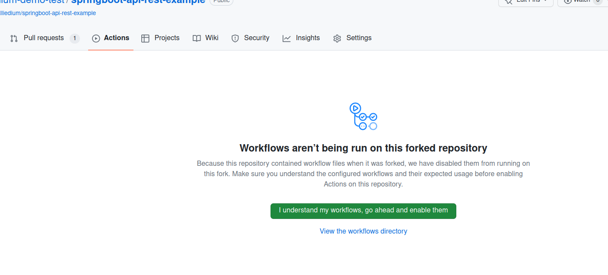

# CI/CD: Jenkins integration with GitHub. GitHub Actions part 5

In this lecture, we will cover the following aspects to improve your understanding of Jenkins and GitHub integration, GitHub features such as organizations, app, app permissions and private key, GitHub Checks, as well as Jenkins multibranch pipeline configuration:
- Jenkins and GitHub Integration: We will explore the benefits and capabilities of integrating Jenkins, a popular continuous integration and delivery tool, with GitHub. This integration allows you to leverage the strengths of both tools, combining the flexibility of GitHub with the robustness of Jenkins pipelines.
- Creating Organizations and Apps in GitHub: We will guide you through the process of creating GitHub Organizations, which provide a structured way to manage repositories, teams, and access permissions within your projects. Additionally, we will cover how to create a GitHub App, allowing for more granular control over integrations, and how to configure the necessary permissions for the app within your GitHub organization.
- Setting Permissions and Private Keys in GitHub Apps: GitHub Apps offer fine-grained permissions to control access to repositories and resources. We will discuss how to configure and manage these permissions for your GitHub App, ensuring secure and controlled access.
- GitHub Checks: GitHub Checks provide a powerful mechanism for running automated tests, code analysis, and other validations on your repositories.
- Jenkins Multibranch Pipeline Configuration: Jenkins multibranch pipelines allow you to automate builds, tests, and deployments across multiple branches of your GitHub repository. We will cover the configuration steps required to set up a Jenkins multibranch pipeline, including defining stages, steps, and triggers.

Also, we will get familiar with GitHub actions:
- Basic notions: workflow, events, common actions, jobs, environments, job ordering, job matrix    
## Jenkins' integration with GitHub
### Prerequisites
Install  [`Jenkins`](https://github.com/Alliedium/awesome-jenkins/#instructions-to-install-jenkins-with-ansible-playbook)      

Follow steps from  `Jenkins` and `GitHub Actions` [integration](https://github.com/Alliedium/awesome-jenkins/#jenkins-and-github-integration)

## Get familiar with GitHub workflows

1. Fork the repository to run examples with GitHub actions [workflows](https://github.com/Alliedium/awesome-github-actions/)
2. Navigate to Actions and enable them       
            

| Example                                                                                                              | Code                                                                                                                          |
|----------------------------------------------------------------------------------------------------------------------|--------------------------------------------------------------------------------------------------------------------------------------|
| [Example 1: Hello world](https://github.com/Alliedium/awesome-github-actions#example-01-hello-world)                 | [Hello world](https://github.com/Alliedium/awesome-github-actions/blob/main/.github/workflows/01-hello-world.yml)            |
| [Example 2: Event triggers](https://github.com/Alliedium/awesome-github-actions#example-02-event-triggers)           | [Event triggers](https://github.com/Alliedium/awesome-github-actions/blob/main/.github/workflows/02-event-triggers.yml)              |
| [Example 3: Actions](https://github.com/Alliedium/awesome-github-actions#example-03-actions)                         | [Actions](https://github.com/Alliedium/awesome-github-actions/blob/main/.github/workflows/03-actions.yml)                            |
| [Example 4: Environment variables](https://github.com/Alliedium/awesome-github-actions#example-04-environment-variables) | [Environment variables](https://github.com/Alliedium/awesome-github-actions/blob/main/.github/workflows/04-environment-variables.yml) |
| [Example 5: Parallel jobs](https://github.com/Alliedium/awesome-github-actions#example-05-parallel-jobs)             | [Parallel jobs](https://github.com/Alliedium/awesome-github-actions/blob/main/.github/workflows/05-parallel-jobs.yml)                |
| [Example 6: Job ordering](https://github.com/Alliedium/awesome-github-actions#example-06-job-ordering)               | [Job ordering](https://github.com/Alliedium/awesome-github-actions/blob/main/.github/workflows/06-job-ordering.yml)                  |
| [Example 7: Job matrix](https://github.com/Alliedium/awesome-github-actions#example-07-job-matrix)                   | [Job matrix](https://github.com/Alliedium/awesome-github-actions/blob/main/.github/workflows/07-job-matrix.yml)                      |

## References
#### Jenkins and GitHub integration
1. [GitHub checks Jenkins plugin](https://plugins.jenkins.io/github-checks/)
2. [Disable GitHub multibranch status Jenkins plugin](https://plugins.jenkins.io/disable-github-multibranch-status/)
3. [How to integrate Jenkins with GitHub](https://docs.cloudbees.com/docs/cloudbees-ci/latest/cloud-admin-guide/github-app-auth)
4. [How to create GitHub App](https://docs.github.com/en/apps/creating-github-apps/setting-up-a-github-app/creating-a-github-app)
5. [Manage protected branches on GitHub](https://docs.github.com/en/repositories/configuring-branches-and-merges-in-your-repository/managing-protected-branches)
6. [Setup GitHub checks in Jenkinsfile](https://github.com/jenkinsci/checks-api-plugin/blob/master/docs/consumers-guide.md)

#### GitHub Actions
7. [GitHub Actions workflows](https://docs.github.com/en/actions/using-workflows/about-workflows)
8. [GitHub Actions workflows basics, examples and a quick tutorial](https://codefresh.io/learn/github-actions/github-actions-workflows-basics-examples-and-a-quick-tutorial/)
9. [Trigger a workflow](https://docs.github.com/en/actions/using-workflows/triggering-a-workflow)
10. [Job environments](https://docs.github.com/en/actions/using-jobs/using-environments-for-jobs)
11. [Expressions in GitHub Actions](https://docs.github.com/en/actions/learn-github-actions/expressions)
12. [GitHub Actions contexts](https://docs.github.com/en/actions/learn-github-actions/contexts)
13. [GitHub Actions variables](https://docs.github.com/en/actions/learn-github-actions/variables)
14. [GitHub Actions common actions](https://github.com/actions)