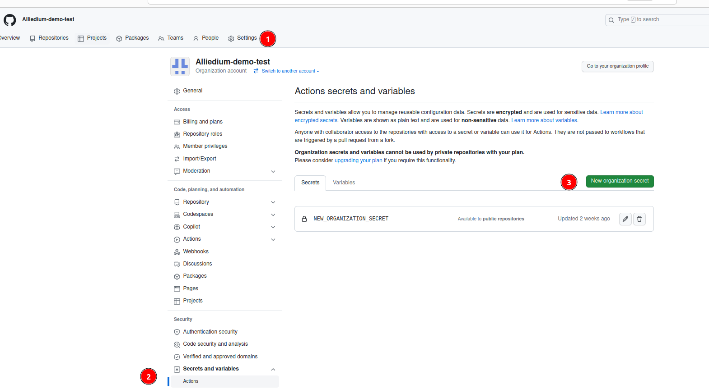
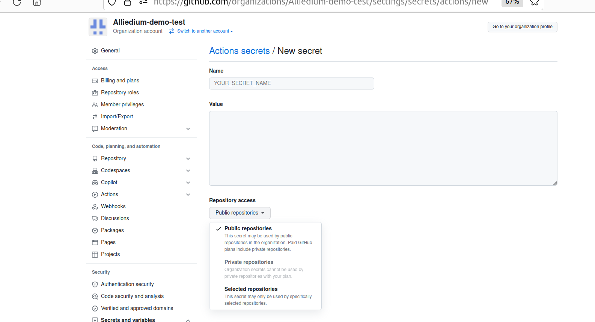
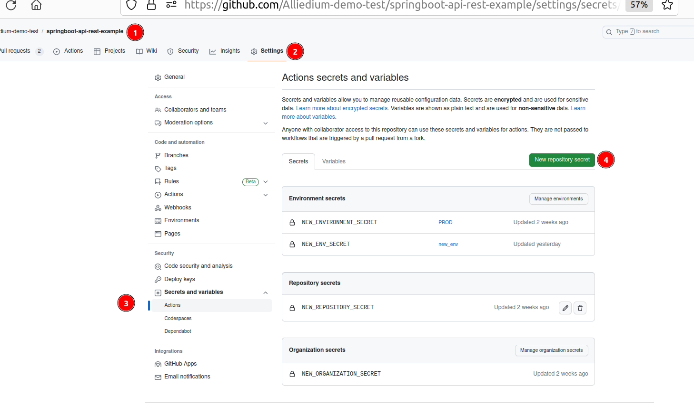
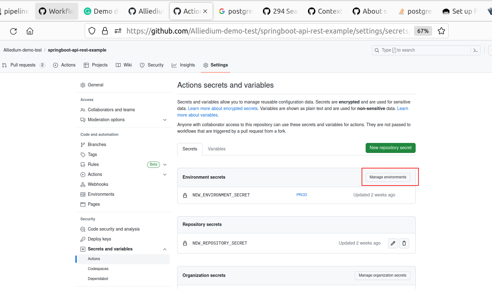
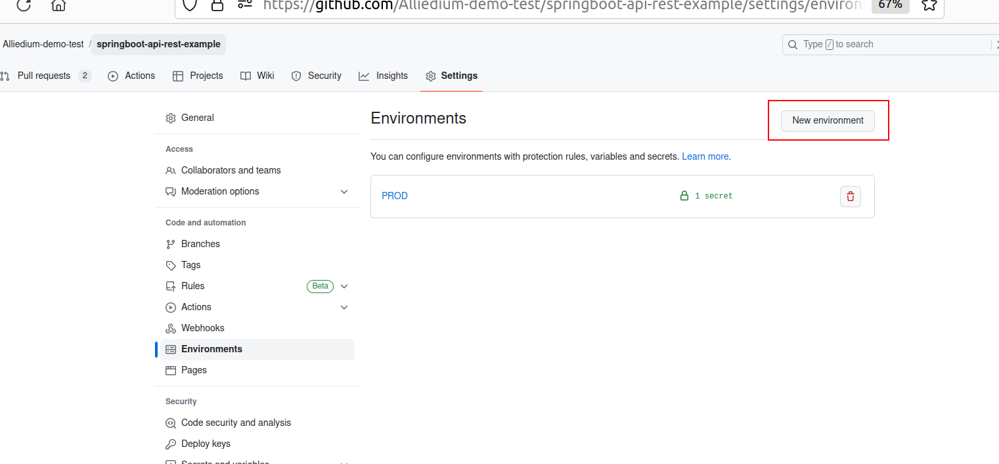
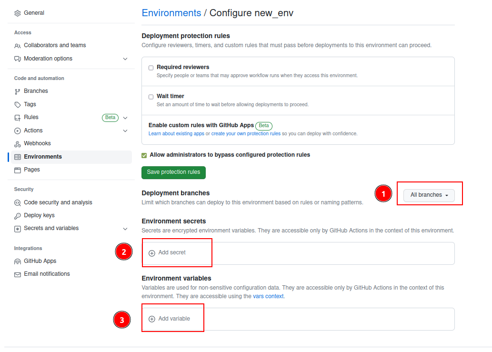
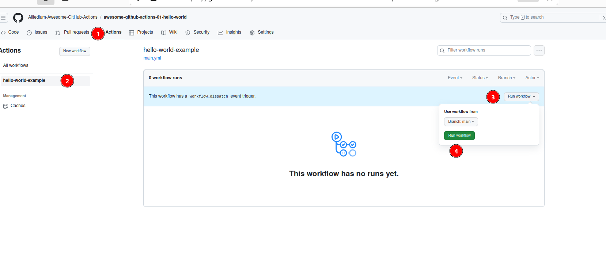

# CI/CD: Debug Jenkins pipeline, Debug GitHub Actions, part 8

## Prerequisites
1. Your environment is [ready](https://github.com/Alliedium/awesome-jenkins#prerequisites)      
2. Jenkins is [installed](https://github.com/Alliedium/awesome-jenkins#instructions-to-install-jenkins-with-ansible-playbook)     
3. Jenkins node is [created](https://github.com/Alliedium/awesome-jenkins#create-jenkins-node-on-vm)       
4. Create Jenkins input job for [debugging](https://github.com/Alliedium/awesome-jenkins#create-jenkins-input-job)      
5. Also, you can add this stage into the `Jenkinsfile` in the other projects you would like to debug 
```groovy
     stage('input') {
        agent any
        input {
            message "What is your first name?"
            ok "Submit"
            parameters {
                string(defaultValue: 'Dave', name: 'FIRST_NAME', trim: true)
            }
        }
        steps {
            echo "Good Morning, $FIRST_NAME"
            sh '''
            hostname
            cat /etc/redhat-release
            '''
        }
    }
```

## GitHub Actions

Fork the repository to run examples with GitHub actions [workflows](https://github.com/Alliedium/awesome-github-actions/)
1. Follow the instruction for Example 08-13 from the links. To get familiar with github Actions secrets follow additional instructions for `Example 09` provided [below](##GitHub secrets)

| Example                                                                                                                   | Code                                                                                                                  |
|---------------------------------------------------------------------------------------------------------------------------|-----------------------------------------------------------------------------------------------------------------------|
| [Example 8: Outputs](https://github.com/Alliedium/awesome-github-actions#example-08-outputs)                              | [Outputs](https://github.com/Alliedium/awesome-github-actions/blob/main/.github/workflows/08-outputs.yml)         |
| [Example 9: Context](https://github.com/Alliedium/awesome-github-actions#example-09-context)                              | [Context](https://github.com/Alliedium/awesome-github-actions/blob/main/.github/workflows/09-context-variables.yml)      |
| [Example 10: Expressions](https://github.com/Alliedium/awesome-github-actions#example-10-expressions)                     | [Expressions](https://github.com/Alliedium/awesome-github-actions/blob/main/.github/workflows/10-context-expressions.yml)         |
| [Example 11: Tmate actions](https://github.com/Alliedium/awesome-github-actions#example-11-tmate-terminal)                | [Tmate actions](https://github.com/Alliedium/awesome-github-actions/blob/main/.github/workflows/11-tmate.yml) |
| [Example 12: Postgres container service](https://github.com/Alliedium/awesome-github-actions#example-12-postgres-service) | [Postgres container service](https://github.com/Alliedium/awesome-github-actions/blob/main/.github/workflows/12-postgres-example.yml)   |
| [Example 13: Get secret's value](https://github.com/Alliedium/awesome-github-actions#example-13-get-secret-value)         | [Get secret's value](https://github.com/Alliedium/awesome-github-actions/blob/main/.github/workflows/13-get-secret-value.yml)       |


## GitHub secrets

Go to the example [`09-context-variables.yml`](https://github.com/Alliedium/awesome-github-actions/blob/main/.github/workflows/09-context-variables.yml).    
1. Create secret with the name `USERNAME` at the organisation level.    
     
Choose the repositories that will have access to your secret: Public repositories, Private repositories or Selected repositories. Current project should be among selected repositories.        
     
Run workflow [`contexts-example`](https://github.com/Alliedium/awesome-github-actions/blob/main/.github/workflows/09-context-variables.yml).     

2. Create secret with the name `USERNAME` at the repo level with another value.
     
Run workflow [`contexts-example`](https://github.com/Alliedium/awesome-github-actions/blob/main/.github/workflows/09-context-variables.yml)    

3. Create an environment for `main` branch and secret with the name `USERNAME` at the environment level with another value.     
      
       
      
Run workflow [`contexts-example`](https://github.com/Alliedium/awesome-github-actions/blob/main/.github/workflows/09-context-variables.yml)     

## GitHub Actions Manual run
Replace section `on` with the following lines in any workflow: 
```yaml
on:
   workflow_dispatch:
```
Run workflow manually:     


## Nektos/act
1. Follow steps from [awesome-github-actions](https://github.com/Alliedium/awesome-github-actions#nektos-act)

## [Ignite migration tool](https://github.com/Alliedium/ignite-migration-tool)

1. [About project](https://github.com/Alliedium/ignite-migration-tool/blob/main/README.md)
2. [Apache Ignite Migration Tool CI/CD](https://github.com/Alliedium/ignite-migration-tool/blob/main/README_CI.md)
3. [Apache Ignite Migration Tool CI/CD GPG](https://github.com/Alliedium/ignite-migration-tool/blob/main/README_GPG.md)

## References

##### Jenkins 
1. [Debugging Jenkins](https://www.reddit.com/r/jenkinsci/comments/z2qqbc/debugging_jenkins_by_inserting_a_breakpoint/)
2. [Debugging Jenkins pipeline](https://notes.asaleh.net/posts/debugging-jenkins-pipeline/)

#### GitHub Actions
3. [Good security practices for using GitHub Actions features](https://docs.github.com/en/actions/security-guides/security-hardening-for-github-actions)
4. [Encrypted secrets](https://docs.github.com/en/actions/security-guides/encrypted-secrets)
5. [Outputs for jobs](https://docs.github.com/en/actions/using-jobs/defining-outputs-for-jobs)
6. [Output commands](https://github.blog/changelog/2022-10-11-github-actions-deprecating-save-state-and-set-output-commands/)
7. [Tmate actions](https://github.com/mxschmitt/action-tmate)
8. [Job services](https://docs.github.com/en/actions/using-workflows/workflow-syntax-for-github-actions#jobsjob_idservices)
9. [Trigger a workflow](https://docs.github.com/en/actions/using-workflows/triggering-a-workflow)

#### Act
10. [Act](https://github.com/nektos/act)
11. [GitHub Actions on your local machine](https://dev.to/ken_mwaura1/run-github-actions-on-your-local-machine-bdm)
12. [Debug GitHub Actions locally with act](https://everyday.codes/tutorials/debug-github-actions-locally-with-act/)

