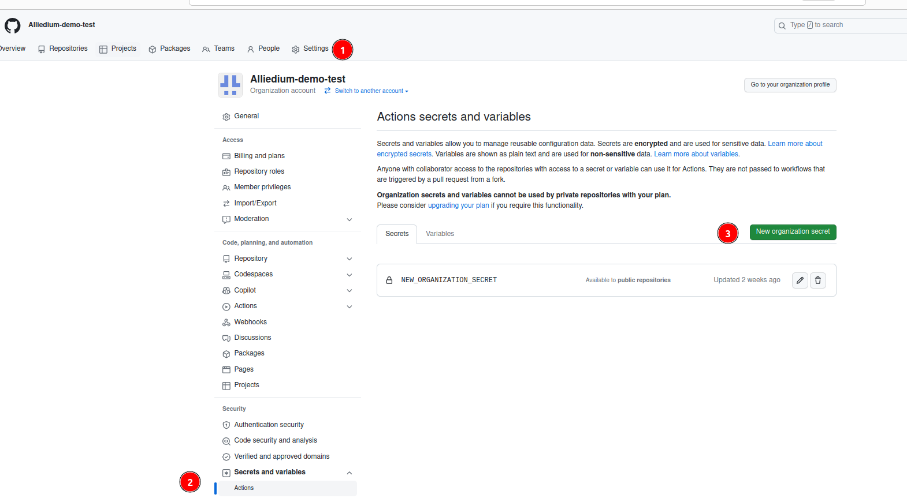
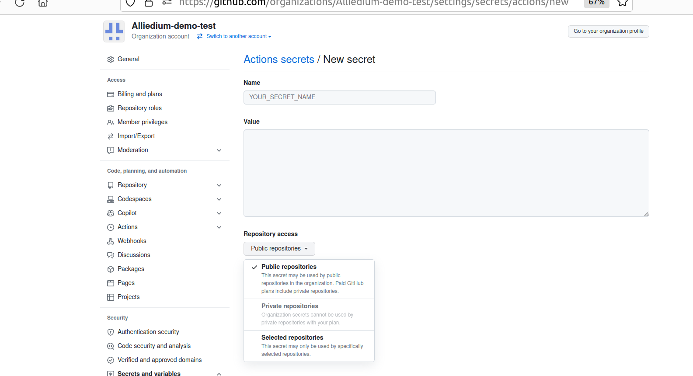
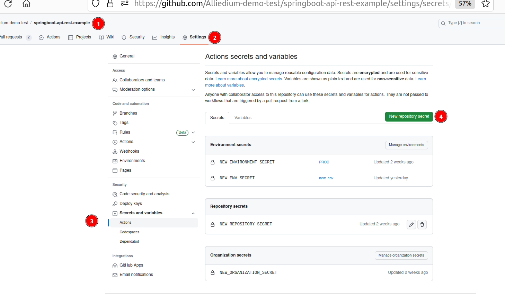
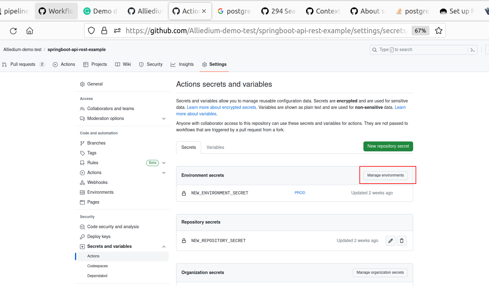
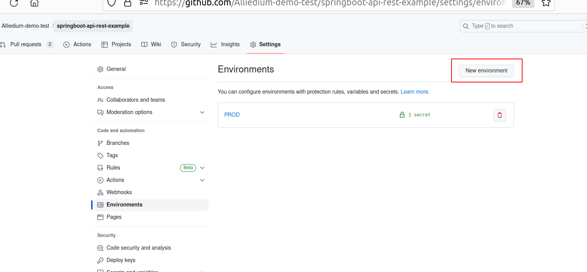
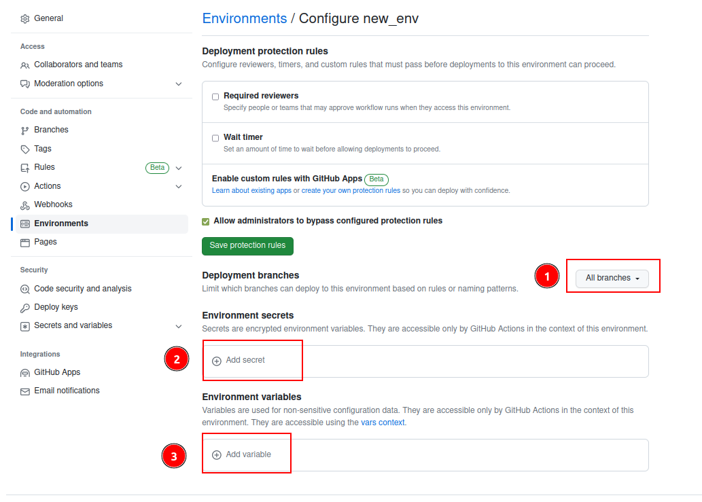
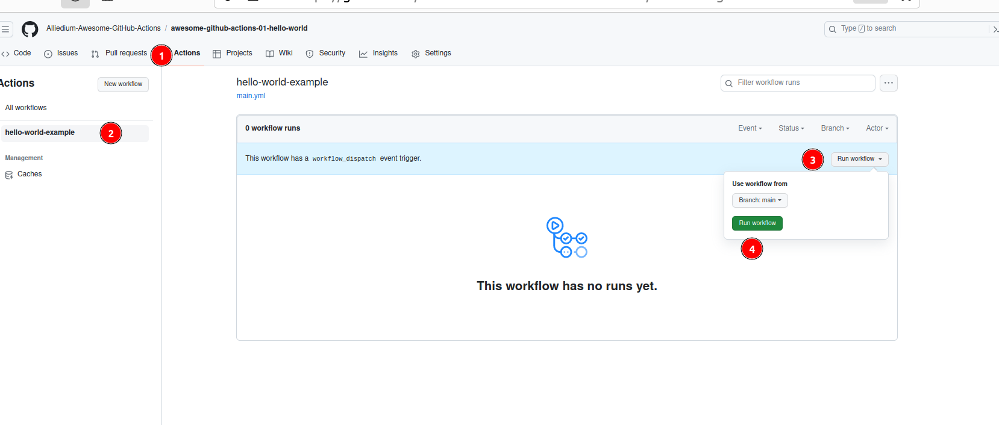

# CI/CD

## Prerequisites
1. [We used VM with Jammy Ubuntu](https://github.com/Alliedium/awesome-proxmox). Use the [script](https://github.com/Alliedium/awesome-proxmox/blob/main/vm-cloud-init-shell/.env.example) to create VM on `Proxmox`.
2. Follow the prerequisites from [our repo](https://github.com/Alliedium/awesome-jenkins/#prerequisites) and () to install Jenkins on your machine or VM
   #instructions-to-install-jenkins-with-ansible-playbook

## Input Job
To install Jenkins and create input job
1. Clone repo 
```shell
git clone https://github.com/Alliedium/awesome-jenkins/
````
2. Install Jenkins and create input job. You can use the same command and if Jenkins is already installed 
```shell
ansible-playbook $HOME/awesome-jenkins/playbooks/create-job.yml -i $HOME/awesome-jenkins/inventory/localhost -t step8
```
3. Install Jenkins agent. Follow the steps from awesome-jenkins [create jenkins node on VM](https://github.com/Alliedium/awesome-jenkins/#create-jenkins-node-on-vm)
4. Run Input job
5. Connect to your VM via ssh and enter password
   ```shell
   ssh <username>@<vm_ip_address>
   ```
6. Go to the Jenkins directory on your VM:
   ```shell
   cd <jenkins_directory>
   ```
7. To see installed tools use command:
   ```shell
    ls ./tools
    ```
8. To see job workspace:
   ```shell
    ls ./workspace/pipeline-input-job
    ```
9. Also, you can add this stage into the `Jenkinsfile` in the other projects you would like to debug 
```groovy
     stage('input') {
        agent any
        input {
            message "What is your first name?"
            ok "Submit"
            parameters {
                string(defaultValue: 'Dave', name: 'FIRST_NAME', trim: true)
            }
        }
        steps {
            echo "Good Morning, $FIRST_NAME"
            sh '''
            hostname
            cat /etc/redhat-release
            '''
        }
    }
```

## GitHub Actions

Fork and clone the [project](https://github.com/Alliedium/awesome-github-actions/)
Enable Actions for the repository
## GitHub secrets

Go to the example `09-context-variables.yml`.    
1. Create secret with the name `USERNAME` at the organisation level.    
     
Choose the repositories that will have access to your secret: Public repositories, Private repositories or Selected repositories. Current project should be among selected repositories.        
     
Run workflow `contexts-example`     

2. Create secret with the name `USERNAME` at the repo level with another value.
     
Run workflow `contexts-example`    

3. Create an environment for `main` branch and secret with the name `USERNAME` at the environment level with another value.     
      
       
      
Run workflow `contexts-example`     

## GitHub Actions expressions
Go to the example `10-context-expressions.yml`     
Run workflow `expressions-example`

## GitHub Actions `tmate`
Go to the example `11-tmate.yml`     
Run workflow `tmate`
Open `tmate` session in your browser using link form the logs
Run command to install `npm`:
```shell
npm ci
```
Run npm test and watch if there are no failure
```shell
npm test
```
Continue workflow run
```shell
touch continue
```

## GitHub Actions PostgreSQL Service
Go to the example `12-postgres-example.yml`     
Run workflow `PostgreSQL Service Example`


## GitHub Actions Get secret value
Go to the example `13-get-secret-value.yml`  
Create secret with the name `NEW_SECRET` at the organisation level.
Run workflow `Get secret value`

## GitHub Actions Manual run
Replace section `on` with the following lines: 
```yaml
on:
   workflow_dispatch:
```
Run workflow manually:     


## Nektos/act
1. Follow steps from awesome-github-actions#link

## [Ignite migration tool](https://github.com/Alliedium/ignite-migration-tool)

1. [About project](https://github.com/Alliedium/ignite-migration-tool/blob/main/README.md)
2. [Apache Ignite Migration Tool CI/CD](https://github.com/Alliedium/ignite-migration-tool/blob/main/README_CI.md)
3. [Apache Ignite Migration Tool CI/CD GPG](https://github.com/Alliedium/ignite-migration-tool/blob/main/README_GPG.md)

## References

##### Jenkins 
1. [Debugging Jenkins](https://www.reddit.com/r/jenkinsci/comments/z2qqbc/debugging_jenkins_by_inserting_a_breakpoint/)
2. [Debugging Jenkins pipeline](https://notes.asaleh.net/posts/debugging-jenkins-pipeline/)

#### GitHub Actions
3. [GitHub Actions workflows basics, examples and a quick tutorial](https://codefresh.io/learn/github-actions/github-actions-workflows-basics-examples-and-a-quick-tutorial/)
4. [Trigger a workflow](https://docs.github.com/en/actions/using-workflows/triggering-a-workflow)
5. [Job environments](https://docs.github.com/en/actions/using-jobs/using-environments-for-jobs)
6. [Expressions in GitHub Actions](https://docs.github.com/en/actions/learn-github-actions/expressions)
7. [GitHub Actions contexts](https://docs.github.com/en/actions/learn-github-actions/contexts)
8. [GitHub Actions variables](https://docs.github.com/en/actions/learn-github-actions/variables)
9. [GitHub Actions common actions](https://github.com/actions)
10. [Good security practices for using GitHub Actions features](https://docs.github.com/en/actions/security-guides/security-hardening-for-github-actions)
11. [Encrypted secrets](https://docs.github.com/en/actions/security-guides/encrypted-secrets)
12. [Outputs for jobs](https://docs.github.com/en/actions/using-jobs/defining-outputs-for-jobs)
13. [Output commands](https://github.blog/changelog/2022-10-11-github-actions-deprecating-save-state-and-set-output-commands/)
14. [Tmate actions](https://github.com/mxschmitt/action-tmate)
15. [Job services](https://docs.github.com/en/actions/using-workflows/workflow-syntax-for-github-actions#jobsjob_idservices)

#### Act
16. [Act](https://github.com/nektos/act)
17. [GitHub Actions on your local machine](https://dev.to/ken_mwaura1/run-github-actions-on-your-local-machine-bdm)
18. [Debug GitHub Actions locally with act](https://everyday.codes/tutorials/debug-github-actions-locally-with-act/)

